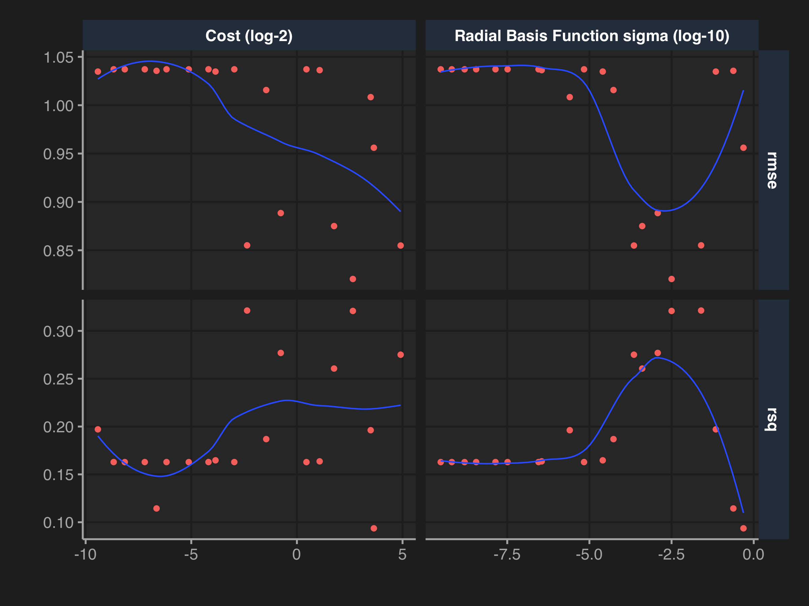
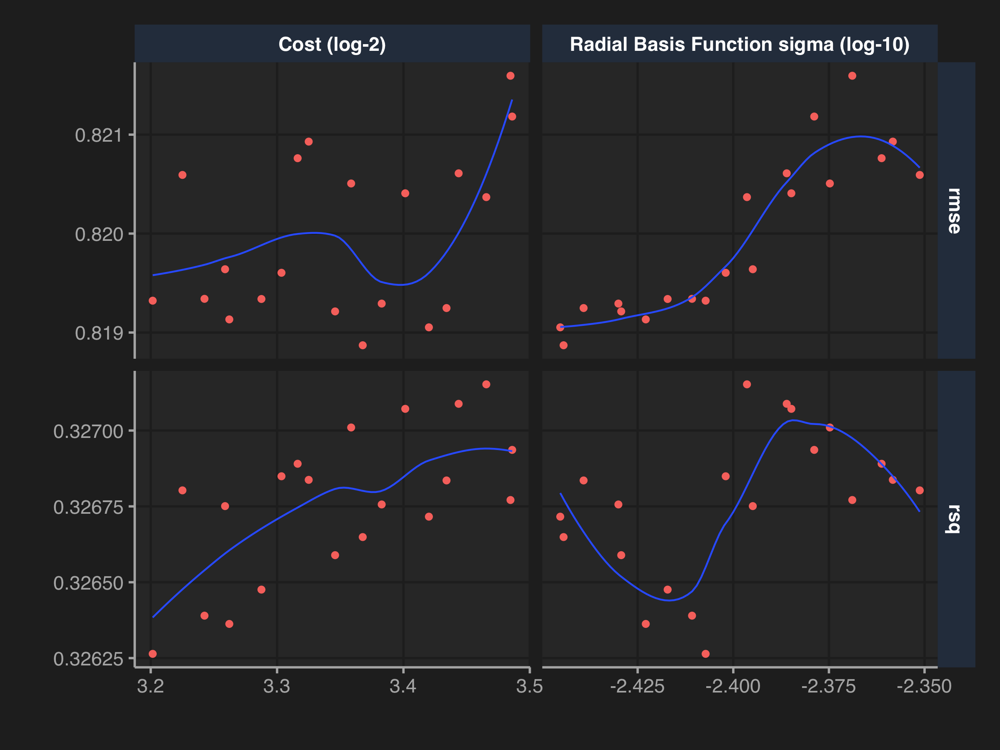
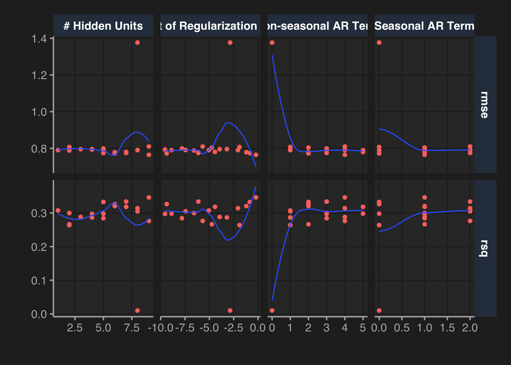
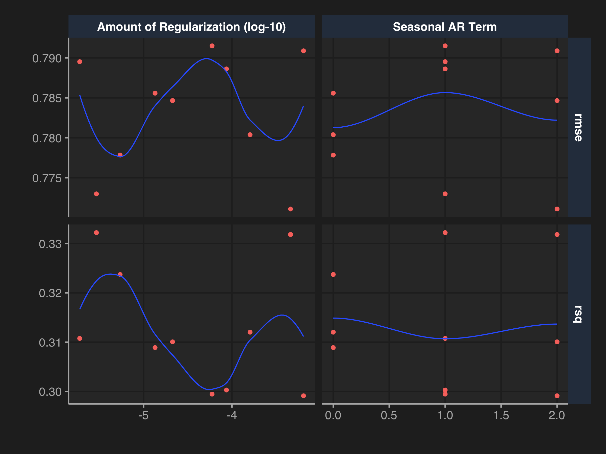
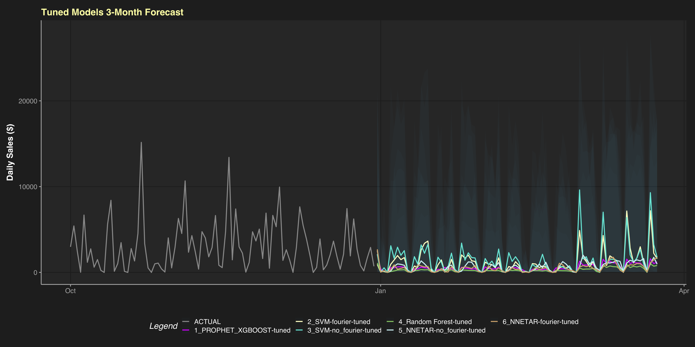

-   [🥅 Project Goal](#goal)
-   [🗂 Obtain Data](#data)
-   [🛁 Clean Data](#clean)
-   [🔭 Explore Data](#explore)
-   [🧮 Prep Data for Forecasting](#prep)
-   [🏗 Build Workflows](#build)
-   [🔧 Tune Models](#tune)
-   [🏆 Forecast w/ Best Models](#forecast)
-   [🏁 Ensemble & Save Work](#ensemble)
-   [🤔 Decisions](#decisions)

## 🥅 Goal of this Project

For this blog post, I use the `{modeltime}` package to forecast 3 months
of daily sales in Q1 for a young ‘Superstore’ company selling furniture,
technology, and office supplies. The forecast can then be used to make
decisions about supply-chain orders, warehouse inventory, and if/when
new employees are needed to meet predicted sales demand after the
holiday season.

## 🗂 Obtain Data

The [Superstore Sales
Dataset](https://www.kaggle.com/rohitsahoo/sales-forecasting/) on Kaggle
is relatively unexplored. There’s a couple python exploratory data
analysis projects posted but nothing using R and only one 7-day forecast
using a simple SARIMAX model.

    df <- read_csv("train.csv")

## 🛁 Clean Data

    glimpse(df)

    ## Rows: 9,800
    ## Columns: 18
    ## $ `Row ID`        <dbl> 1, 2, 3, 4, 5, 6, 7, 8, 9, 10, 11, 12, 13, 14, 1…
    ## $ `Order ID`      <chr> "CA-2017-152156", "CA-2017-152156", "CA-2017-138…
    ## $ `Order Date`    <chr> "08/11/2017", "08/11/2017", "12/06/2017", "11/10…
    ## $ `Ship Date`     <chr> "11/11/2017", "11/11/2017", "16/06/2017", "18/10…
    ## $ `Ship Mode`     <chr> "Second Class", "Second Class", "Second Class", …
    ## $ `Customer ID`   <chr> "CG-12520", "CG-12520", "DV-13045", "SO-20335", …
    ## $ `Customer Name` <chr> "Claire Gute", "Claire Gute", "Darrin Van Huff",…
    ## $ Segment         <chr> "Consumer", "Consumer", "Corporate", "Consumer",…
    ## $ Country         <chr> "United States", "United States", "United States…
    ## $ City            <chr> "Henderson", "Henderson", "Los Angeles", "Fort L…
    ## $ State           <chr> "Kentucky", "Kentucky", "California", "Florida",…
    ## $ `Postal Code`   <dbl> 42420, 42420, 90036, 33311, 33311, 90032, 90032,…
    ## $ Region          <chr> "South", "South", "West", "South", "South", "Wes…
    ## $ `Product ID`    <chr> "FUR-BO-10001798", "FUR-CH-10000454", "OFF-LA-10…
    ## $ Category        <chr> "Furniture", "Furniture", "Office Supplies", "Fu…
    ## $ `Sub-Category`  <chr> "Bookcases", "Chairs", "Labels", "Tables", "Stor…
    ## $ `Product Name`  <chr> "Bush Somerset Collection Bookcase", "Hon Deluxe…
    ## $ Sales           <dbl> 261.9600, 731.9400, 14.6200, 957.5775, 22.3680, …

After a little digging a few things become obvious. There are two date
variables, but lets only use `Order Date` going forward. It seems
`Order Date` format is day/month/year. They only ship within the United
States. We don’t need individual `order_id` numbers. Let’s clean up
column names, format the date, factor the categorical variables, and
remove what we definitely don’t need.

    data_clean_tbl <- janitor::clean_names(df) %>% 
                      as_tibble() %>% 
                      mutate(order_date = lubridate::dmy(order_date),
                             across(customer_id:product_name, .fns = as.factor)) %>% 
                      select(-c(ship_date, country, order_id, ship_mode))
    glimpse(data_clean_tbl)

    ## Rows: 9,800
    ## Columns: 14
    ## $ row_id        <dbl> 1, 2, 3, 4, 5, 6, 7, 8, 9, 10, 11, 12, 13, 14, 15,…
    ## $ order_date    <date> 2017-11-08, 2017-11-08, 2017-06-12, 2016-10-11, 2…
    ## $ customer_id   <fct> CG-12520, CG-12520, DV-13045, SO-20335, SO-20335, …
    ## $ customer_name <fct> Claire Gute, Claire Gute, Darrin Van Huff, Sean O'…
    ## $ segment       <fct> Consumer, Consumer, Corporate, Consumer, Consumer,…
    ## $ city          <fct> Henderson, Henderson, Los Angeles, Fort Lauderdale…
    ## $ state         <fct> Kentucky, Kentucky, California, Florida, Florida, …
    ## $ postal_code   <fct> 42420, 42420, 90036, 33311, 33311, 90032, 90032, 9…
    ## $ region        <fct> South, South, West, South, South, West, West, West…
    ## $ product_id    <fct> FUR-BO-10001798, FUR-CH-10000454, OFF-LA-10000240,…
    ## $ category      <fct> Furniture, Furniture, Office Supplies, Furniture, …
    ## $ sub_category  <fct> Bookcases, Chairs, Labels, Tables, Storage, Furnis…
    ## $ product_name  <fct> "Bush Somerset Collection Bookcase", "Hon Deluxe F…
    ## $ sales         <dbl> 261.9600, 731.9400, 14.6200, 957.5775, 22.3680, 48…

What period of time does this data cover?

    t <- summarise_by_time(.data     = data_clean_tbl,
                           .date_var = order_date)
    (diff_t <- difftime(last(t$order_date),
                        first(t$order_date),
                        units = 'weeks'))

    ## Time difference of 208.1429 weeks

    lubridate::dweeks(208.1429)

    ## [1] "125884825.92s (~3.99 years)"

This is a daily dataset spanning just under 4 years from 2015-01-03 to
2018-12-30. There are gaps though!

## 🔭 Exploratory Data Analysis

Let’s group by `region`/`state` to see where the ‘Superstore’ does
business, looking at total `orders` and total `sales`.

    q <- data_clean_tbl %>%
         group_by(region,state) %>%
         summarise(orders = n(), sales = sum(sales)) %>%
         ungroup() %>%
         mutate(state = tidytext::reorder_within(state, orders, region)) %>%
         arrange(desc(sales))

    ggplot(q, aes(reorder_within(state, sales, region, sep = ""), sales, fill = region)) +
       geom_col(show.legend = FALSE, alpha = 0.9) +
       facet_grid(region ~., scales = 'free', space = 'free') +
       coord_flip() +
       tidytext::scale_x_reordered() +  # gets rid of the ___region
       scale_y_continuous(limits = c(0,500000), expand = c(0,0), labels=dollar_format(prefix="$")) +
       theme_dark_grey() +
       scale_color_todd_dark_subtle() +
       scale_fill_todd_dark() +
       theme(panel.grid.major.y = element_blank(),
             panel.grid.major.x = element_blank()) +
       geom_hline(yintercept = c(100000,200000,300000,400000),
                  color      = "#FFCF6A",
                  alpha      = 0.1,
                  size       = 1) +
       labs(x = element_blank(), title = 'Sales by State/Region') +
       geom_text(aes(label = dollar(round((sales)))),
                 color="white", size=3.5, fontface = 'bold',
                 hjust = -0.1, vjust = 0.4)

Looks like the do business throughout the US, with the most business
coming from California. They probably do most of their business from
online shopping, as these total sale numbers aren’t high enough for
multiple warehouses spread across the country.

Lets also look at number of `orders` and `sales` grouped by
`customer_name`, `category`, and `segment`. Any outliers?

    # Want to identify any outlier customers, and see if any category/segment of their business dominates
    x <- data_clean_tbl %>%
          group_by(customer_name, category, segment) %>%
          summarise(sales  = sum(sales),
                    orders = n()) %>%
          mutate(log_sales = log(sales))

    z <- data_clean_tbl %>%
          group_by(category, segment) %>%
          summarise(sales  = sum(sales),
                    orders = n()) %>%
          ungroup() %>%
          mutate(orders_pct      = round(prop.table(orders) * 100),
                 sales_pct       = round(prop.table(sales) * 100),
                 sales_per_order = round(sales/orders)) %>%
          pivot_longer(orders_pct:sales_pct,
                       names_to  = 'metric',
                       values_to = 'percent')

    outlier_furniture_consumer <- x %>% filter(segment  == 'Consumer',
                                                category == "Furniture") %>%
                                         arrange(desc(orders)) %>% head()

    outlier_technology_corporate_homeoffice <- x %>%
                                               filter(segment  == 'Corporate' | segment == "Home Office",
                                                      category == "Technology") %>%
                                               arrange(desc(log_sales)) %>% head()
    # Make specific tbl for outlier Seth Vernon so label doesn't appear in other facets
    seth_vernon <- data.frame(category = factor("Furniture", levels = c("Furniture","Office Supplies","Technology")),
                              segment  = factor("Consumer", levels = c("Consumer","Corporate","Home Office")))

    ggplot(x, aes(log(sales), orders, color = category)) +
       geom_jitter(aes(shape = segment),
                   alpha       = 0.7,
                   width       = 0,
                   height      = 0.3,
                   show.legend = FALSE,
                   size        = 2) +
       theme_dark_grey() +
       scale_color_manual(values = c("#fbb4ae", "#b3cde3", "#fed9a6")) +
       facet_grid(segment~category, scales = 'free_y') +
       labs(title = "Orders & Sales in log($) per Customer by Category/Segment",
            x     = 'log($)') +
       geom_curve(aes(x = 7, xend = 8.9, y = 18, yend = 16),
                  data      = seth_vernon,
                  curvature = -0.5,
                  size      = 1,
                  arrow     = arrow(length = unit(2, "mm")),
                  color     = 'white',
                  alpha     = 0.7) +
       geom_text(aes(x = 6.5, y = 15),
                 data        = seth_vernon ,
                 label       = "Seth Vernon\n15 Orders\nTotal = $8,332",
                 size        = 3.5,
                 show.legend = F,
                 color       = 'white',
                 alpha       = 0.7)

%20per%20Customer%20by%20Category/Segment-1.png)

Their sales are spread pretty evenly between these categories. More
orders are for office supplies, but their largest sales are for
technology; not surprising. They have a some loyal customers too, like
Seth Vernon.

## 🧮 Prep Data for Forecasting

Now lets focus on sales within this time-series. If we want to forecast
sales, we can’t use any other variable but `order_date`. After
2018-12-30 we don’t have any information about the number of orders or
where those orders are coming from. We could build models using , for
example, `orders` as an independent variable to predict sales, but only
until 2018-12-30. After that, the models will break down since we don’t
have values for `orders` to predict `sales` with.

This is when we really start using `{timetk}` and `{modeltime}`.
Hopefully you can appreciate how well they work alongside `{tidyverse}`
and `{tidymodels}` packages. No more learning unique processes for every
type of model you want to build.

    sales_daily_tbl <- data_clean_tbl %>% 
                       summarise_by_time(.date_var = order_date, 
                                         .by       = 'day', 
                                         sales     = sum(sales))

Let’s look at the daily total sales for this company over the
time-series.

    sales_daily_tbl %>% 
       plot_time_series(.date_var     = order_date,
                        .value        = sales,
                        .interactive  = FALSE,
                        .line_color   = "#cccccc",
                        .smooth_color = "#db0000",
                        .title        = "Daily Total Sales",
                        .y_lab        = "$") +
       theme_dark_grey()

There are no days with 0 orders/sales. But in our EDA we noticed gaps in
the data. This data spans just under 4 years, but we only have 1,230
rows of daily data. If we have a row for every day, we should have about
365 \* 4 or 1,460 rows. We need to pad these missing days so our
time-series is complete. We can fill sales with 0 for these missing
days.

### Pad Missing Dates

    sales_daily_pad_tbl <- sales_daily_tbl %>% 
                           pad_by_time(order_date, 
                                       .by        = 'day', 
                                       .pad_value = 0) 

    glimpse(sales_daily_pad_tbl)

    ## Rows: 1,458
    ## Columns: 2
    ## $ order_date <date> 2015-01-03, 2015-01-04, 2015-01-05, 2015-01-06, 2015…
    ## $ sales      <dbl> 16.448, 288.060, 19.536, 4407.100, 87.158, 0.000, 40.…

1,458 rows, great! Now we have a full 4-year daily dataset with no
missing dates.

Our sales variable ranges from 0 to ~ 30,000 on any given day, so we’ll
need to transform this continuous variable. And since 0’s can mess up
our machine learning models, we’ll use a log10 + 1 transformation,
followed by standardization that centers our data around 0. We could do
this at each recipe stage of our workflows, but we can do it here once
and be done with it. Lets also change sales to sales\_trans.

### Transform `sales`

    sales_daily_pad_trans_tbl <- sales_daily_pad_tbl %>%
                                 mutate(sales = log_interval_vec(sales, 
                                                                 limit_lower = 0, 
                                                                 offset      = 1)) %>%
                                 mutate(sales = standardize_vec(sales)) %>%
                                 rename(sales_trans = sales)

We need to keep track of the Standardization Parameters for when we
un-transform the data at the end.

    limit_lower <-  0
    limit_upper <-  30918.3876
    offset <-  1
    std_mean_sales <- -4.61074359571939
    std_sd_sales <- 2.86059320652223

Let’s look at our new padded & transformed time-series.

    sales_daily_pad_trans_tbl %>% 
       plot_time_series(order_date,
                        sales_trans,
                        .interactive  = FALSE,
                        .line_color   = "#cccccc",
                        .smooth_color = "#db0000",
                        .title        = "Daily Total Sales, Padded & Transformed",
                        .y_lab        = "Sales") +
       theme_dark_grey()

-1.png)

We might want to add lags, rolling lags, and/or fourier-series features
that could help our forecast. This is way to add features to regress on
for the future dates we want to forecast. Currently future forecast
dates have only order\_date to predict with.

Let’s look at ACF/PACF plots to see if any periods look usable.  
\#\#\# ACF/PACF

    lag_labels <- data.frame(name  = c("ACF","ACF","ACF","ACF","ACF","PACF","PACF","PACF","PACF"),
                             label = c('7','14','21','28','357','7','14','21','28'))

    sales_daily_pad_trans_tbl %>%
       plot_acf_diagnostics(.date_var = order_date, .value = sales_trans, .lags = 400,
                            .show_white_noise_bars = TRUE, .interactive = FALSE, .line_color = "#cccccc",
                            .line_size = 0.5, .white_noise_line_color = "#db0000", .point_color = "#fed9a6",
                            .point_size = 0.8) +
       theme_dark_grey() +
       geom_text(aes(label = label),
                 data  = lag_labels,
                 x     = c(7, 14, 21.7, 29.5, 358, 7, 15, 22, 30),
                 y     = c(.53, .52, .5, .5, .38,.5, .35, .27, .25),
                 size  = 4,
                 color = "white",
                 angle = 55)

Clearly there is a strong weekly correlation of sales vs sales 7d, 14d,
21d, … later. The Partial Auto Correlation Features (PACF) de-weights
the correlation values depending on the values that come before it. Our
PACF shows lags 7, 14, 21, and 28 as potentially important lags. All
other lags can be considered white noise or close to white noise.

I experimented with multiple lag and Fourier-Series combos. A lag the
length of my forecast (84 days) with rolling 30d, 60d, and 90d averages
helped. Additional lags and Fourier-Series did not improve model
accuracy. It’s possible I didn’t use them correctly, or experiment
enough. I’ll include multiple Fourier-Series with 3 orders each to show
the process.

### Add Forecast/Lag/Rolling Averages

    forecast_3_month <- 84
    lag_period       <- 84            # 84 smallest lag period to get our forecast of 84 into the future
    rolling_periods  <- c(30, 60, 90) # 1 month, 2 month, and 3 month moving averages as features to catch the trend

### Full Data

    full_data_prepared_tbl <- sales_daily_pad_trans_tbl %>% 
                              future_frame(.date_var   = order_date, 
                                           .length_out = forecast_3_month, 
                                           .bind_data  = TRUE) %>% 
                              tk_augment_fourier(.date_var = order_date,
                                                 .periods  = c(7,14,21,28,357),
                                                 .K        = 3) %>% 
                              tk_augment_lags(.value = sales_trans,
                                              .lags  = lag_period ) %>% 
                              tk_augment_slidify(.value   = sales_trans_lag84,
                                                 .f       = ~ mean(.x, na.rm = TRUE),
                                                 .period  = rolling_periods,
                                                 .partial = TRUE,
                                                 .align   = 'center') %>% 
                              rowid_to_column(var = 'rowid') %>% 
                              rename_with(.cols = contains('lag'), 
                                          .fn   = ~ str_c('lag_', .)) %>% 
                              rename_with(.cols = matches('(_sin)|(_cos)'), 
                                          .fn   = ~ str_c('fourier_', .))

    glimpse(full_data_prepared_tbl)

    ## Rows: 1,542
    ## Columns: 37
    ## $ rowid                         <int> 1, 2, 3, 4, 5, 6, 7, 8, 9, 10, 11,…
    ## $ order_date                    <date> 2015-01-03, 2015-01-04, 2015-01-0…
    ## $ sales_trans                   <dbl> -1.002789645, -0.018295287, -0.945…
    ## $ fourier_order_date_sin7_K1    <dbl> 9.749279e-01, 4.338837e-01, -4.338…
    ## $ fourier_order_date_cos7_K1    <dbl> -0.2225209, -0.9009689, -0.9009689…
    ## $ fourier_order_date_sin7_K2    <dbl> -4.338837e-01, -7.818315e-01, 7.81…
    ## $ fourier_order_date_cos7_K2    <dbl> -0.9009689, 0.6234898, 0.6234898, …
    ## $ fourier_order_date_sin7_K3    <dbl> -7.818315e-01, 9.749279e-01, -9.74…
    ## $ fourier_order_date_cos7_K3    <dbl> 0.6234898, -0.2225209, -0.2225209,…
    ## $ fourier_order_date_sin14_K1   <dbl> 7.818315e-01, 9.749279e-01, 9.7492…
    ## $ fourier_order_date_cos14_K1   <dbl> 0.6234898, 0.2225209, -0.2225209, …
    ## $ fourier_order_date_sin14_K2   <dbl> 9.749279e-01, 4.338837e-01, -4.338…
    ## $ fourier_order_date_cos14_K2   <dbl> -0.2225209, -0.9009689, -0.9009689…
    ## $ fourier_order_date_sin14_K3   <dbl> 4.338837e-01, -7.818315e-01, -7.81…
    ## $ fourier_order_date_cos14_K3   <dbl> -0.9009689, -0.6234898, 0.6234898,…
    ## $ fourier_order_date_sin21_K1   <dbl> -9.972038e-01, -9.308737e-01, -7.8…
    ## $ fourier_order_date_cos21_K1   <dbl> 0.07473009, 0.36534102, 0.62348980…
    ## $ fourier_order_date_sin21_K2   <dbl> -1.490423e-01, -6.801727e-01, -9.7…
    ## $ fourier_order_date_cos21_K2   <dbl> -0.98883083, -0.73305187, -0.22252…
    ## $ fourier_order_date_sin21_K3   <dbl> 9.749279e-01, 4.338837e-01, -4.338…
    ## $ fourier_order_date_cos21_K3   <dbl> -0.2225209, -0.9009689, -0.9009689…
    ## $ fourier_order_date_sin28_K1   <dbl> 4.338837e-01, 6.234898e-01, 7.8183…
    ## $ fourier_order_date_cos28_K1   <dbl> 9.009689e-01, 7.818315e-01, 6.2348…
    ## $ fourier_order_date_sin28_K2   <dbl> 7.818315e-01, 9.749279e-01, 9.7492…
    ## $ fourier_order_date_cos28_K2   <dbl> 0.6234898, 0.2225209, -0.2225209, …
    ## $ fourier_order_date_sin28_K3   <dbl> 9.749279e-01, 9.009689e-01, 4.3388…
    ## $ fourier_order_date_cos28_K3   <dbl> 2.225209e-01, -4.338837e-01, -9.00…
    ## $ fourier_order_date_sin357_K1  <dbl> 0.2778924, 0.2947552, 0.3115267, 0…
    ## $ fourier_order_date_cos357_K1  <dbl> 0.9606122, 0.9555728, 0.9502374, 0…
    ## $ fourier_order_date_sin357_K2  <dbl> 0.5338936, 0.5633201, 0.5920486, 0…
    ## $ fourier_order_date_cos357_K2  <dbl> 0.8455517, 0.8262388, 0.8059022, 0…
    ## $ fourier_order_date_sin357_K3  <dbl> 0.7478370, 0.7818315, 0.8136468, 0…
    ## $ fourier_order_date_cos357_K3  <dbl> 0.66388234, 0.62348980, 0.58135949…
    ## $ lag_sales_trans_lag84         <dbl> NA, NA, NA, NA, NA, NA, NA, NA, NA…
    ## $ lag_sales_trans_lag84_roll_30 <dbl> NaN, NaN, NaN, NaN, NaN, NaN, NaN,…
    ## $ lag_sales_trans_lag84_roll_60 <dbl> NaN, NaN, NaN, NaN, NaN, NaN, NaN,…
    ## $ lag_sales_trans_lag84_roll_90 <dbl> NaN, NaN, NaN, NaN, NaN, NaN, NaN,…

The time-series now includes lag, rolling\_lag and fourier-series data
in future forecast dates. If these features help model accuracy on the
training/testing sets, we can assume they’ll help the models forecast
future sales. They may or may not help though. Gotta experiment. Let’s
look at the lag and rolling lags data.

    full_data_prepared_tbl %>%
       pivot_longer(c(sales_trans,
                      lag_sales_trans_lag84,
                      lag_sales_trans_lag84_roll_30,
                      lag_sales_trans_lag84_roll_60,
                      lag_sales_trans_lag84_roll_90)) %>%
       plot_time_series(order_date, value, name, .interactive = FALSE, .smooth = FALSE, .title = "30d, 60d, 90d Rolling Lags") +
       theme_dark_grey() +
       scale_color_manual(values = c("#cccccc","#db0000", "#0099ff", "#00ff99", "#ffffcc"))

Notice each of the first 84 days lacks at least some of the lag/rolling
lag features. We can’t use these days in our testing/training splits.
That’s the downside. We probably could pad those dates somehow, but I
won’t try here.

The `full_data_prepared_tbl` has 1542 rows (1458 original days + 84
future days). We need to separate rows for future days so we can split
the original data into training/testing sets. Filter using days lacking
`sales_trans` values.

### Forecast Data

We can use `{skimr}` to show us a summary of our data.

    forecast_tbl <- full_data_prepared_tbl %>% 
                    filter(is.na(sales_trans))

    skimr::skim_without_charts(forecast_tbl)

<table>
<caption>Data summary</caption>
<tbody>
<tr class="odd">
<td style="text-align: left;">Name</td>
<td style="text-align: left;">forecast_tbl</td>
</tr>
<tr class="even">
<td style="text-align: left;">Number of rows</td>
<td style="text-align: left;">84</td>
</tr>
<tr class="odd">
<td style="text-align: left;">Number of columns</td>
<td style="text-align: left;">37</td>
</tr>
<tr class="even">
<td style="text-align: left;">_______________________</td>
<td style="text-align: left;"></td>
</tr>
<tr class="odd">
<td style="text-align: left;">Column type frequency:</td>
<td style="text-align: left;"></td>
</tr>
<tr class="even">
<td style="text-align: left;">Date</td>
<td style="text-align: left;">1</td>
</tr>
<tr class="odd">
<td style="text-align: left;">numeric</td>
<td style="text-align: left;">36</td>
</tr>
<tr class="even">
<td style="text-align: left;">________________________</td>
<td style="text-align: left;"></td>
</tr>
<tr class="odd">
<td style="text-align: left;">Group variables</td>
<td style="text-align: left;">None</td>
</tr>
</tbody>
</table>

Data summary

**Variable type: Date**

<table>
<thead>
<tr class="header">
<th style="text-align: left;">skim_variable</th>
<th style="text-align: right;">n_missing</th>
<th style="text-align: right;">complete_rate</th>
<th style="text-align: left;">min</th>
<th style="text-align: left;">max</th>
<th style="text-align: left;">median</th>
<th style="text-align: right;">n_unique</th>
</tr>
</thead>
<tbody>
<tr class="odd">
<td style="text-align: left;">order_date</td>
<td style="text-align: right;">0</td>
<td style="text-align: right;">1</td>
<td style="text-align: left;">2018-12-31</td>
<td style="text-align: left;">2019-03-24</td>
<td style="text-align: left;">2019-02-10</td>
<td style="text-align: right;">84</td>
</tr>
</tbody>
</table>

**Variable type: numeric**

<table>
<thead>
<tr class="header">
<th style="text-align: left;">skim_variable</th>
<th style="text-align: right;">n_missing</th>
<th style="text-align: right;">complete_rate</th>
<th style="text-align: right;">mean</th>
<th style="text-align: right;">sd</th>
<th style="text-align: right;">p0</th>
<th style="text-align: right;">p25</th>
<th style="text-align: right;">p50</th>
<th style="text-align: right;">p75</th>
<th style="text-align: right;">p100</th>
</tr>
</thead>
<tbody>
<tr class="odd">
<td style="text-align: left;">rowid</td>
<td style="text-align: right;">0</td>
<td style="text-align: right;">1</td>
<td style="text-align: right;">1500.50</td>
<td style="text-align: right;">24.39</td>
<td style="text-align: right;">1459.00</td>
<td style="text-align: right;">1479.75</td>
<td style="text-align: right;">1500.50</td>
<td style="text-align: right;">1521.25</td>
<td style="text-align: right;">1542.00</td>
</tr>
<tr class="even">
<td style="text-align: left;">sales_trans</td>
<td style="text-align: right;">84</td>
<td style="text-align: right;">0</td>
<td style="text-align: right;">NaN</td>
<td style="text-align: right;">NA</td>
<td style="text-align: right;">NA</td>
<td style="text-align: right;">NA</td>
<td style="text-align: right;">NA</td>
<td style="text-align: right;">NA</td>
<td style="text-align: right;">NA</td>
</tr>
<tr class="odd">
<td style="text-align: left;">fourier_order_date_sin7_K1</td>
<td style="text-align: right;">0</td>
<td style="text-align: right;">1</td>
<td style="text-align: right;">0.00</td>
<td style="text-align: right;">0.71</td>
<td style="text-align: right;">-0.97</td>
<td style="text-align: right;">-0.78</td>
<td style="text-align: right;">0.00</td>
<td style="text-align: right;">0.78</td>
<td style="text-align: right;">0.97</td>
</tr>
<tr class="even">
<td style="text-align: left;">fourier_order_date_cos7_K1</td>
<td style="text-align: right;">0</td>
<td style="text-align: right;">1</td>
<td style="text-align: right;">0.00</td>
<td style="text-align: right;">0.71</td>
<td style="text-align: right;">-0.90</td>
<td style="text-align: right;">-0.90</td>
<td style="text-align: right;">-0.22</td>
<td style="text-align: right;">0.62</td>
<td style="text-align: right;">1.00</td>
</tr>
<tr class="odd">
<td style="text-align: left;">fourier_order_date_sin7_K2</td>
<td style="text-align: right;">0</td>
<td style="text-align: right;">1</td>
<td style="text-align: right;">0.00</td>
<td style="text-align: right;">0.71</td>
<td style="text-align: right;">-0.97</td>
<td style="text-align: right;">-0.78</td>
<td style="text-align: right;">0.00</td>
<td style="text-align: right;">0.78</td>
<td style="text-align: right;">0.97</td>
</tr>
<tr class="even">
<td style="text-align: left;">fourier_order_date_cos7_K2</td>
<td style="text-align: right;">0</td>
<td style="text-align: right;">1</td>
<td style="text-align: right;">0.00</td>
<td style="text-align: right;">0.71</td>
<td style="text-align: right;">-0.90</td>
<td style="text-align: right;">-0.90</td>
<td style="text-align: right;">-0.22</td>
<td style="text-align: right;">0.62</td>
<td style="text-align: right;">1.00</td>
</tr>
<tr class="odd">
<td style="text-align: left;">fourier_order_date_sin7_K3</td>
<td style="text-align: right;">0</td>
<td style="text-align: right;">1</td>
<td style="text-align: right;">0.00</td>
<td style="text-align: right;">0.71</td>
<td style="text-align: right;">-0.97</td>
<td style="text-align: right;">-0.78</td>
<td style="text-align: right;">0.00</td>
<td style="text-align: right;">0.78</td>
<td style="text-align: right;">0.97</td>
</tr>
<tr class="even">
<td style="text-align: left;">fourier_order_date_cos7_K3</td>
<td style="text-align: right;">0</td>
<td style="text-align: right;">1</td>
<td style="text-align: right;">0.00</td>
<td style="text-align: right;">0.71</td>
<td style="text-align: right;">-0.90</td>
<td style="text-align: right;">-0.90</td>
<td style="text-align: right;">-0.22</td>
<td style="text-align: right;">0.62</td>
<td style="text-align: right;">1.00</td>
</tr>
<tr class="odd">
<td style="text-align: left;">fourier_order_date_sin14_K1</td>
<td style="text-align: right;">0</td>
<td style="text-align: right;">1</td>
<td style="text-align: right;">0.00</td>
<td style="text-align: right;">0.71</td>
<td style="text-align: right;">-0.97</td>
<td style="text-align: right;">-0.78</td>
<td style="text-align: right;">0.00</td>
<td style="text-align: right;">0.78</td>
<td style="text-align: right;">0.97</td>
</tr>
<tr class="even">
<td style="text-align: left;">fourier_order_date_cos14_K1</td>
<td style="text-align: right;">0</td>
<td style="text-align: right;">1</td>
<td style="text-align: right;">0.00</td>
<td style="text-align: right;">0.71</td>
<td style="text-align: right;">-1.00</td>
<td style="text-align: right;">-0.62</td>
<td style="text-align: right;">0.00</td>
<td style="text-align: right;">0.62</td>
<td style="text-align: right;">1.00</td>
</tr>
<tr class="odd">
<td style="text-align: left;">fourier_order_date_sin14_K2</td>
<td style="text-align: right;">0</td>
<td style="text-align: right;">1</td>
<td style="text-align: right;">0.00</td>
<td style="text-align: right;">0.71</td>
<td style="text-align: right;">-0.97</td>
<td style="text-align: right;">-0.78</td>
<td style="text-align: right;">0.00</td>
<td style="text-align: right;">0.78</td>
<td style="text-align: right;">0.97</td>
</tr>
<tr class="even">
<td style="text-align: left;">fourier_order_date_cos14_K2</td>
<td style="text-align: right;">0</td>
<td style="text-align: right;">1</td>
<td style="text-align: right;">0.00</td>
<td style="text-align: right;">0.71</td>
<td style="text-align: right;">-0.90</td>
<td style="text-align: right;">-0.90</td>
<td style="text-align: right;">-0.22</td>
<td style="text-align: right;">0.62</td>
<td style="text-align: right;">1.00</td>
</tr>
<tr class="odd">
<td style="text-align: left;">fourier_order_date_sin14_K3</td>
<td style="text-align: right;">0</td>
<td style="text-align: right;">1</td>
<td style="text-align: right;">0.00</td>
<td style="text-align: right;">0.71</td>
<td style="text-align: right;">-0.97</td>
<td style="text-align: right;">-0.78</td>
<td style="text-align: right;">0.00</td>
<td style="text-align: right;">0.78</td>
<td style="text-align: right;">0.97</td>
</tr>
<tr class="even">
<td style="text-align: left;">fourier_order_date_cos14_K3</td>
<td style="text-align: right;">0</td>
<td style="text-align: right;">1</td>
<td style="text-align: right;">0.00</td>
<td style="text-align: right;">0.71</td>
<td style="text-align: right;">-1.00</td>
<td style="text-align: right;">-0.62</td>
<td style="text-align: right;">0.00</td>
<td style="text-align: right;">0.62</td>
<td style="text-align: right;">1.00</td>
</tr>
<tr class="odd">
<td style="text-align: left;">fourier_order_date_sin21_K1</td>
<td style="text-align: right;">0</td>
<td style="text-align: right;">1</td>
<td style="text-align: right;">0.00</td>
<td style="text-align: right;">0.71</td>
<td style="text-align: right;">-1.00</td>
<td style="text-align: right;">-0.68</td>
<td style="text-align: right;">0.00</td>
<td style="text-align: right;">0.68</td>
<td style="text-align: right;">1.00</td>
</tr>
<tr class="even">
<td style="text-align: left;">fourier_order_date_cos21_K1</td>
<td style="text-align: right;">0</td>
<td style="text-align: right;">1</td>
<td style="text-align: right;">0.00</td>
<td style="text-align: right;">0.71</td>
<td style="text-align: right;">-0.99</td>
<td style="text-align: right;">-0.73</td>
<td style="text-align: right;">0.07</td>
<td style="text-align: right;">0.62</td>
<td style="text-align: right;">1.00</td>
</tr>
<tr class="odd">
<td style="text-align: left;">fourier_order_date_sin21_K2</td>
<td style="text-align: right;">0</td>
<td style="text-align: right;">1</td>
<td style="text-align: right;">0.00</td>
<td style="text-align: right;">0.71</td>
<td style="text-align: right;">-1.00</td>
<td style="text-align: right;">-0.68</td>
<td style="text-align: right;">0.00</td>
<td style="text-align: right;">0.68</td>
<td style="text-align: right;">1.00</td>
</tr>
<tr class="even">
<td style="text-align: left;">fourier_order_date_cos21_K2</td>
<td style="text-align: right;">0</td>
<td style="text-align: right;">1</td>
<td style="text-align: right;">0.00</td>
<td style="text-align: right;">0.71</td>
<td style="text-align: right;">-0.99</td>
<td style="text-align: right;">-0.73</td>
<td style="text-align: right;">0.07</td>
<td style="text-align: right;">0.62</td>
<td style="text-align: right;">1.00</td>
</tr>
<tr class="odd">
<td style="text-align: left;">fourier_order_date_sin21_K3</td>
<td style="text-align: right;">0</td>
<td style="text-align: right;">1</td>
<td style="text-align: right;">0.00</td>
<td style="text-align: right;">0.71</td>
<td style="text-align: right;">-0.97</td>
<td style="text-align: right;">-0.78</td>
<td style="text-align: right;">0.00</td>
<td style="text-align: right;">0.78</td>
<td style="text-align: right;">0.97</td>
</tr>
<tr class="even">
<td style="text-align: left;">fourier_order_date_cos21_K3</td>
<td style="text-align: right;">0</td>
<td style="text-align: right;">1</td>
<td style="text-align: right;">0.00</td>
<td style="text-align: right;">0.71</td>
<td style="text-align: right;">-0.90</td>
<td style="text-align: right;">-0.90</td>
<td style="text-align: right;">-0.22</td>
<td style="text-align: right;">0.62</td>
<td style="text-align: right;">1.00</td>
</tr>
<tr class="odd">
<td style="text-align: left;">fourier_order_date_sin28_K1</td>
<td style="text-align: right;">0</td>
<td style="text-align: right;">1</td>
<td style="text-align: right;">0.00</td>
<td style="text-align: right;">0.71</td>
<td style="text-align: right;">-1.00</td>
<td style="text-align: right;">-0.66</td>
<td style="text-align: right;">0.00</td>
<td style="text-align: right;">0.66</td>
<td style="text-align: right;">1.00</td>
</tr>
<tr class="even">
<td style="text-align: left;">fourier_order_date_cos28_K1</td>
<td style="text-align: right;">0</td>
<td style="text-align: right;">1</td>
<td style="text-align: right;">0.00</td>
<td style="text-align: right;">0.71</td>
<td style="text-align: right;">-1.00</td>
<td style="text-align: right;">-0.66</td>
<td style="text-align: right;">0.00</td>
<td style="text-align: right;">0.66</td>
<td style="text-align: right;">1.00</td>
</tr>
<tr class="odd">
<td style="text-align: left;">fourier_order_date_sin28_K2</td>
<td style="text-align: right;">0</td>
<td style="text-align: right;">1</td>
<td style="text-align: right;">0.00</td>
<td style="text-align: right;">0.71</td>
<td style="text-align: right;">-0.97</td>
<td style="text-align: right;">-0.78</td>
<td style="text-align: right;">0.00</td>
<td style="text-align: right;">0.78</td>
<td style="text-align: right;">0.97</td>
</tr>
<tr class="even">
<td style="text-align: left;">fourier_order_date_cos28_K2</td>
<td style="text-align: right;">0</td>
<td style="text-align: right;">1</td>
<td style="text-align: right;">0.00</td>
<td style="text-align: right;">0.71</td>
<td style="text-align: right;">-1.00</td>
<td style="text-align: right;">-0.62</td>
<td style="text-align: right;">0.00</td>
<td style="text-align: right;">0.62</td>
<td style="text-align: right;">1.00</td>
</tr>
<tr class="odd">
<td style="text-align: left;">fourier_order_date_sin28_K3</td>
<td style="text-align: right;">0</td>
<td style="text-align: right;">1</td>
<td style="text-align: right;">0.00</td>
<td style="text-align: right;">0.71</td>
<td style="text-align: right;">-1.00</td>
<td style="text-align: right;">-0.66</td>
<td style="text-align: right;">0.00</td>
<td style="text-align: right;">0.66</td>
<td style="text-align: right;">1.00</td>
</tr>
<tr class="even">
<td style="text-align: left;">fourier_order_date_cos28_K3</td>
<td style="text-align: right;">0</td>
<td style="text-align: right;">1</td>
<td style="text-align: right;">0.00</td>
<td style="text-align: right;">0.71</td>
<td style="text-align: right;">-1.00</td>
<td style="text-align: right;">-0.66</td>
<td style="text-align: right;">0.00</td>
<td style="text-align: right;">0.66</td>
<td style="text-align: right;">1.00</td>
</tr>
<tr class="odd">
<td style="text-align: left;">fourier_order_date_sin357_K1</td>
<td style="text-align: right;">0</td>
<td style="text-align: right;">1</td>
<td style="text-align: right;">0.91</td>
<td style="text-align: right;">0.08</td>
<td style="text-align: right;">0.72</td>
<td style="text-align: right;">0.85</td>
<td style="text-align: right;">0.93</td>
<td style="text-align: right;">0.98</td>
<td style="text-align: right;">1.00</td>
</tr>
<tr class="even">
<td style="text-align: left;">fourier_order_date_cos357_K1</td>
<td style="text-align: right;">0</td>
<td style="text-align: right;">1</td>
<td style="text-align: right;">0.03</td>
<td style="text-align: right;">0.41</td>
<td style="text-align: right;">-0.64</td>
<td style="text-align: right;">-0.33</td>
<td style="text-align: right;">0.03</td>
<td style="text-align: right;">0.39</td>
<td style="text-align: right;">0.69</td>
</tr>
<tr class="odd">
<td style="text-align: left;">fourier_order_date_sin357_K2</td>
<td style="text-align: right;">0</td>
<td style="text-align: right;">1</td>
<td style="text-align: right;">0.04</td>
<td style="text-align: right;">0.69</td>
<td style="text-align: right;">-0.99</td>
<td style="text-align: right;">-0.62</td>
<td style="text-align: right;">0.06</td>
<td style="text-align: right;">0.71</td>
<td style="text-align: right;">1.00</td>
</tr>
<tr class="even">
<td style="text-align: left;">fourier_order_date_cos357_K2</td>
<td style="text-align: right;">0</td>
<td style="text-align: right;">1</td>
<td style="text-align: right;">-0.67</td>
<td style="text-align: right;">0.28</td>
<td style="text-align: right;">-1.00</td>
<td style="text-align: right;">-0.93</td>
<td style="text-align: right;">-0.74</td>
<td style="text-align: right;">-0.45</td>
<td style="text-align: right;">-0.05</td>
</tr>
<tr class="odd">
<td style="text-align: left;">fourier_order_date_sin357_K3</td>
<td style="text-align: right;">0</td>
<td style="text-align: right;">1</td>
<td style="text-align: right;">-0.36</td>
<td style="text-align: right;">0.52</td>
<td style="text-align: right;">-1.00</td>
<td style="text-align: right;">-0.85</td>
<td style="text-align: right;">-0.45</td>
<td style="text-align: right;">0.09</td>
<td style="text-align: right;">0.65</td>
</tr>
<tr class="even">
<td style="text-align: left;">fourier_order_date_cos357_K3</td>
<td style="text-align: right;">0</td>
<td style="text-align: right;">1</td>
<td style="text-align: right;">-0.03</td>
<td style="text-align: right;">0.78</td>
<td style="text-align: right;">-1.00</td>
<td style="text-align: right;">-0.85</td>
<td style="text-align: right;">-0.09</td>
<td style="text-align: right;">0.84</td>
<td style="text-align: right;">1.00</td>
</tr>
<tr class="odd">
<td style="text-align: left;">lag_sales_trans_lag84</td>
<td style="text-align: right;">0</td>
<td style="text-align: right;">1</td>
<td style="text-align: right;">0.53</td>
<td style="text-align: right;">0.76</td>
<td style="text-align: right;">-2.00</td>
<td style="text-align: right;">0.29</td>
<td style="text-align: right;">0.71</td>
<td style="text-align: right;">1.00</td>
<td style="text-align: right;">1.60</td>
</tr>
<tr class="even">
<td style="text-align: left;">lag_sales_trans_lag84_roll_30</td>
<td style="text-align: right;">0</td>
<td style="text-align: right;">1</td>
<td style="text-align: right;">0.54</td>
<td style="text-align: right;">0.16</td>
<td style="text-align: right;">0.22</td>
<td style="text-align: right;">0.46</td>
<td style="text-align: right;">0.57</td>
<td style="text-align: right;">0.64</td>
<td style="text-align: right;">0.81</td>
</tr>
<tr class="odd">
<td style="text-align: left;">lag_sales_trans_lag84_roll_60</td>
<td style="text-align: right;">0</td>
<td style="text-align: right;">1</td>
<td style="text-align: right;">0.56</td>
<td style="text-align: right;">0.07</td>
<td style="text-align: right;">0.43</td>
<td style="text-align: right;">0.51</td>
<td style="text-align: right;">0.56</td>
<td style="text-align: right;">0.61</td>
<td style="text-align: right;">0.66</td>
</tr>
<tr class="even">
<td style="text-align: left;">lag_sales_trans_lag84_roll_90</td>
<td style="text-align: right;">0</td>
<td style="text-align: right;">1</td>
<td style="text-align: right;">0.55</td>
<td style="text-align: right;">0.06</td>
<td style="text-align: right;">0.45</td>
<td style="text-align: right;">0.51</td>
<td style="text-align: right;">0.53</td>
<td style="text-align: right;">0.61</td>
<td style="text-align: right;">0.66</td>
</tr>
</tbody>
</table>

The `forecast_tbl` has 84 rows, 37 columns for 84 future dates starting
2018-12-31 and ending 2019-03-24. Rows are only missing `sales_trans`
data. Good to go.

### Training/Testing Data

The rest of the data we’ll call the `data_prepared_tbl`. We need to drop
those rows that lack any lag/rolling lag data.

    data_prepared_tbl <- full_data_prepared_tbl %>% 
                         filter(!is.na(sales_trans)) %>% 
                         drop_na()

    skimr::skim_without_charts(data_prepared_tbl)

<table>
<caption>Data summary</caption>
<tbody>
<tr class="odd">
<td style="text-align: left;">Name</td>
<td style="text-align: left;">data_prepared_tbl</td>
</tr>
<tr class="even">
<td style="text-align: left;">Number of rows</td>
<td style="text-align: left;">1374</td>
</tr>
<tr class="odd">
<td style="text-align: left;">Number of columns</td>
<td style="text-align: left;">37</td>
</tr>
<tr class="even">
<td style="text-align: left;">_______________________</td>
<td style="text-align: left;"></td>
</tr>
<tr class="odd">
<td style="text-align: left;">Column type frequency:</td>
<td style="text-align: left;"></td>
</tr>
<tr class="even">
<td style="text-align: left;">Date</td>
<td style="text-align: left;">1</td>
</tr>
<tr class="odd">
<td style="text-align: left;">numeric</td>
<td style="text-align: left;">36</td>
</tr>
<tr class="even">
<td style="text-align: left;">________________________</td>
<td style="text-align: left;"></td>
</tr>
<tr class="odd">
<td style="text-align: left;">Group variables</td>
<td style="text-align: left;">None</td>
</tr>
</tbody>
</table>

Data summary

**Variable type: Date**

<table>
<thead>
<tr class="header">
<th style="text-align: left;">skim_variable</th>
<th style="text-align: right;">n_missing</th>
<th style="text-align: right;">complete_rate</th>
<th style="text-align: left;">min</th>
<th style="text-align: left;">max</th>
<th style="text-align: left;">median</th>
<th style="text-align: right;">n_unique</th>
</tr>
</thead>
<tbody>
<tr class="odd">
<td style="text-align: left;">order_date</td>
<td style="text-align: right;">0</td>
<td style="text-align: right;">1</td>
<td style="text-align: left;">2015-03-28</td>
<td style="text-align: left;">2018-12-30</td>
<td style="text-align: left;">2017-02-11</td>
<td style="text-align: right;">1374</td>
</tr>
</tbody>
</table>

**Variable type: numeric**

<table>
<thead>
<tr class="header">
<th style="text-align: left;">skim_variable</th>
<th style="text-align: right;">n_missing</th>
<th style="text-align: right;">complete_rate</th>
<th style="text-align: right;">mean</th>
<th style="text-align: right;">sd</th>
<th style="text-align: right;">p0</th>
<th style="text-align: right;">p25</th>
<th style="text-align: right;">p50</th>
<th style="text-align: right;">p75</th>
<th style="text-align: right;">p100</th>
</tr>
</thead>
<tbody>
<tr class="odd">
<td style="text-align: left;">rowid</td>
<td style="text-align: right;">0</td>
<td style="text-align: right;">1</td>
<td style="text-align: right;">771.50</td>
<td style="text-align: right;">396.78</td>
<td style="text-align: right;">85.00</td>
<td style="text-align: right;">428.25</td>
<td style="text-align: right;">771.50</td>
<td style="text-align: right;">1114.75</td>
<td style="text-align: right;">1458.00</td>
</tr>
<tr class="even">
<td style="text-align: left;">sales_trans</td>
<td style="text-align: right;">0</td>
<td style="text-align: right;">1</td>
<td style="text-align: right;">0.04</td>
<td style="text-align: right;">0.98</td>
<td style="text-align: right;">-2.00</td>
<td style="text-align: right;">-0.25</td>
<td style="text-align: right;">0.37</td>
<td style="text-align: right;">0.70</td>
<td style="text-align: right;">1.75</td>
</tr>
<tr class="odd">
<td style="text-align: left;">fourier_order_date_sin7_K1</td>
<td style="text-align: right;">0</td>
<td style="text-align: right;">1</td>
<td style="text-align: right;">0.00</td>
<td style="text-align: right;">0.71</td>
<td style="text-align: right;">-0.97</td>
<td style="text-align: right;">-0.78</td>
<td style="text-align: right;">0.00</td>
<td style="text-align: right;">0.78</td>
<td style="text-align: right;">0.97</td>
</tr>
<tr class="even">
<td style="text-align: left;">fourier_order_date_cos7_K1</td>
<td style="text-align: right;">0</td>
<td style="text-align: right;">1</td>
<td style="text-align: right;">0.00</td>
<td style="text-align: right;">0.71</td>
<td style="text-align: right;">-0.90</td>
<td style="text-align: right;">-0.90</td>
<td style="text-align: right;">-0.22</td>
<td style="text-align: right;">0.62</td>
<td style="text-align: right;">1.00</td>
</tr>
<tr class="odd">
<td style="text-align: left;">fourier_order_date_sin7_K2</td>
<td style="text-align: right;">0</td>
<td style="text-align: right;">1</td>
<td style="text-align: right;">0.00</td>
<td style="text-align: right;">0.71</td>
<td style="text-align: right;">-0.97</td>
<td style="text-align: right;">-0.78</td>
<td style="text-align: right;">0.00</td>
<td style="text-align: right;">0.78</td>
<td style="text-align: right;">0.97</td>
</tr>
<tr class="even">
<td style="text-align: left;">fourier_order_date_cos7_K2</td>
<td style="text-align: right;">0</td>
<td style="text-align: right;">1</td>
<td style="text-align: right;">0.00</td>
<td style="text-align: right;">0.71</td>
<td style="text-align: right;">-0.90</td>
<td style="text-align: right;">-0.90</td>
<td style="text-align: right;">-0.22</td>
<td style="text-align: right;">0.62</td>
<td style="text-align: right;">1.00</td>
</tr>
<tr class="odd">
<td style="text-align: left;">fourier_order_date_sin7_K3</td>
<td style="text-align: right;">0</td>
<td style="text-align: right;">1</td>
<td style="text-align: right;">0.00</td>
<td style="text-align: right;">0.71</td>
<td style="text-align: right;">-0.97</td>
<td style="text-align: right;">-0.78</td>
<td style="text-align: right;">0.00</td>
<td style="text-align: right;">0.78</td>
<td style="text-align: right;">0.97</td>
</tr>
<tr class="even">
<td style="text-align: left;">fourier_order_date_cos7_K3</td>
<td style="text-align: right;">0</td>
<td style="text-align: right;">1</td>
<td style="text-align: right;">0.00</td>
<td style="text-align: right;">0.71</td>
<td style="text-align: right;">-0.90</td>
<td style="text-align: right;">-0.90</td>
<td style="text-align: right;">-0.22</td>
<td style="text-align: right;">0.62</td>
<td style="text-align: right;">1.00</td>
</tr>
<tr class="odd">
<td style="text-align: left;">fourier_order_date_sin14_K1</td>
<td style="text-align: right;">0</td>
<td style="text-align: right;">1</td>
<td style="text-align: right;">0.00</td>
<td style="text-align: right;">0.71</td>
<td style="text-align: right;">-0.97</td>
<td style="text-align: right;">-0.78</td>
<td style="text-align: right;">0.00</td>
<td style="text-align: right;">0.78</td>
<td style="text-align: right;">0.97</td>
</tr>
<tr class="even">
<td style="text-align: left;">fourier_order_date_cos14_K1</td>
<td style="text-align: right;">0</td>
<td style="text-align: right;">1</td>
<td style="text-align: right;">0.00</td>
<td style="text-align: right;">0.71</td>
<td style="text-align: right;">-1.00</td>
<td style="text-align: right;">-0.62</td>
<td style="text-align: right;">0.22</td>
<td style="text-align: right;">0.62</td>
<td style="text-align: right;">1.00</td>
</tr>
<tr class="odd">
<td style="text-align: left;">fourier_order_date_sin14_K2</td>
<td style="text-align: right;">0</td>
<td style="text-align: right;">1</td>
<td style="text-align: right;">0.00</td>
<td style="text-align: right;">0.71</td>
<td style="text-align: right;">-0.97</td>
<td style="text-align: right;">-0.78</td>
<td style="text-align: right;">0.00</td>
<td style="text-align: right;">0.78</td>
<td style="text-align: right;">0.97</td>
</tr>
<tr class="even">
<td style="text-align: left;">fourier_order_date_cos14_K2</td>
<td style="text-align: right;">0</td>
<td style="text-align: right;">1</td>
<td style="text-align: right;">0.00</td>
<td style="text-align: right;">0.71</td>
<td style="text-align: right;">-0.90</td>
<td style="text-align: right;">-0.90</td>
<td style="text-align: right;">-0.22</td>
<td style="text-align: right;">0.62</td>
<td style="text-align: right;">1.00</td>
</tr>
<tr class="odd">
<td style="text-align: left;">fourier_order_date_sin14_K3</td>
<td style="text-align: right;">0</td>
<td style="text-align: right;">1</td>
<td style="text-align: right;">0.00</td>
<td style="text-align: right;">0.71</td>
<td style="text-align: right;">-0.97</td>
<td style="text-align: right;">-0.78</td>
<td style="text-align: right;">0.00</td>
<td style="text-align: right;">0.78</td>
<td style="text-align: right;">0.97</td>
</tr>
<tr class="even">
<td style="text-align: left;">fourier_order_date_cos14_K3</td>
<td style="text-align: right;">0</td>
<td style="text-align: right;">1</td>
<td style="text-align: right;">0.00</td>
<td style="text-align: right;">0.71</td>
<td style="text-align: right;">-1.00</td>
<td style="text-align: right;">-0.62</td>
<td style="text-align: right;">-0.22</td>
<td style="text-align: right;">0.62</td>
<td style="text-align: right;">1.00</td>
</tr>
<tr class="odd">
<td style="text-align: left;">fourier_order_date_sin21_K1</td>
<td style="text-align: right;">0</td>
<td style="text-align: right;">1</td>
<td style="text-align: right;">0.00</td>
<td style="text-align: right;">0.71</td>
<td style="text-align: right;">-1.00</td>
<td style="text-align: right;">-0.68</td>
<td style="text-align: right;">0.00</td>
<td style="text-align: right;">0.68</td>
<td style="text-align: right;">1.00</td>
</tr>
<tr class="even">
<td style="text-align: left;">fourier_order_date_cos21_K1</td>
<td style="text-align: right;">0</td>
<td style="text-align: right;">1</td>
<td style="text-align: right;">0.00</td>
<td style="text-align: right;">0.71</td>
<td style="text-align: right;">-0.99</td>
<td style="text-align: right;">-0.73</td>
<td style="text-align: right;">0.07</td>
<td style="text-align: right;">0.62</td>
<td style="text-align: right;">1.00</td>
</tr>
<tr class="odd">
<td style="text-align: left;">fourier_order_date_sin21_K2</td>
<td style="text-align: right;">0</td>
<td style="text-align: right;">1</td>
<td style="text-align: right;">0.00</td>
<td style="text-align: right;">0.71</td>
<td style="text-align: right;">-1.00</td>
<td style="text-align: right;">-0.68</td>
<td style="text-align: right;">0.00</td>
<td style="text-align: right;">0.68</td>
<td style="text-align: right;">1.00</td>
</tr>
<tr class="even">
<td style="text-align: left;">fourier_order_date_cos21_K2</td>
<td style="text-align: right;">0</td>
<td style="text-align: right;">1</td>
<td style="text-align: right;">0.00</td>
<td style="text-align: right;">0.71</td>
<td style="text-align: right;">-0.99</td>
<td style="text-align: right;">-0.73</td>
<td style="text-align: right;">0.07</td>
<td style="text-align: right;">0.62</td>
<td style="text-align: right;">1.00</td>
</tr>
<tr class="odd">
<td style="text-align: left;">fourier_order_date_sin21_K3</td>
<td style="text-align: right;">0</td>
<td style="text-align: right;">1</td>
<td style="text-align: right;">0.00</td>
<td style="text-align: right;">0.71</td>
<td style="text-align: right;">-0.97</td>
<td style="text-align: right;">-0.78</td>
<td style="text-align: right;">0.00</td>
<td style="text-align: right;">0.78</td>
<td style="text-align: right;">0.97</td>
</tr>
<tr class="even">
<td style="text-align: left;">fourier_order_date_cos21_K3</td>
<td style="text-align: right;">0</td>
<td style="text-align: right;">1</td>
<td style="text-align: right;">0.00</td>
<td style="text-align: right;">0.71</td>
<td style="text-align: right;">-0.90</td>
<td style="text-align: right;">-0.90</td>
<td style="text-align: right;">-0.22</td>
<td style="text-align: right;">0.62</td>
<td style="text-align: right;">1.00</td>
</tr>
<tr class="odd">
<td style="text-align: left;">fourier_order_date_sin28_K1</td>
<td style="text-align: right;">0</td>
<td style="text-align: right;">1</td>
<td style="text-align: right;">0.00</td>
<td style="text-align: right;">0.71</td>
<td style="text-align: right;">-1.00</td>
<td style="text-align: right;">-0.62</td>
<td style="text-align: right;">0.00</td>
<td style="text-align: right;">0.62</td>
<td style="text-align: right;">1.00</td>
</tr>
<tr class="even">
<td style="text-align: left;">fourier_order_date_cos28_K1</td>
<td style="text-align: right;">0</td>
<td style="text-align: right;">1</td>
<td style="text-align: right;">0.00</td>
<td style="text-align: right;">0.71</td>
<td style="text-align: right;">-1.00</td>
<td style="text-align: right;">-0.62</td>
<td style="text-align: right;">0.00</td>
<td style="text-align: right;">0.78</td>
<td style="text-align: right;">1.00</td>
</tr>
<tr class="odd">
<td style="text-align: left;">fourier_order_date_sin28_K2</td>
<td style="text-align: right;">0</td>
<td style="text-align: right;">1</td>
<td style="text-align: right;">0.00</td>
<td style="text-align: right;">0.71</td>
<td style="text-align: right;">-0.97</td>
<td style="text-align: right;">-0.78</td>
<td style="text-align: right;">0.00</td>
<td style="text-align: right;">0.78</td>
<td style="text-align: right;">0.97</td>
</tr>
<tr class="even">
<td style="text-align: left;">fourier_order_date_cos28_K2</td>
<td style="text-align: right;">0</td>
<td style="text-align: right;">1</td>
<td style="text-align: right;">0.00</td>
<td style="text-align: right;">0.71</td>
<td style="text-align: right;">-1.00</td>
<td style="text-align: right;">-0.62</td>
<td style="text-align: right;">0.22</td>
<td style="text-align: right;">0.62</td>
<td style="text-align: right;">1.00</td>
</tr>
<tr class="odd">
<td style="text-align: left;">fourier_order_date_sin28_K3</td>
<td style="text-align: right;">0</td>
<td style="text-align: right;">1</td>
<td style="text-align: right;">0.00</td>
<td style="text-align: right;">0.71</td>
<td style="text-align: right;">-1.00</td>
<td style="text-align: right;">-0.62</td>
<td style="text-align: right;">0.00</td>
<td style="text-align: right;">0.78</td>
<td style="text-align: right;">1.00</td>
</tr>
<tr class="even">
<td style="text-align: left;">fourier_order_date_cos28_K3</td>
<td style="text-align: right;">0</td>
<td style="text-align: right;">1</td>
<td style="text-align: right;">0.00</td>
<td style="text-align: right;">0.71</td>
<td style="text-align: right;">-1.00</td>
<td style="text-align: right;">-0.62</td>
<td style="text-align: right;">0.00</td>
<td style="text-align: right;">0.62</td>
<td style="text-align: right;">1.00</td>
</tr>
<tr class="odd">
<td style="text-align: left;">fourier_order_date_sin357_K1</td>
<td style="text-align: right;">0</td>
<td style="text-align: right;">1</td>
<td style="text-align: right;">-0.04</td>
<td style="text-align: right;">0.70</td>
<td style="text-align: right;">-1.00</td>
<td style="text-align: right;">-0.73</td>
<td style="text-align: right;">-0.06</td>
<td style="text-align: right;">0.64</td>
<td style="text-align: right;">1.00</td>
</tr>
<tr class="even">
<td style="text-align: left;">fourier_order_date_cos357_K1</td>
<td style="text-align: right;">0</td>
<td style="text-align: right;">1</td>
<td style="text-align: right;">-0.01</td>
<td style="text-align: right;">0.72</td>
<td style="text-align: right;">-1.00</td>
<td style="text-align: right;">-0.73</td>
<td style="text-align: right;">-0.05</td>
<td style="text-align: right;">0.73</td>
<td style="text-align: right;">1.00</td>
</tr>
<tr class="odd">
<td style="text-align: left;">fourier_order_date_sin357_K2</td>
<td style="text-align: right;">0</td>
<td style="text-align: right;">1</td>
<td style="text-align: right;">-0.02</td>
<td style="text-align: right;">0.71</td>
<td style="text-align: right;">-1.00</td>
<td style="text-align: right;">-0.73</td>
<td style="text-align: right;">-0.04</td>
<td style="text-align: right;">0.69</td>
<td style="text-align: right;">1.00</td>
</tr>
<tr class="even">
<td style="text-align: left;">fourier_order_date_cos357_K2</td>
<td style="text-align: right;">0</td>
<td style="text-align: right;">1</td>
<td style="text-align: right;">0.03</td>
<td style="text-align: right;">0.70</td>
<td style="text-align: right;">-1.00</td>
<td style="text-align: right;">-0.67</td>
<td style="text-align: right;">0.06</td>
<td style="text-align: right;">0.73</td>
<td style="text-align: right;">1.00</td>
</tr>
<tr class="odd">
<td style="text-align: left;">fourier_order_date_sin357_K3</td>
<td style="text-align: right;">0</td>
<td style="text-align: right;">1</td>
<td style="text-align: right;">0.02</td>
<td style="text-align: right;">0.71</td>
<td style="text-align: right;">-1.00</td>
<td style="text-align: right;">-0.69</td>
<td style="text-align: right;">0.03</td>
<td style="text-align: right;">0.73</td>
<td style="text-align: right;">1.00</td>
</tr>
<tr class="even">
<td style="text-align: left;">fourier_order_date_cos357_K3</td>
<td style="text-align: right;">0</td>
<td style="text-align: right;">1</td>
<td style="text-align: right;">0.02</td>
<td style="text-align: right;">0.71</td>
<td style="text-align: right;">-1.00</td>
<td style="text-align: right;">-0.68</td>
<td style="text-align: right;">0.04</td>
<td style="text-align: right;">0.74</td>
<td style="text-align: right;">1.00</td>
</tr>
<tr class="odd">
<td style="text-align: left;">lag_sales_trans_lag84</td>
<td style="text-align: right;">0</td>
<td style="text-align: right;">1</td>
<td style="text-align: right;">-0.03</td>
<td style="text-align: right;">1.00</td>
<td style="text-align: right;">-2.00</td>
<td style="text-align: right;">-0.39</td>
<td style="text-align: right;">0.33</td>
<td style="text-align: right;">0.67</td>
<td style="text-align: right;">2.42</td>
</tr>
<tr class="even">
<td style="text-align: left;">lag_sales_trans_lag84_roll_30</td>
<td style="text-align: right;">0</td>
<td style="text-align: right;">1</td>
<td style="text-align: right;">-0.03</td>
<td style="text-align: right;">0.33</td>
<td style="text-align: right;">-1.02</td>
<td style="text-align: right;">-0.23</td>
<td style="text-align: right;">0.00</td>
<td style="text-align: right;">0.21</td>
<td style="text-align: right;">0.64</td>
</tr>
<tr class="odd">
<td style="text-align: left;">lag_sales_trans_lag84_roll_60</td>
<td style="text-align: right;">0</td>
<td style="text-align: right;">1</td>
<td style="text-align: right;">-0.03</td>
<td style="text-align: right;">0.29</td>
<td style="text-align: right;">-0.83</td>
<td style="text-align: right;">-0.21</td>
<td style="text-align: right;">0.01</td>
<td style="text-align: right;">0.18</td>
<td style="text-align: right;">0.53</td>
</tr>
<tr class="even">
<td style="text-align: left;">lag_sales_trans_lag84_roll_90</td>
<td style="text-align: right;">0</td>
<td style="text-align: right;">1</td>
<td style="text-align: right;">-0.03</td>
<td style="text-align: right;">0.26</td>
<td style="text-align: right;">-0.83</td>
<td style="text-align: right;">-0.18</td>
<td style="text-align: right;">0.00</td>
<td style="text-align: right;">0.16</td>
<td style="text-align: right;">0.46</td>
</tr>
</tbody>
</table>

1374 rows, 37 columns, no missing data. Dates now range from 2015-03-28
to 2018-12-30. Good to go.

I decided to split training/testing so we’re testing on the last 84
days, the same amount of days in our `forecast_tbl`. Could have split
differently. Cross-Validation for sequential models need to be ordered,
so making the testing set too big limits the benefit of time-series
cross-validation. That’ll make sense soon.

    splits <- data_prepared_tbl %>% 
              time_series_split(date_var   = order_date,
                                assess     = 84,
                                cumulative = TRUE)

    splits %>%
       tk_time_series_cv_plan() %>%
       plot_time_series_cv_plan(.date_var    = order_date,
                                .value       = sales_trans,
                                .smooth      = FALSE,
                                .interactive = FALSE,
                                .title       = "Initial Cross-Validation Plan",
                                .y_lab       = "Sales") +
       theme_dark_grey() +
       scale_color_manual(values = c("#cccccc", "#db0000"))

`{modeltime}` was built to complement `{tidymodels}`, so the recipes,
workflows, hyperparameter tuning, etc. all work the same.

I’m going to make two recipes for modeling workflows. One recipe will
include the Fourier-Series, and one will lack Fourier-Series. I could
have done this differently, but it works.

The `step_timeseries_signature()` function adds many time-series
features based on our date variable, `order_date`. We just have to
remove features we can’t use with our daily dataset, like features
involving minutes, hours, etc. I also added steps to normalize numeric
variables and dummy the nominal variables.

    recipe_spec <- recipe(sales_trans ~ ., data = training(splits)) %>% 
                   step_timeseries_signature(order_date) %>% 
                   update_role(rowid, new_role = 'indicator') %>% 
                   step_rm(matches("(.iso)|(xts)|(hour)|(minute)|(second)|(am.pm)")) %>% 
                   step_normalize(matches('(index.num)|(year)|(yday)|(qday)|(mday)|(date_day)')) %>% 
                   step_dummy(all_nominal(), one_hot = TRUE) %>% 
                   step_holiday(order_date, holidays = timeDate::listHolidays("US")) 

`recipe_spec` uses all the Fourier-Series found in our
`data_prepared_tbl`.

    recipe_spec_no_f <- recipe(sales_trans ~ order_date 
                               + lag_sales_trans_lag84
                               + lag_sales_trans_lag84_roll_30
                               + lag_sales_trans_lag84_roll_60
                               + lag_sales_trans_lag84_roll_90, 
                               data = training(splits)) %>% 
       step_timeseries_signature(order_date) %>% 
       step_rm(matches("(.iso)|(xts)|(hour)|(minute)|(second)|(am.pm)")) %>% 
       step_normalize(matches('(index.num)|(year)|(yday)|(qday)|(mday)|(date_day)')) %>% 
       step_dummy(all_nominal(), one_hot = TRUE) %>% 
       step_holiday(order_date, holidays = timeDate::listHolidays("US")) 

`recipe_spec_no_f` does NOT use the Fourier-Series found in our
`data_prepared_tbl`.

    recipe_spec_no_f %>% prep() %>% juice() %>% glimpse()

    ## Rows: 1,290
    ## Columns: 58
    ## $ order_date                         <date> 2015-03-28, 2015-03-29, 2015…
    ## $ lag_sales_trans_lag84              <dbl> -1.002789645, -0.018295287, -…
    ## $ lag_sales_trans_lag84_roll_30      <dbl> -0.6456698, -0.6031017, -0.52…
    ## $ lag_sales_trans_lag84_roll_60      <dbl> -0.6811990, -0.6723552, -0.66…
    ## $ lag_sales_trans_lag84_roll_90      <dbl> -0.7196151, -0.7196938, -0.74…
    ## $ sales_trans                        <dbl> 0.56999672, 0.38250608, 0.481…
    ## $ order_date_index.num               <dbl> -1.730038, -1.727353, -1.7246…
    ## $ order_date_year                    <dbl> -1.419664, -1.419664, -1.4196…
    ## $ order_date_half                    <int> 1, 1, 1, 1, 1, 1, 1, 1, 1, 1,…
    ## $ order_date_quarter                 <int> 1, 1, 1, 1, 2, 2, 2, 2, 2, 2,…
    ## $ order_date_month                   <int> 3, 3, 3, 3, 4, 4, 4, 4, 4, 4,…
    ## $ order_date_day                     <dbl> 1.38891404, 1.50196926, 1.615…
    ## $ order_date_wday                    <int> 7, 1, 2, 3, 4, 5, 6, 7, 1, 2,…
    ## $ order_date_mday                    <dbl> 1.38891404, 1.50196926, 1.615…
    ## $ order_date_qday                    <dbl> 1.5404251, 1.5780733, 1.61572…
    ## $ order_date_yday                    <dbl> -0.9656001, -0.9555644, -0.94…
    ## $ order_date_mweek                   <int> 4, 4, 5, 5, 5, 1, 1, 1, 1, 2,…
    ## $ order_date_week                    <int> 13, 13, 13, 13, 13, 14, 14, 1…
    ## $ order_date_week2                   <int> 1, 1, 1, 1, 1, 0, 0, 0, 0, 0,…
    ## $ order_date_week3                   <int> 1, 1, 1, 1, 1, 2, 2, 2, 2, 2,…
    ## $ order_date_week4                   <int> 1, 1, 1, 1, 1, 2, 2, 2, 2, 2,…
    ## $ order_date_mday7                   <dbl> 1.6685116, 1.6685116, 1.66851…
    ## $ order_date_month.lbl_01            <dbl> 0, 0, 0, 0, 0, 0, 0, 0, 0, 0,…
    ## $ order_date_month.lbl_02            <dbl> 0, 0, 0, 0, 0, 0, 0, 0, 0, 0,…
    ## $ order_date_month.lbl_03            <dbl> 1, 1, 1, 1, 0, 0, 0, 0, 0, 0,…
    ## $ order_date_month.lbl_04            <dbl> 0, 0, 0, 0, 1, 1, 1, 1, 1, 1,…
    ## $ order_date_month.lbl_05            <dbl> 0, 0, 0, 0, 0, 0, 0, 0, 0, 0,…
    ## $ order_date_month.lbl_06            <dbl> 0, 0, 0, 0, 0, 0, 0, 0, 0, 0,…
    ## $ order_date_month.lbl_07            <dbl> 0, 0, 0, 0, 0, 0, 0, 0, 0, 0,…
    ## $ order_date_month.lbl_08            <dbl> 0, 0, 0, 0, 0, 0, 0, 0, 0, 0,…
    ## $ order_date_month.lbl_09            <dbl> 0, 0, 0, 0, 0, 0, 0, 0, 0, 0,…
    ## $ order_date_month.lbl_10            <dbl> 0, 0, 0, 0, 0, 0, 0, 0, 0, 0,…
    ## $ order_date_month.lbl_11            <dbl> 0, 0, 0, 0, 0, 0, 0, 0, 0, 0,…
    ## $ order_date_month.lbl_12            <dbl> 0, 0, 0, 0, 0, 0, 0, 0, 0, 0,…
    ## $ order_date_wday.lbl_1              <dbl> 0, 1, 0, 0, 0, 0, 0, 0, 1, 0,…
    ## $ order_date_wday.lbl_2              <dbl> 0, 0, 1, 0, 0, 0, 0, 0, 0, 1,…
    ## $ order_date_wday.lbl_3              <dbl> 0, 0, 0, 1, 0, 0, 0, 0, 0, 0,…
    ## $ order_date_wday.lbl_4              <dbl> 0, 0, 0, 0, 1, 0, 0, 0, 0, 0,…
    ## $ order_date_wday.lbl_5              <dbl> 0, 0, 0, 0, 0, 1, 0, 0, 0, 0,…
    ## $ order_date_wday.lbl_6              <dbl> 0, 0, 0, 0, 0, 0, 1, 0, 0, 0,…
    ## $ order_date_wday.lbl_7              <dbl> 1, 0, 0, 0, 0, 0, 0, 1, 0, 0,…
    ## $ order_date_USChristmasDay          <dbl> 0, 0, 0, 0, 0, 0, 0, 0, 0, 0,…
    ## $ order_date_USColumbusDay           <dbl> 0, 0, 0, 0, 0, 0, 0, 0, 0, 0,…
    ## $ order_date_USCPulaskisBirthday     <dbl> 0, 0, 0, 0, 0, 0, 0, 0, 0, 0,…
    ## $ order_date_USDecorationMemorialDay <dbl> 0, 0, 0, 0, 0, 0, 0, 0, 0, 0,…
    ## $ order_date_USElectionDay           <dbl> 0, 0, 0, 0, 0, 0, 0, 0, 0, 0,…
    ## $ order_date_USGoodFriday            <dbl> 0, 0, 0, 0, 0, 0, 1, 0, 0, 0,…
    ## $ order_date_USInaugurationDay       <dbl> 0, 0, 0, 0, 0, 0, 0, 0, 0, 0,…
    ## $ order_date_USIndependenceDay       <dbl> 0, 0, 0, 0, 0, 0, 0, 0, 0, 0,…
    ## $ order_date_USLaborDay              <dbl> 0, 0, 0, 0, 0, 0, 0, 0, 0, 0,…
    ## $ order_date_USLincolnsBirthday      <dbl> 0, 0, 0, 0, 0, 0, 0, 0, 0, 0,…
    ## $ order_date_USMemorialDay           <dbl> 0, 0, 0, 0, 0, 0, 0, 0, 0, 0,…
    ## $ order_date_USMLKingsBirthday       <dbl> 0, 0, 0, 0, 0, 0, 0, 0, 0, 0,…
    ## $ order_date_USNewYearsDay           <dbl> 0, 0, 0, 0, 0, 0, 0, 0, 0, 0,…
    ## $ order_date_USPresidentsDay         <dbl> 0, 0, 0, 0, 0, 0, 0, 0, 0, 0,…
    ## $ order_date_USThanksgivingDay       <dbl> 0, 0, 0, 0, 0, 0, 0, 0, 0, 0,…
    ## $ order_date_USVeteransDay           <dbl> 0, 0, 0, 0, 0, 0, 0, 0, 0, 0,…
    ## $ order_date_USWashingtonsBirthday   <dbl> 0, 0, 0, 0, 0, 0, 0, 0, 0, 0,…

Even without Fourier-Series, look at all the features that may help us
model future sales. We started with just `order_date`.

## 🏗 Build Workflows

We don’t know which algorithms will work best with our data to predict
sales, so lets train and test a bunch of models. Building workflows
makes it so easy to move from one model to the next. Notice how many
different models I tested and the code chunks are nearly identical.
Experimenting becomes easy and limited only by your CPUs.

Let’s build:

-   **3 sequential models:**
    -   ARIMA, ARIMA\_boost, NNETAR
-   **8 non-sequential models:**
    -   Prophet, XGBoost, Prophet\_boost, SVM, RF, NNET, MARS, GLMNET
-   **2 Recipes per model:**
    -   1 w/ Fourier-Seires, 1 w/out Fourier-Series

Certain models use a date object like `order_date` as a predictor. Some
models CANNOT and we’ll predict on all variables in our recipes EXCEPT
`order_date`.

**Models that use a date object predictor:** ARIMA, ARIMA\_boost, Neral
Network Autoregression (NNETAR), Prophet, and Prophet\_boost

**Models that CANNOT use a date object predictor:** XGBoost,
Support-Vector Machine (SVM), Random Forest (RF), Neural Network (NNET),
Multiple Adaptive Regression Splines (MARS), and Elastic-Net Regularized
Generalized Linear Models (GLMNET)

Ok, lets build!

### ARIMA

*Only model w/out a workflow*

    set.seed(321)
    model_fit_arima <- arima_reg() %>%
       set_engine('auto_arima') %>%
       fit(sales_trans ~ order_date, data = training(splits))

### ARIMA BOOST

Keep `order_date` feature

    wflw_fit_arimaboost <- workflow() %>%
       add_model(spec = arima_boost() %>% set_engine('auto_arima_xgboost')) %>%
       add_recipe(recipe_spec) %>%
       fit(training(splits))

    wflw_fit_arimaboost_no_f <- workflow() %>%
       add_model(spec = arima_boost() %>% set_engine('auto_arima_xgboost')) %>%
       add_recipe(recipe_spec_no_f) %>%
       fit(training(splits))

### PROPHET

Keep `order_date` feature

    wflw_fit_prophet <- workflow() %>%
       add_model(spec = prophet_reg() %>% set_engine('prophet')) %>%
       add_recipe(recipe_spec) %>%
       fit(training(splits))

    wflw_fit_prophet_no_f <- workflow() %>%
       add_model(spec = prophet_reg() %>% set_engine('prophet')) %>%
       add_recipe(recipe_spec_no_f) %>%
       fit(training(splits))

### XGBOOST

Set `order_date` to ‘indicator’

    wflw_fit_xgboost <- workflow() %>%
       add_model(spec = boost_tree(mode = 'regression') %>% set_engine('xgboost')) %>%
       add_recipe(recipe_spec %>% update_role(order_date, new_role = 'indicator')) %>%
       fit(training(splits))

    wflw_fit_xgboost_no_f <- workflow() %>%
       add_model(spec = boost_tree(mode = 'regression') %>% set_engine('xgboost')) %>%
       add_recipe(recipe_spec_no_f %>% update_role(order_date, new_role = 'indicator')) %>%
       fit(training(splits))

### PROPHET BOOST

Keep `order_date` feature

    wflw_fit_prophet_xgboost <- workflow() %>%
       add_model(spec = prophet_boost(seasonality_daily  = FALSE,
                                      seasonality_weekly = FALSE,
                                      seasonality_yearly = FALSE) %>% set_engine('prophet_xgboost')) %>%
       add_recipe(recipe_spec) %>%
       fit(training(splits))

    wflw_fit_prophet_xgboost_no_f <- workflow() %>%
       add_model(spec = prophet_boost(seasonality_daily  = FALSE,
                                      seasonality_weekly = FALSE,
                                      seasonality_yearly = FALSE) %>% set_engine('prophet_xgboost')) %>%
       add_recipe(recipe_spec_no_f) %>%
       fit(training(splits))

I turned Prophet seasonalities off so prophet is only used for trend.
XGBoost will model seasonality with the Prophet model’s residuals using
the calandar features from the recipe.

### SVM

Set `order_date` to ‘indicator’

    set.seed(321)
    wflw_fit_svm <- workflow() %>%
       add_model(spec = svm_rbf(mode = 'regression') %>% set_engine('kernlab')) %>%
       add_recipe(recipe_spec %>% update_role(order_date, new_role = 'indicator')) %>%
       fit(training(splits))

    wflw_fit_svm_no_f <- workflow() %>%
       add_model(spec = svm_rbf(mode = 'regression') %>% set_engine('kernlab')) %>%
       add_recipe(recipe_spec_no_f %>% update_role(order_date, new_role = 'indicator')) %>%
       fit(training(splits))

### RANDOM FOREST

Set `order_date` to ‘indicator’

    set.seed(321)
    wflw_fit_rf <- workflow() %>%
       add_model(spec = rand_forest(mode = 'regression') %>% set_engine('ranger')) %>%
       add_recipe(recipe_spec %>% update_role(order_date, new_role = 'indicator')) %>%
       fit(training(splits))

    wflw_fit_rf_no_f <- workflow() %>%
       add_model(spec = rand_forest(mode = 'regression') %>% set_engine('ranger')) %>%
       add_recipe(recipe_spec_no_f %>% update_role(order_date, new_role = 'indicator')) %>%
       fit(training(splits))

### NNET

Set `order_date` to ‘indicator’

    set.seed(321)
    wflw_fit_nnet <- workflow() %>%
       add_model(spec = mlp(mode = 'regression') %>% set_engine('nnet')) %>%
       add_recipe(recipe_spec %>% update_role(order_date, new_role = 'indicator')) %>%
       fit(training(splits))

    wflw_fit_nnet_no_f <- workflow() %>%
       add_model(spec = mlp(mode = 'regression') %>% set_engine('nnet')) %>%
       add_recipe(recipe_spec_no_f %>% update_role(order_date, new_role = 'indicator')) %>%
       fit(training(splits))

### NNETAR

Keep `order_date` feature

    set.seed(321)
    wflw_fit_nnetar <- workflow() %>%
       add_model(nnetar_reg() %>% set_engine('nnetar')) %>%
       add_recipe(recipe_spec) %>%
       fit(training(splits))

    wflw_fit_nnetar_no_f <- workflow() %>%
       add_model(nnetar_reg() %>% set_engine('nnetar')) %>%
       add_recipe(recipe_spec_no_f) %>%
       fit(training(splits))

### MARS

Set `order_date` to ‘indicator’

    wflw_fit_mars <- workflow() %>%
       add_model(spec = mars(mode = 'regression') %>% set_engine('earth')) %>%
       add_recipe(recipe_spec %>% update_role(order_date, new_role = 'indicator')) %>%
       fit(training(splits))

    wflw_fit_mars_no_f <- workflow() %>%
       add_model(spec = mars(mode = 'regression') %>% set_engine('earth')) %>%
       add_recipe(recipe_spec_no_f %>% update_role(order_date, new_role = 'indicator')) %>%
       fit(training(splits))

### GLMNET

Set `order_date` to ‘indicator’

    wflw_fit_glmnet <- workflow() %>%
       add_model(spec = linear_reg(mode = 'regression',
                                   penalty = 0.1,
                                   mixture = 0.5) %>% set_engine('glmnet')) %>%
       add_recipe(recipe_spec %>% update_role(order_date, new_role = 'indicator')) %>%
       fit(training(splits))

    wflw_fit_glmnet_no_f <- workflow() %>%
       add_model(spec = linear_reg(mode = 'regression',
                                   penalty = 0.1,
                                   mixture = 0.5) %>% set_engine('glmnet')) %>%
       add_recipe(recipe_spec_no_f %>% update_role(order_date, new_role = 'indicator')) %>%
       fit(training(splits))

That’s a lot of code, but also lots of copy/pasting followed by small
changes. It’s really not that bad. Let’s collect each model/workflow and
measure performance on the testing data.

**Collect and Rename**

    submodels_tbl <- modeltime_table(model_fit_arima,
                                     wflw_fit_arimaboost,
                                     wflw_fit_arimaboost_no_f,
                                     wflw_fit_prophet,
                                     wflw_fit_prophet_no_f,
                                     wflw_fit_prophet_xgboost,
                                     wflw_fit_prophet_xgboost_no_f,
                                     wflw_fit_svm,
                                     wflw_fit_svm_no_f,
                                     wflw_fit_rf,
                                     wflw_fit_rf_no_f,
                                     wflw_fit_nnet,
                                     wflw_fit_nnet_no_f,
                                     wflw_fit_nnetar,
                                     wflw_fit_nnetar_no_f,
                                     wflw_fit_mars,
                                     wflw_fit_mars_no_f,
                                     wflw_fit_glmnet,
                                     wflw_fit_glmnet_no_f) %>% 
                     update_model_description(1, "ARIMA(0,1,1)(0,0,2)[7]") %>%
                     update_model_description(2, "ARIMA_boost") %>%
                     update_model_description(3, "ARIMA_boost-no_fourier") %>%
                     update_model_description(4, "PROPHET") %>%
                     update_model_description(5, "PROPHET-no_fourier") %>%
                     update_model_description(6, "PROPHET_boost") %>%
                     update_model_description(7, "PROPHET_boost-no_fourier") %>%
                     update_model_description(8, "SVM") %>%
                     update_model_description(9, "SVM-no_fourier") %>%
                     update_model_description(10, "RandomForest") %>%
                     update_model_description(11, "RandomForest-no_fourier") %>%
                     update_model_description(12, "NNET") %>%
                     update_model_description(13, "NNET-no_fourier") %>%
                     update_model_description(14, "NNETAR") %>%
                     update_model_description(15, "NNETAR-no_fourier") %>%
                     update_model_description(16, "MARS") %>%
                     update_model_description(17, "MARS-no_fourier") %>%
                     update_model_description(18, "GLMNET") %>%
                     update_model_description(19, "GLMNET-no_fourier")

**Calibrate on Testing Data**

    calibration_tbl <- submodels_tbl %>% modeltime_calibrate(testing(splits)) 

**Measure Accuracy**

    calibration_tbl %>% modeltime_accuracy() %>%  arrange(rmse) %>% table_modeltime_accuracy(.interactive = FALSE)

<table class="gt_table">
  <thead class="gt_header">
    <tr>
      <th colspan="9" class="gt_heading gt_title gt_font_normal gt_bottom_border" style>Accuracy Table</th>
    </tr>
    
  </thead>
  <thead class="gt_col_headings">
    <tr>
      <th class="gt_col_heading gt_columns_bottom_border gt_right" rowspan="1" colspan="1">.model_id</th>
      <th class="gt_col_heading gt_columns_bottom_border gt_left" rowspan="1" colspan="1">.model_desc</th>
      <th class="gt_col_heading gt_columns_bottom_border gt_left" rowspan="1" colspan="1">.type</th>
      <th class="gt_col_heading gt_columns_bottom_border gt_right" rowspan="1" colspan="1">mae</th>
      <th class="gt_col_heading gt_columns_bottom_border gt_right" rowspan="1" colspan="1">mape</th>
      <th class="gt_col_heading gt_columns_bottom_border gt_right" rowspan="1" colspan="1">mase</th>
      <th class="gt_col_heading gt_columns_bottom_border gt_right" rowspan="1" colspan="1">smape</th>
      <th class="gt_col_heading gt_columns_bottom_border gt_right" rowspan="1" colspan="1">rmse</th>
      <th class="gt_col_heading gt_columns_bottom_border gt_right" rowspan="1" colspan="1">rsq</th>
    </tr>
  </thead>
  <tbody class="gt_table_body">
    <tr><td class="gt_row gt_right">9</td>
<td class="gt_row gt_left">SVM-no_fourier</td>
<td class="gt_row gt_left">Test</td>
<td class="gt_row gt_right">0.35</td>
<td class="gt_row gt_right">318.28</td>
<td class="gt_row gt_right">0.48</td>
<td class="gt_row gt_right">58.42</td>
<td class="gt_row gt_right">0.53</td>
<td class="gt_row gt_right">0.52</td></tr>
    <tr><td class="gt_row gt_right">15</td>
<td class="gt_row gt_left">NNETAR-no_fourier</td>
<td class="gt_row gt_left">Test</td>
<td class="gt_row gt_right">0.39</td>
<td class="gt_row gt_right">236.60</td>
<td class="gt_row gt_right">0.53</td>
<td class="gt_row gt_right">65.32</td>
<td class="gt_row gt_right">0.54</td>
<td class="gt_row gt_right">0.49</td></tr>
    <tr><td class="gt_row gt_right">8</td>
<td class="gt_row gt_left">SVM</td>
<td class="gt_row gt_left">Test</td>
<td class="gt_row gt_right">0.38</td>
<td class="gt_row gt_right">355.88</td>
<td class="gt_row gt_right">0.52</td>
<td class="gt_row gt_right">63.21</td>
<td class="gt_row gt_right">0.56</td>
<td class="gt_row gt_right">0.45</td></tr>
    <tr><td class="gt_row gt_right">7</td>
<td class="gt_row gt_left">PROPHET_boost-no_fourier</td>
<td class="gt_row gt_left">Test</td>
<td class="gt_row gt_right">0.38</td>
<td class="gt_row gt_right">351.48</td>
<td class="gt_row gt_right">0.52</td>
<td class="gt_row gt_right">58.60</td>
<td class="gt_row gt_right">0.57</td>
<td class="gt_row gt_right">0.44</td></tr>
    <tr><td class="gt_row gt_right">14</td>
<td class="gt_row gt_left">NNETAR</td>
<td class="gt_row gt_left">Test</td>
<td class="gt_row gt_right">0.41</td>
<td class="gt_row gt_right">323.66</td>
<td class="gt_row gt_right">0.56</td>
<td class="gt_row gt_right">68.40</td>
<td class="gt_row gt_right">0.57</td>
<td class="gt_row gt_right">0.45</td></tr>
    <tr><td class="gt_row gt_right">11</td>
<td class="gt_row gt_left">RandomForest-no_fourier</td>
<td class="gt_row gt_left">Test</td>
<td class="gt_row gt_right">0.44</td>
<td class="gt_row gt_right">242.98</td>
<td class="gt_row gt_right">0.60</td>
<td class="gt_row gt_right">71.29</td>
<td class="gt_row gt_right">0.59</td>
<td class="gt_row gt_right">0.43</td></tr>
    <tr><td class="gt_row gt_right">6</td>
<td class="gt_row gt_left">PROPHET_boost</td>
<td class="gt_row gt_left">Test</td>
<td class="gt_row gt_right">0.42</td>
<td class="gt_row gt_right">309.38</td>
<td class="gt_row gt_right">0.57</td>
<td class="gt_row gt_right">65.50</td>
<td class="gt_row gt_right">0.63</td>
<td class="gt_row gt_right">0.31</td></tr>
    <tr><td class="gt_row gt_right">10</td>
<td class="gt_row gt_left">RandomForest</td>
<td class="gt_row gt_left">Test</td>
<td class="gt_row gt_right">0.49</td>
<td class="gt_row gt_right">232.54</td>
<td class="gt_row gt_right">0.66</td>
<td class="gt_row gt_right">81.48</td>
<td class="gt_row gt_right">0.63</td>
<td class="gt_row gt_right">0.38</td></tr>
    <tr><td class="gt_row gt_right">17</td>
<td class="gt_row gt_left">MARS-no_fourier</td>
<td class="gt_row gt_left">Test</td>
<td class="gt_row gt_right">0.44</td>
<td class="gt_row gt_right">428.06</td>
<td class="gt_row gt_right">0.60</td>
<td class="gt_row gt_right">68.69</td>
<td class="gt_row gt_right">0.63</td>
<td class="gt_row gt_right">0.32</td></tr>
    <tr><td class="gt_row gt_right">12</td>
<td class="gt_row gt_left">NNET</td>
<td class="gt_row gt_left">Test</td>
<td class="gt_row gt_right">0.50</td>
<td class="gt_row gt_right">254.90</td>
<td class="gt_row gt_right">0.68</td>
<td class="gt_row gt_right">78.72</td>
<td class="gt_row gt_right">0.64</td>
<td class="gt_row gt_right">0.33</td></tr>
    <tr><td class="gt_row gt_right">5</td>
<td class="gt_row gt_left">PROPHET-no_fourier</td>
<td class="gt_row gt_left">Test</td>
<td class="gt_row gt_right">0.46</td>
<td class="gt_row gt_right">425.59</td>
<td class="gt_row gt_right">0.63</td>
<td class="gt_row gt_right">75.72</td>
<td class="gt_row gt_right">0.65</td>
<td class="gt_row gt_right">0.29</td></tr>
    <tr><td class="gt_row gt_right">16</td>
<td class="gt_row gt_left">MARS</td>
<td class="gt_row gt_left">Test</td>
<td class="gt_row gt_right">0.47</td>
<td class="gt_row gt_right">243.98</td>
<td class="gt_row gt_right">0.64</td>
<td class="gt_row gt_right">81.43</td>
<td class="gt_row gt_right">0.65</td>
<td class="gt_row gt_right">0.29</td></tr>
    <tr><td class="gt_row gt_right">13</td>
<td class="gt_row gt_left">NNET-no_fourier</td>
<td class="gt_row gt_left">Test</td>
<td class="gt_row gt_right">0.45</td>
<td class="gt_row gt_right">336.22</td>
<td class="gt_row gt_right">0.62</td>
<td class="gt_row gt_right">66.84</td>
<td class="gt_row gt_right">0.65</td>
<td class="gt_row gt_right">0.25</td></tr>
    <tr><td class="gt_row gt_right">19</td>
<td class="gt_row gt_left">GLMNET-no_fourier</td>
<td class="gt_row gt_left">Test</td>
<td class="gt_row gt_right">0.49</td>
<td class="gt_row gt_right">290.47</td>
<td class="gt_row gt_right">0.67</td>
<td class="gt_row gt_right">85.03</td>
<td class="gt_row gt_right">0.66</td>
<td class="gt_row gt_right">0.26</td></tr>
    <tr><td class="gt_row gt_right">18</td>
<td class="gt_row gt_left">GLMNET</td>
<td class="gt_row gt_left">Test</td>
<td class="gt_row gt_right">0.50</td>
<td class="gt_row gt_right">288.36</td>
<td class="gt_row gt_right">0.68</td>
<td class="gt_row gt_right">89.65</td>
<td class="gt_row gt_right">0.66</td>
<td class="gt_row gt_right">0.26</td></tr>
    <tr><td class="gt_row gt_right">3</td>
<td class="gt_row gt_left">ARIMA_boost-no_fourier</td>
<td class="gt_row gt_left">Test</td>
<td class="gt_row gt_right">0.50</td>
<td class="gt_row gt_right">291.62</td>
<td class="gt_row gt_right">0.68</td>
<td class="gt_row gt_right">79.44</td>
<td class="gt_row gt_right">0.67</td>
<td class="gt_row gt_right">0.21</td></tr>
    <tr><td class="gt_row gt_right">4</td>
<td class="gt_row gt_left">PROPHET</td>
<td class="gt_row gt_left">Test</td>
<td class="gt_row gt_right">0.49</td>
<td class="gt_row gt_right">484.70</td>
<td class="gt_row gt_right">0.67</td>
<td class="gt_row gt_right">80.61</td>
<td class="gt_row gt_right">0.68</td>
<td class="gt_row gt_right">0.25</td></tr>
    <tr><td class="gt_row gt_right">2</td>
<td class="gt_row gt_left">ARIMA_boost</td>
<td class="gt_row gt_left">Test</td>
<td class="gt_row gt_right">0.50</td>
<td class="gt_row gt_right">241.05</td>
<td class="gt_row gt_right">0.69</td>
<td class="gt_row gt_right">79.06</td>
<td class="gt_row gt_right">0.70</td>
<td class="gt_row gt_right">0.18</td></tr>
    <tr><td class="gt_row gt_right">1</td>
<td class="gt_row gt_left">ARIMA(0,1,1)(0,0,2)[7]</td>
<td class="gt_row gt_left">Test</td>
<td class="gt_row gt_right">0.61</td>
<td class="gt_row gt_right">162.54</td>
<td class="gt_row gt_right">0.83</td>
<td class="gt_row gt_right">102.57</td>
<td class="gt_row gt_right">0.76</td>
<td class="gt_row gt_right">0.13</td></tr>
  </tbody>
  
  
</table>

Looking for models with low ‘rmse’ and high ‘rsq’. Those perform the
best fit on the testing data. I want to see how only the 6 best models
perform.

**Collect 6 Best**

    submodels_tbl_2 <- modeltime_table(wflw_fit_svm_no_f,
                                       wflw_fit_nnetar_no_f,
                                       wflw_fit_svm,
                                       wflw_fit_prophet_xgboost_no_f,
                                       wflw_fit_nnetar,
                                       wflw_fit_rf_no_f) %>% 
                       update_model_description(1, "SVM_no_f") %>% 
                       update_model_description(2, "NNETAR_no_f") %>% 
                       update_model_description(3, "SVM") %>% 
                       update_model_description(4, "PROPHET_boost_no_f") %>% 
                       update_model_description(5, "NNETAR") %>% 
                       update_model_description(6, "RandomForest_no_f") 

**Visualize Best 6 Models Fit on Testing Data**

    calibration_tbl <- submodels_tbl_2 %>% modeltime_calibrate(testing(splits)) 

    calibration_tbl %>%
       modeltime_forecast(new_data    = testing(splits),
                          actual_data = filter_by_time(data_prepared_tbl, .start_date = "2018-09"),
                          keep_data = TRUE) %>%
       plot_modeltime_forecast(.conf_interval_alpha = 0.02,
                               .conf_interval_fill  = 'skyblue',
                               .interactive         = FALSE,
                               .title               = "Models fit on testing(splits)",
                               .y_lab               = "sales_trans",
                               .line_size           = 1) +
       theme_dark_grey() +
       scale_color_todd_dark_bright()

-1.png)

Not bad. But we can tune these models for a better fit before
forecasting.

## 🔧 Hyperparameter Tuning

There are two types of cross-validation we’ll need for resampling.
K-Fold CV for models that can train on random data and Time-Series CV
for models that need to train on sequential or ordered data. You’ll see.

**K-Fold CV**

    set.seed(321)
    resamples_kfold <- training(splits) %>% vfold_cv(v = 6)

    resamples_kfold %>%
       tk_time_series_cv_plan() %>%
       plot_time_series_cv_plan(order_date,
                                sales_trans,
                                .facet_ncol = 2,
                                .interactive = FALSE,
                                .title = "K-fold CV Plan",
                                .y_lab = "sales_trans") +
       theme_dark_grey() +
       scale_color_manual(values = c("#cccccc", "#db0000"))

**Time-Series CV**

    set.seed(321)
    resamples_tscv <- time_series_cv(data        = training(splits) %>% drop_na(),
                                     cumulative  = TRUE,
                                     assess      = "12 weeks",
                                     skip        = '6 weeks',
                                     slice_limit = 6)

    resamples_tscv %>%
       tk_time_series_cv_plan() %>%
       plot_time_series_cv_plan(order_date,
                                sales_trans,
                                .facet_ncol = 2,
                                .interactive = FALSE,
                                .title = "Time-Series CV Plan",
                                .y_lab = "sales_trans") +
       theme_dark_grey() +
       scale_color_manual(values = c("#cccccc", "#db0000"))

I did 2-3 rounds of tuning for all 6 models, I’ll show the first and
last round of tuning for just 2 of the 6 models. We’ll still compare
performance of all 6 tuned models.

Each of my tuning sets consist of:

-   **Tunable Model**
-   **Workflow**
    -   specifies model and recipe
-   **Parameter Grid**
    -   specifies parameters to tune and range of values to test
-   **Round of Tuning**
    -   uses tunable model, workflow, parameter grid, and appropriate CV
        plan to train/test
-   **Results Table**
    -   shows which combinations work best
-   **Results Plot**
    -   chose values that associate with low rmse and high rsq

After each set I narrow the tuning grid, depending on what the plot
shows me. Then I do it again until additional tunes make little impact
on the rmse/rsq. Hint - pay attention to the y-axis of the plots. Models
tuning with many tuning parameters could take ~8 minutes to run on my
2019 16 GB, 1.6 GHz MacBook Air. I could use an upgrade.

### SVM - no Fourier-Series

**Tunable Model**

    model_spec_svm_tune <- svm_rbf(mode      = 'regression',
                                   cost      = tune(),
                                   rbf_sigma = tune(),
                                   margin    = 0.17 ) %>%
                           set_engine('kernlab')

**Workflow**

*Change `order_date` feature to ‘indicator’*

    wflw_spec_svm_tune <- workflow() %>%
                          add_model(model_spec_svm_tune) %>%
                          add_recipe(recipe_spec_no_f %>% update_role(order_date,
                                                                      new_role = 'indicator'))

**Tuning Grid 1**

    grid_spec_svm_1 <- grid_latin_hypercube(parameters(model_spec_svm_tune),
                                                       size = 20)

**Tuning Round 1**

    set.seed(321)
    tune_results_svm <- wflw_spec_svm_tune %>%
                        tune_grid(resamples  = resamples_kfold,
                                  grid       = grid_spec_svm_1,
                                  control    = control_grid(verbose = TRUE))

**Results Table 1**

    tune_results_svm %>% show_best('rmse', n = 10)

    ## # A tibble: 10 x 8
    ##        cost rbf_sigma .metric .estimator  mean     n std_err .config      
    ##       <dbl>     <dbl> <chr>   <chr>      <dbl> <int>   <dbl> <chr>        
    ##  1  6.27      3.16e-3 rmse    standard   0.820     6  0.0252 Preprocessor…
    ##  2 30.1       2.26e-4 rmse    standard   0.855     6  0.0301 Preprocessor…
    ##  3  0.195     2.50e-2 rmse    standard   0.855     6  0.0310 Preprocessor…
    ##  4  3.38      4.04e-4 rmse    standard   0.875     6  0.0328 Preprocessor…
    ##  5  0.589     1.20e-3 rmse    standard   0.888     6  0.0329 Preprocessor…
    ##  6 12.5       4.87e-1 rmse    standard   0.956     6  0.0251 Preprocessor…
    ##  7 11.2       2.52e-6 rmse    standard   1.01      6  0.0407 Preprocessor…
    ##  8  0.365     5.40e-5 rmse    standard   1.02      6  0.0412 Preprocessor…
    ##  9  0.00146   7.02e-2 rmse    standard   1.03      6  0.0425 Preprocessor…
    ## 10  0.0692    2.55e-5 rmse    standard   1.03      6  0.0424 Preprocessor…

**Results Plot 1**

     tune_results_svm %>% 
         autoplot +
         geom_point(aes(color = '#fed9a6'), show.legend = F) +
         geom_smooth(se = FALSE, size = 0.5) +
         theme_dark_grey() 

The range of the rmse and rsq y-axis is wide-enough to use a round of
tuning. Update the grid and do round 2.

**Tuning Grid 2**

    grid_spec_svm_2 <- grid_latin_hypercube(cost(range = c(3.2,3.5),
                                                 trans = scales::log2_trans()),
                                            rbf_sigma(range = c(-2.45,-2.35),
                                                      trans = scales::log10_trans()),
                                            size = 20)

**Tuning Round 2**

    set.seed(321)
    tune_results_svm_2 <- wflw_spec_svm_tune %>%
                          tune_grid(resamples  = resamples_kfold,
                                    grid       = grid_spec_svm_2,
                                    control    = control_grid(verbose = TRUE))

**Results Table 2**

    tune_results_svm_2 %>% show_best('rmse', n = 10)

    ## # A tibble: 10 x 8
    ##     cost rbf_sigma .metric .estimator  mean     n std_err .config         
    ##    <dbl>     <dbl> <chr>   <chr>      <dbl> <int>   <dbl> <chr>           
    ##  1 10.3    0.00359 rmse    standard   0.819     6  0.0236 Preprocessor1_M…
    ##  2 10.7    0.00359 rmse    standard   0.819     6  0.0236 Preprocessor1_M…
    ##  3  9.59   0.00378 rmse    standard   0.819     6  0.0236 Preprocessor1_M…
    ##  4 10.2    0.00372 rmse    standard   0.819     6  0.0235 Preprocessor1_M…
    ##  5 10.8    0.00364 rmse    standard   0.819     6  0.0235 Preprocessor1_M…
    ##  6 10.4    0.00372 rmse    standard   0.819     6  0.0235 Preprocessor1_M…
    ##  7  9.20   0.00392 rmse    standard   0.819     6  0.0236 Preprocessor1_M…
    ##  8  9.76   0.00383 rmse    standard   0.819     6  0.0235 Preprocessor1_M…
    ##  9  9.46   0.00388 rmse    standard   0.819     6  0.0235 Preprocessor1_M…
    ## 10  9.87   0.00396 rmse    standard   0.820     6  0.0235 Preprocessor1_M…

**Results Plot 2**

     tune_results_svm_2 %>% 
         autoplot +
         geom_point(aes(color = '#fed9a6'), show.legend = F) +
         geom_smooth(se = FALSE, size = 0.5) +
         theme_dark_grey() 

Good enough. Look at the y-axis. Another round of tuning won’t make a
big difference.

**Fit Tuned Workflow on Original Traning Data**

    wflw_fit_svm_no_f_tuned <- wflw_spec_svm_tune %>%
       finalize_workflow(select_best(tune_results_svm_2, 'rmse')) %>%
       fit(training(splits))

### NNETAR - w/ Fourier Series

**Tunable Model**

    model_spec_nnetar_tune <- nnetar_reg(mode            = 'regression', 
                                         seasonal_period = 7,
                                         non_seasonal_ar = tune(),
                                         seasonal_ar     = tune(), 
                                         num_networks    = 10,
                                         hidden_units    = tune(),
                                         penalty         = tune(),                            
                                         epochs          = 50) %>% 
                              set_engine('nnetar')

**Workflow**

*Keep `order_date` feature*

    wflw_spec_nnetar_tune_f <- workflow() %>% 
                               add_model(model_spec_nnetar_tune) %>% 
                               add_recipe(recipe_spec)

**Tuning Grid 1**

    grid_spec_nnetar_f_1 <- grid_latin_hypercube(parameters(model_spec_nnetar_tune),
                                                 size = 20)

**Tuning Round 1**

    set.seed(321)
    tune_results_nnetar_f <- wflw_spec_nnetar_tune_f %>% 
                             tune_grid(resamples = resamples_tscv,
                                       grid      = grid_spec_nnetar_f_1,
                                       control   = control_grid(verbose = TRUE))

**Results Table 1**

    tune_results_nnetar_f %>% show_best('rmse', n = 10)

    ## # A tibble: 10 x 10
    ##    non_seasonal_ar seasonal_ar hidden_units  penalty .metric .estimator
    ##              <int>       <int>        <int>    <dbl> <chr>   <chr>     
    ##  1               4           1            9 6.10e- 1 rmse    standard  
    ##  2               2           0            6 4.15e-10 rmse    standard  
    ##  3               2           0            5 1.44e- 1 rmse    standard  
    ##  4               3           2            7 7.34e- 7 rmse    standard  
    ##  5               2           1            6 6.35e- 2 rmse    standard  
    ##  6               5           1            7 3.76e- 5 rmse    standard  
    ##  7               3           1            2 2.64e- 7 rmse    standard  
    ##  8               5           0            5 1.30e- 9 rmse    standard  
    ##  9               1           2            1 8.72e- 6 rmse    standard  
    ## 10               4           2            8 8.67e- 3 rmse    standard  
    ## # … with 4 more variables: mean <dbl>, n <int>, std_err <dbl>,
    ## #   .config <chr>

**Results Plot 1**

     tune_results_nnetar_f %>% 
         autoplot +
         geom_point(aes(color = '#fed9a6'), show.legend = F) +
         geom_smooth(se = FALSE, size = 0.5) +
         theme_dark_grey() 

**Tuning Grid 2**

    set.seed(321)
    grid_spec_nnetar_f_2 <- grid_latin_hypercube(non_seasonal_ar(range = c(1,1)),
                                                 seasonal_ar(range = c(0,2)),
                                                 hidden_units(range = c(5,5)),
                                                 penalty(range = c(-6,-3), 
                                                         trans = scales::log10_trans()),
                                                 size = 10)

**Tuning Round 2**

    set.seed(321)
    tune_results_nnetar_f_2 <- wflw_spec_nnetar_tune_f %>% 
                               tune_grid(resamples = resamples_tscv,
                                         grid      = grid_spec_nnetar_f_2,
                                         control   = control_grid(verbose = TRUE))

**Results Table 2**

    tune_results_nnetar_f_2 %>% show_best('rmse', n = 10)

    ## # A tibble: 10 x 10
    ##    non_seasonal_ar seasonal_ar hidden_units    penalty .metric .estimator
    ##              <int>       <int>        <int>      <dbl> <chr>   <chr>     
    ##  1               1           2            5 0.000460   rmse    standard  
    ##  2               1           1            5 0.00000292 rmse    standard  
    ##  3               1           0            5 0.00000541 rmse    standard  
    ##  4               1           0            5 0.000160   rmse    standard  
    ##  5               1           2            5 0.0000212  rmse    standard  
    ##  6               1           0            5 0.0000135  rmse    standard  
    ##  7               1           1            5 0.0000865  rmse    standard  
    ##  8               1           1            5 0.00000189 rmse    standard  
    ##  9               1           2            5 0.000645   rmse    standard  
    ## 10               1           1            5 0.0000595  rmse    standard  
    ## # … with 4 more variables: mean <dbl>, n <int>, std_err <dbl>,
    ## #   .config <chr>

**Results Plot 2**

    tune_results_nnetar_f_2 %>% 
         autoplot +
         geom_point(aes(color = '#fed9a6'), show.legend = F) +
         geom_smooth(se = FALSE, size = 0.5) +
         theme_dark_grey() 

**Fit Tuned Workflow on Original Traning Data**

    wflw_fit_nnetar_f_tuned <- wflw_spec_nnetar_tune_f %>% 
                               finalize_workflow(select_best(tune_results_nnetar_f_2, 'rmse')) %>% 
                               fit(training(splits))

## 🏆 Forecast w/ Best Models

After lots of tuning, we have 6 models that have been tuned and fit back
onto the training data. Now let’s evaluate their performance on the
testing data.

**Collect Tuned Models**

    submodels_tuned_tbl <- modeltime_table(wflw_fit_prophet_boost_tuned,
                                           wflw_fit_svm_f_tuned,
                                           wflw_fit_svm_no_f_tuned,
                                           wflw_fit_rf_tuned,
                                           wflw_fit_nnetar_no_f_tuned,
                                           wflw_fit_nnetar_f_tuned) %>% 
                           update_model_description(1, "PROPHET_XGBOOST-tuned") %>% 
                           update_model_description(2, "SVM-fourier-tuned") %>%   
                           update_model_description(3, "SVM-no_fourier-tuned") %>% 
                           update_model_description(4, "Random Forest-tuned") %>% 
                           update_model_description(5, "NNETAR-no_fourier-tuned") %>% 
                           update_model_description(6, "NNETAR-fourier-tuned")  

**Calibrate on Test Data**

    calibration_tuned_tbl <- submodels_tuned_tbl %>% modeltime_calibrate(testing(splits))

**Measure Accuracy**

    calibration_tuned_tbl %>% modeltime_accuracy() %>% arrange(rmse) 

    ## # A tibble: 6 x 9
    ##   .model_id .model_desc          .type   mae  mape  mase smape  rmse   rsq
    ##       <int> <chr>                <chr> <dbl> <dbl> <dbl> <dbl> <dbl> <dbl>
    ## 1         3 SVM-no_fourier-tuned Test  0.371  359. 0.506  57.8 0.543 0.483
    ## 2         6 NNETAR-fourier-tuned Test  0.403  363. 0.549  63.4 0.559 0.447
    ## 3         2 SVM-fourier-tuned    Test  0.395  381. 0.538  63.3 0.571 0.427
    ## 4         5 NNETAR-no_fourier-t… Test  0.430  250. 0.586  68.9 0.581 0.427
    ## 5         4 Random Forest-tuned  Test  0.419  304. 0.571  64.5 0.586 0.403
    ## 6         1 PROPHET_XGBOOST-tun… Test  0.419  378. 0.572  62.0 0.601 0.369

**Visualize Fit on Test Data**

    calibration_tuned_tbl %>% 
       modeltime_forecast(new_data    = testing(splits),
                          actual_data = filter_by_time(data_prepared_tbl, .start_date = "2018-09"),
                          keep_data   = TRUE) %>% 
       plot_modeltime_forecast(.conf_interval_alpha = 0.02, 
                               .conf_interval_fill  = 'skyblue', 
                               .interactive         = FALSE, 
                               .title               = "Tuned Models fit on testing(splits)",
                               .y_lab               = "sales_trans", 
                               .line_size           = 1) +
       theme_dark_grey() +
       scale_color_todd_dark_bright()

-1.png)

The hyperparameter tuning helped the performance of some models, at
least regarding fit on the testing data. I could do some more work
tuning, but lets move forward and forecast future sales with these tuned
models. We need to refit the models on the entire dataset now, not just
the training or testing data. Once refit, we can forecast daily sales
for the next 84 days.

**Refit on All Data**

    refit_tbl <- calibration_tuned_tbl %>% 
                 modeltime_refit(data = data_prepared_tbl)

After refitting, we can un-transform the data using those transformation
parameters we saved way up top and visualize our models on a true y-axis
of sales.

**Visualizing Sales Forecast with 6 Tuned-Models Zoomed In**

    refit_tbl %>% 
       modeltime_forecast(new_data    = forecast_tbl,
                          actual_data = data_prepared_tbl,
                          keep_data   = FALSE) %>%  
       mutate(across(.value:.conf_hi, .fns = ~ standardize_inv_vec(x    = .,
                                                                   mean = std_mean_sales,
                                                                   sd   = std_sd_sales))) %>%
       mutate(across(.value:.conf_hi, .fns = ~ log_interval_inv_vec(x           = ., 
                                                                    limit_lower = limit_lower,
                                                                    limit_upper = limit_upper,
                                                                    offset      = offset))) %>% 
       filter_by_time(.start_date = '2018-10' ) %>% 
       plot_modeltime_forecast(.conf_interval_alpha = 0.02, 
                               .conf_interval_fill  = 'skyblue', 
                               .interactive         = FALSE, 
                               .title               = "Tuned Models 3-Month Forecast",
                               .y_lab               = "Daily Sales ($)",
                               .line_size           = 0.8) +
       theme_dark_grey() +
       scale_color_todd_dark_bright()

**Visualizing Sales Forecast with 6 Tuned-Models Zoomed Out**

    refit_tbl %>% 
       modeltime_forecast(new_data    = forecast_tbl,
                          actual_data = data_prepared_tbl,
                          keep_data   = FALSE) %>%  
       mutate(across(.value:.conf_hi, .fns = ~ standardize_inv_vec(x    = .,
                                                                   mean = std_mean_sales,
                                                                   sd   = std_sd_sales))) %>%
       mutate(across(.value:.conf_hi, .fns = ~ log_interval_inv_vec(x           = ., 
                                                                    limit_lower = limit_lower,
                                                                    limit_upper = limit_upper,
                                                                    offset      = offset))) %>% 
       #filter_by_time(.start_date = '2018-10' ) %>% 
       plot_modeltime_forecast(.conf_interval_alpha = 0.02, 
                               .conf_interval_fill  = 'skyblue', 
                               .interactive         = FALSE, 
                               .title               = "Tuned Models 3-Month Forecast",
                               .y_lab               = "Daily Sales ($)",
                               .line_size           = 0.5) +
       theme_dark_grey() +
       scale_color_todd_dark_bright()

## 🏁 Ensemble & Save Work

There’s plenty more we could do to improve these models, but the last
thing I’ll show here is a quick and easy weighted model. Instead of
using all 6 tuned models individually, I wanted to give the best
performing tuned models a scalable weight and make 1 weighted ensemble
model. My best fitting model was `SVM-no_fourier-tuned`, the worst
fitting was `PROPHET_XGBOOST-tuned`. My weights ranged from 10 for the
best to 5 for the worst.

**Weighted Ensemble Model**

    calibration_tuned_tbl %>% modeltime_accuracy() %>% arrange(rmse) 

    ## # A tibble: 6 x 9
    ##   .model_id .model_desc          .type   mae  mape  mase smape  rmse   rsq
    ##       <int> <chr>                <chr> <dbl> <dbl> <dbl> <dbl> <dbl> <dbl>
    ## 1         3 SVM-no_fourier-tuned Test  0.371  359. 0.506  57.8 0.543 0.483
    ## 2         6 NNETAR-fourier-tuned Test  0.403  363. 0.549  63.4 0.559 0.447
    ## 3         2 SVM-fourier-tuned    Test  0.395  381. 0.538  63.3 0.571 0.427
    ## 4         5 NNETAR-no_fourier-t… Test  0.430  250. 0.586  68.9 0.581 0.427
    ## 5         4 Random Forest-tuned  Test  0.419  304. 0.571  64.5 0.586 0.403
    ## 6         1 PROPHET_XGBOOST-tun… Test  0.419  378. 0.572  62.0 0.601 0.369

    weight_ensemble_tbl <- calibration_tuned_tbl %>%  
                           ensemble_weighted(loadings = c(5,7,10,6,8,9)) %>% 
                           modeltime_table()

**Calibrate Accuracy of Weighted Ensemble Model**

    weight_ensemble_tbl %>% modeltime_accuracy(testing(splits))

    ## # A tibble: 1 x 9
    ##   .model_id .model_desc          .type   mae  mape  mase smape  rmse   rsq
    ##       <int> <chr>                <chr> <dbl> <dbl> <dbl> <dbl> <dbl> <dbl>
    ## 1         1 ENSEMBLE (WEIGHTED)… Test  0.380  334. 0.518  59.8 0.547 0.473

**Refit Ensemble on All Data**

    refit_weight_tbl <- weight_ensemble_tbl %>% 
                        modeltime_refit(data = data_prepared_tbl)

**Visualizing Sales Forecast with Ensemble Model**

    refit_weight_tbl %>% 
       modeltime_forecast(new_data    = forecast_tbl,
                          actual_data = data_prepared_tbl)  %>%  
       mutate(across(.value, .fns = ~ standardize_inv_vec(x    = .,
                                                          mean = std_mean_sales,
                                                          sd   = std_sd_sales))) %>%
       mutate(across(.value, .fns = ~ log_interval_inv_vec(x           = ., 
                                                           limit_lower = limit_lower,
                                                           limit_upper = limit_upper,
                                                           offset      = offset))) %>% 
       #filter_by_time(.start_date = '2018') %>% 
       plot_modeltime_forecast(.interactive         = FALSE, 
                               .title               = "Weighted Ensemble Forecast", 
                               .y_lab               = "Daily Sales ($)",
                               .line_size           = 0.6) +
       theme_dark_grey() +
       scale_color_todd_dark_bright()

If you need the actual forecast values, be sure to un-transform and save
any individual model or ensemble data. These files have a lot of
information, so they can get quite large.

**Collect Un-Transformed Forecast Data**

    forecast_tbl_final <- refit_weight_tbl %>% 
       modeltime_forecast(new_data    = forecast_tbl,
                          actual_data = data_prepared_tbl)  %>%  
       mutate(across(.value, .fns = ~ standardize_inv_vec(x    = .,
                                                          mean = std_mean_sales,
                                                          sd   = std_sd_sales))) %>%
       mutate(across(.value, .fns = ~ log_interval_inv_vec(x           = ., 
                                                           limit_lower = limit_lower,
                                                           limit_upper = limit_upper,
                                                           offset      = offset))) %>% 
      filter(.key == 'prediction')

    forecast_tbl_final

    ## # A tibble: 84 x 5
    ##    .model_id .model_desc                   .key       .index      .value
    ##        <int> <chr>                         <fct>      <date>       <dbl>
    ##  1         1 ENSEMBLE (WEIGHTED): 6 MODELS prediction 2018-12-31 1623.  
    ##  2         1 ENSEMBLE (WEIGHTED): 6 MODELS prediction 2019-01-01   56.8 
    ##  3         1 ENSEMBLE (WEIGHTED): 6 MODELS prediction 2019-01-02  167.  
    ##  4         1 ENSEMBLE (WEIGHTED): 6 MODELS prediction 2019-01-03    1.25
    ##  5         1 ENSEMBLE (WEIGHTED): 6 MODELS prediction 2019-01-04  598.  
    ##  6         1 ENSEMBLE (WEIGHTED): 6 MODELS prediction 2019-01-05  716.  
    ##  7         1 ENSEMBLE (WEIGHTED): 6 MODELS prediction 2019-01-06  877.  
    ##  8         1 ENSEMBLE (WEIGHTED): 6 MODELS prediction 2019-01-07  894.  
    ##  9         1 ENSEMBLE (WEIGHTED): 6 MODELS prediction 2019-01-08  867.  
    ## 10         1 ENSEMBLE (WEIGHTED): 6 MODELS prediction 2019-01-09  129.  
    ## # … with 74 more rows

*The `.value` is our daily sales prediction for the corresponding date
(`.index`).*

## 🤔 Decisions

Our 3-month forecast predicts a reduction in sales over January and
February. The models then predict an increase in March sales. There’s
always the possibility for unexpectedly big spikes in single day sales,
as demonstrated in our model confidence intervals. However, it is more
logical to expect sales to decrease until March, so the company should
prepare supply-chains, warehouse inventory, and hire/train new employees
accordingly.

For more nuanced decisions, we could run another version of this
pipeline to forecast sales or orders for different categories/segments
or for individual states/regions. Similar to our EDA towards the
beginning of this project.

In a future post I’ll show how to use the `{modeltime.ensemble}` package
for creating more sophisticated ensembles. Until then, I hope you’ve
gotten a good sense for what forecasting with `{modeltime}` can do. If
you already model with `{tidymodels}`, `{modeltime}` is a package worth
digging into. Find the complete code @
[github.com/TWarczak](https://github.com/TWarczak/data_warz/content/post/2021-05-20-forecasting-daily-sales-w-modeltime).
