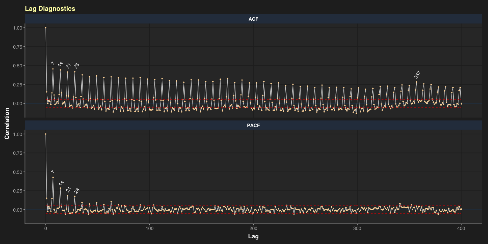
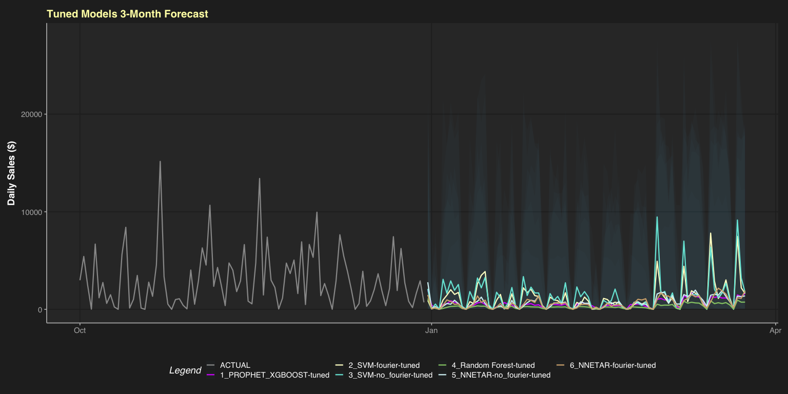

-   [🥅 Project Goal](#goal)
-   [🗂 Obtain Data](#data)
-   [🛁 Clean Data](#clean)
-   [🔭 Explore Data](#explore)
-   [🧮 Prep Data for Forecasting](#prep)
-   [🏗 Build Workflows](#build)
-   [🔧 Tune Models](#tune)
-   [🏆 Forecast w/ Best Models](#forecast)
-   [🏁 Ensemble & Save Work](#ensemble)
-   [🤔 Decisions](#decisions)

## 🥅 Goal of this Project

For this blog post, I use the `{modeltime}` package to forecast 3 months
of daily sales in Q1 for a young ‘Superstore’ company selling furniture,
technology, and office supplies. The forecast can then be used to make
decisions about supply-chain orders, warehouse inventory, and if/when
new employees are needed to meet predicted sales demand after the
holiday season.

## 🗂 Obtain Data

The [Superstore Sales
Dataset](https://www.kaggle.com/rohitsahoo/sales-forecasting/) on Kaggle
is relatively unexplored. There’s a couple python exploratory data
analysis projects posted but nothing using R and only one 7-day forecast
using a simple SARIMAX model.

``` r
library(tidyverse)
library(tidymodels)
library(modeltime)
library(modeltime.ensemble)
library(modeltime.resample)
library(timetk)
library(lubridate)
library(scales)

df <- read_csv("train.csv")
```

## 🛁 Clean Data

``` r
glimpse(df)
```
``` r
# Rows: 9,800
# Columns: 18
# $ `Row ID`        <dbl> 1, 2, 3, 4, 5, 6, 7, 8, 9, 10, 11, 12, 13, 14, 15, 16, 17, 18, 19, 20, 21, …
# $ `Order ID`      <chr> "CA-2017-152156", "CA-2017-152156", "CA-2017-138688", "US-2016-108966", "US…
# $ `Order Date`    <chr> "08/11/2017", "08/11/2017", "12/06/2017", "11/10/2016", "11/10/2016", "09/0…
# $ `Ship Date`     <chr> "11/11/2017", "11/11/2017", "16/06/2017", "18/10/2016", "18/10/2016", "14/0…
# $ `Ship Mode`     <chr> "Second Class", "Second Class", "Second Class", "Standard Class", "Standard…
# $ `Customer ID`   <chr> "CG-12520", "CG-12520", "DV-13045", "SO-20335", "SO-20335", "BH-11710", "BH…
# $ `Customer Name` <chr> "Claire Gute", "Claire Gute", "Darrin Van Huff", "Sean O'Donnell", "Sean O'…
# $ Segment         <chr> "Consumer", "Consumer", "Corporate", "Consumer", "Consumer", "Consumer", "C…
# $ Country         <chr> "United States", "United States", "United States", "United States", "United…
# $ City            <chr> "Henderson", "Henderson", "Los Angeles", "Fort Lauderdale", "Fort Lauderdal…
# $ State           <chr> "Kentucky", "Kentucky", "California", "Florida", "Florida", "California", "…
# $ `Postal Code`   <dbl> 42420, 42420, 90036, 33311, 33311, 90032, 90032, 90032, 90032, 90032, 90032…
# $ Region          <chr> "South", "South", "West", "South", "South", "West", "West", "West", "West",…
# $ `Product ID`    <chr> "FUR-BO-10001798", "FUR-CH-10000454", "OFF-LA-10000240", "FUR-TA-10000577",…
# $ Category        <chr> "Furniture", "Furniture", "Office Supplies", "Furniture", "Office Supplies"…
# $ `Sub-Category`  <chr> "Bookcases", "Chairs", "Labels", "Tables", "Storage", "Furnishings", "Art",…
# $ `Product Name`  <chr> "Bush Somerset Collection Bookcase", "Hon Deluxe Fabric Upholstered Stackin…
# $ Sales           <dbl> 261.9600, 731.9400, 14.6200, 957.5775, 22.3680, 48.8600, 7.2800, 907.1520, …
``` 

After a little digging a few things become obvious. There are two date
variables, but lets only use `Order Date` going forward. It seems
`Order Date` format is day/month/year. They only ship within the United
States. We don’t need individual `order_id` numbers. Let’s clean up
column names, format the date, factor the categorical variables, and
remove what we definitely don’t need.

``` r
data_clean_tbl <- janitor::clean_names(df) %>% 
                  as_tibble() %>% 
                  mutate(order_date = lubridate::dmy(order_date),
                         across(customer_id:product_name, .fns = as.factor)) %>% 
                  select(-c(ship_date, country, order_id, ship_mode))

glimpse(data_clean_tbl)
```

    # Rows: 9,800
    # Columns: 14
    # $ row_id        <dbl> 1, 2, 3, 4, 5, 6, 7, 8, 9, 10, 11, 12, 13, 14, 15, 16, 17, 18, 19, 20, 21, 22…
    # $ order_date    <date> 2017-11-08, 2017-11-08, 2017-06-12, 2016-10-11, 2016-10-11, 2015-06-09, 2015…
    # $ customer_id   <fct> CG-12520, CG-12520, DV-13045, SO-20335, SO-20335, BH-11710, BH-11710, BH-1171…
    # $ customer_name <fct> Claire Gute, Claire Gute, Darrin Van Huff, Sean O'Donnell, Sean O'Donnell, Br…
    # $ segment       <fct> Consumer, Consumer, Corporate, Consumer, Consumer, Consumer, Consumer, Consum…
    # $ city          <fct> Henderson, Henderson, Los Angeles, Fort Lauderdale, Fort Lauderdale, Los Ange…
    # $ state         <fct> Kentucky, Kentucky, California, Florida, Florida, California, California, Cal…
    # $ postal_code   <fct> 42420, 42420, 90036, 33311, 33311, 90032, 90032, 90032, 90032, 90032, 90032, …
    # $ region        <fct> South, South, West, South, South, West, West, West, West, West, West, West, S…
    # $ product_id    <fct> FUR-BO-10001798, FUR-CH-10000454, OFF-LA-10000240, FUR-TA-10000577, OFF-ST-10…
    # $ category      <fct> Furniture, Furniture, Office Supplies, Furniture, Office Supplies, Furniture,…
    # $ sub_category  <fct> Bookcases, Chairs, Labels, Tables, Storage, Furnishings, Art, Phones, Binders…
    # $ product_name  <fct> "Bush Somerset Collection Bookcase", "Hon Deluxe Fabric Upholstered Stacking …
    # $ sales         <dbl> 261.9600, 731.9400, 14.6200, 957.5775, 22.3680, 48.8600, 7.2800, 907.1520, 18…

What period of time does this data cover?

``` r
t <- summarise_by_time(.data     = data_clean_tbl,
                       .date_var = order_date)

(diff_t <- difftime(last(t$order_date),
                    first(t$order_date),
                    units = 'weeks'))

# Time difference of 208.1429 weeks
```

``` r
lubridate::dweeks(208.1429)

# [1] "125884825.92s (~3.99 years)"
```
This is a daily dataset spanning just under 4 years from 2015-01-03 to
2018-12-30. There are gaps though!

## 🔭 Exploratory Data Analysis

Let’s group by `region`/`state` to see where the ‘Superstore’ does
business, looking at total `orders` and total `sales`.

``` r
q <- data_clean_tbl %>%
     group_by(region,state) %>%
     summarise(orders = n(), sales = sum(sales)) %>%
     ungroup() %>%
     mutate(state = tidytext::reorder_within(state, orders, region)) %>%
     arrange(desc(sales))
```

``` r
ggplot(q, aes(reorder_within(state, sales, region, sep = ""), sales, fill = region)) +
   geom_col(show.legend = FALSE, alpha = 0.9) +
   facet_grid(region ~., scales = 'free', space = 'free') +
   coord_flip() +
   tidytext::scale_x_reordered() +  # gets rid of the ___region
   scale_y_continuous(limits = c(0,500000), expand = c(0,0), labels=dollar_format(prefix="$")) +
   theme_dark_grey() +
   scale_color_todd_dark_subtle() +
   scale_fill_todd_dark() +
   theme(panel.grid.major.y = element_blank(),
         panel.grid.major.x = element_blank()) +
   geom_hline(yintercept = c(100000,200000,300000,400000),
              color      = "#FFCF6A",
              alpha      = 0.1,
              size       = 1) +
   labs(x = element_blank(), title = 'Sales by State/Region') +
   geom_text(aes(label = dollar(round((sales)))),
             color="white", size=3.5, fontface = 'bold',
             hjust = -0.1, vjust = 0.4)
```


Looks like the do business throughout the US, with the most business
coming from California. They probably do most of their business from
online shopping, as these total sale numbers aren’t high enough for
multiple warehouses spread across the country.

Lets also look at number of `orders` and `sales` grouped by
`customer_name`, `category`, and `segment`. Any outliers?

``` r
# Want to identify any outlier customers, and see if any category/segment of their business dominates
x <- data_clean_tbl %>%
     group_by(customer_name, category, segment) %>%
     summarise(sales  = sum(sales),
                orders = n()) %>%
     mutate(log_sales = log(sales))

# outlier_seth_vernon
x %>% filter(segment  == 'Consumer',
             category == "Furniture") %>%
      arrange(desc(orders)) %>% head()

## A tibble: 6 × 6
## Groups:   customer_name, category [6]
#  customer_name   category  segment  sales orders log_sales
#  <fct>           <fct>     <fct>    <dbl>  <int>     <dbl>
#1 Seth Vernon     Furniture Consumer 8332.     15      9.03
#2 Caroline Jumper Furniture Consumer 6267.      9      8.74
#3 Joel Eaton      Furniture Consumer 4423.      9      8.39
#4 Lena Creighton  Furniture Consumer 2641.      9      7.88
#5 Anna Andreadi   Furniture Consumer 3751.      8      8.23
#6 Anne McFarland  Furniture Consumer 3557.      8      8.18
```

``` r
# outlier_2 
x %>% filter(segment  == 'Corporate' | segment == "Home Office",
             category == "Technology") %>%
      arrange(desc(log_sales)) %>% head()

## A tibble: 6 × 6
## Groups:   customer_name, category [6]
#  customer_name  category   segment      sales orders log_sales
#  <fct>          <fct>      <fct>        <dbl>  <int>     <dbl>
#1 Sean Miller    Technology Home Office 23482.      3     10.1 
#2 Tamara Chand   Technology Corporate   17998.      2      9.80
#3 Tom Ashbrook   Technology Home Office 13710.      4      9.53
#4 Bill Shonely   Technology Corporate    9107.      2      9.12
#5 Todd Sumrall   Technology Corporate    8804.      4      9.08
#6 Grant Thornton Technology Corporate    8000.      1      8.99
```

``` r
# Make specific tbl for outlier Seth Vernon so label doesn't appear in other facets
seth_vernon <- data.frame(category = factor("Furniture", 
                                            levels = c("Furniture","Office Supplies","Technology")), 
                          segment  = factor("Consumer", 
                                            levels = c("Consumer","Corporate","Home Office")))
```

``` r
ggplot(x, aes(log(sales), orders, color = category)) +
   geom_jitter(aes(shape = segment),
               alpha       = 0.7,
               width       = 0,
               height      = 0.3,
               show.legend = FALSE,
               size        = 2) +
   theme_dark_grey() +
   scale_color_manual(values = c("#fbb4ae", "#b3cde3", "#fed9a6")) +
   facet_grid(segment~category, scales = 'free_y') +
   labs(title = "Orders & Sales in log($) per Customer by Category/Segment",
        x     = 'log($)') +
   geom_curve(aes(x = 7, xend = 8.9, y = 18, yend = 16),
              data      = seth_vernon,
              curvature = -0.5,
              size      = 1,
              arrow     = arrow(length = unit(2, "mm")),
              color     = 'white',
              alpha     = 0.7) +
   geom_text(aes(x = 6.5, y = 15),
             data        = seth_vernon ,
             label       = "Seth Vernon\n15 Orders\nTotal = $8,332",
             size        = 3.5,
             show.legend = F,
             color       = 'white',
             alpha       = 0.7)
```

-per-Customer-by-Category-Segment-1.png)

Their sales are spread pretty evenly between these categories. More
orders are for office supplies, but their largest sales are for
technology; not surprising. They have a some loyal customers too, like
Seth Vernon.

## 🧮 Prep Data for Forecasting

Now lets focus on sales within this time-series. If we want to forecast
sales, we can’t use any other variable but `order_date`. After
2018-12-30 we don’t have any information about the number of orders or
where those orders are coming from. We could build models using , for
example, `orders` as an independent variable to predict sales, but only
until 2018-12-30. After that, the models will break down since we don’t
have values for `orders` to predict `sales` with.

This is when we really start using `{timetk}` and `{modeltime}`.
Hopefully you can appreciate how well they work alongside `{tidyverse}`
and `{tidymodels}` packages. No more learning unique processes for every
type of model you want to build.

``` r
sales_daily_tbl <- data_clean_tbl %>% 
                   summarise_by_time(.date_var = order_date, 
                                     .by       = 'day', 
                                     sales     = sum(sales))
```

Let’s look at the daily total sales for this company over the
time-series.

``` r
sales_daily_tbl %>% 
   plot_time_series(.date_var     = order_date,
                    .value        = sales,
                    .interactive  = FALSE,
                    .line_color   = "#cccccc",
                    .smooth_color = "#db0000",
                    .title        = "Daily Total Sales",
                    .y_lab        = "$") +
   theme_dark_grey()
```


There are no days with 0 orders/sales. But in our EDA we noticed gaps in
the data. This data spans just under 4 years, but we only have 1,230
rows of daily data. If we have a row for every day, we should have about
365 \* 4 or 1,460 rows. We need to pad these missing days so our
time-series is complete. We can fill sales with 0 for these missing
days.

### Pad Missing Dates

``` r
sales_daily_pad_tbl <- sales_daily_tbl %>% 
                       pad_by_time(order_date, 
                                   .by        = 'day', 
                                   .pad_value = 0) 

glimpse(sales_daily_pad_tbl)
```

    # Rows: 1,458
    # Columns: 2
    # $ order_date <date> 2015-01-03, 2015-01-04, 2015-01-05, 2015-01-06, 2015-01-07, 2015-01-08, 2015-01…
    # $ sales      <dbl> 16.448, 288.060, 19.536, 4407.100, 87.158, 0.000, 40.544, 54.830, 9.940, 0.000, …

1,458 rows, great! Now we have a full 4-year daily dataset with no
missing dates.

Our sales variable ranges from 0 to \~ 30,000 on any given day, so we’ll
need to transform this continuous variable. And since 0’s can mess up
our machine learning models, we’ll use a log10 + 1 transformation,
followed by standardization that centers our data around 0. We could do
this at each recipe stage of our workflows, but we can do it here once
and be done with it. Lets also change sales to sales_trans.

### Transform `sales`

``` r
sales_daily_pad_trans_tbl <- sales_daily_pad_tbl %>%
                             mutate(sales = log_interval_vec(sales, 
                                                             limit_lower = 0, 
                                                             offset      = 1)) %>%
                             mutate(sales = standardize_vec(sales)) %>%
                             rename(sales_trans = sales)
```

We need to keep track of the Standardization Parameters for when we
un-transform the data at the end.

``` r
limit_lower <-  0
limit_upper <-  30918.3876
offset <-  1
std_mean_sales <- -4.61074359571939
std_sd_sales <- 2.86059320652223
```

Let’s look at our new padded & transformed time-series.

``` r
sales_daily_pad_trans_tbl %>% 
   plot_time_series(order_date,
                    sales_trans,
                    .interactive  = FALSE,
                    .line_color   = "#cccccc",
                    .smooth_color = "#db0000",
                    .title        = "Daily Total Sales, Padded & Transformed",
                    .y_lab        = "Sales") +
   theme_dark_grey()
```


We might want to add lags, rolling lags, and/or fourier-series features
that could help our forecast. This is way to add features to regress on
for the future dates we want to forecast. Currently future forecast
dates have only `order_date` to predict with.

Let’s look at ACF/PACF plots to see if any periods look usable.

### ACF/PACF

``` r
lag_labels <- data.frame(name  = c("ACF","ACF","ACF","ACF","ACF","PACF","PACF","PACF","PACF"),
                         label = c('7','14','21','28','357','7','14','21','28'))

sales_daily_pad_trans_tbl %>%
   plot_acf_diagnostics(.date_var = order_date, .value = sales_trans, .lags = 400,
                        .show_white_noise_bars = TRUE, .interactive = FALSE, .line_color = "#cccccc",
                        .line_size = 0.5, .white_noise_line_color = "#db0000", .point_color = "#fed9a6",
                        .point_size = 0.8) +
   theme_dark_grey() +
   geom_text(aes(label = label),
             data  = lag_labels,
             x     = c(7, 14, 21.7, 29.5, 358, 7, 15, 22, 30),
             y     = c(.53, .52, .5, .5, .38,.5, .35, .27, .25),
             size  = 4,
             color = "white",
             angle = 55)
```



Clearly there is a strong weekly correlation of sales vs sales 7d, 14d,
21d, … later. The Partial Auto Correlation Features (PACF) de-weights
the correlation values depending on the values that come before it. Our
PACF shows lags 7, 14, 21, and 28 as potentially important lags. All
other lags can be considered white noise or close to white noise.

I experimented with multiple lag and Fourier-Series combos. A lag the
length of my forecast (84 days) with rolling 30d, 60d, and 90d averages
helped. Additional lags and Fourier-Series did not improve model
accuracy. It’s possible I didn’t use them correctly, or experiment
enough. I’ll include multiple Fourier-Series with 3 orders each to show
the process.

### Add Forecast/Lag/Rolling Averages

``` r
forecast_3_month <- 84
lag_period       <- 84            # 84 smallest lag period to get our forecast of 84 into the future
rolling_periods  <- c(30, 60, 90) # 1 month, 2 month, and 3 month moving averages as features to catch the trend
```

### Full Data

``` r
full_data_prepared_tbl <- sales_daily_pad_trans_tbl %>% 
                          future_frame(.date_var   = order_date, 
                                       .length_out = forecast_3_month, 
                                       .bind_data  = TRUE) %>% 
                          tk_augment_fourier(.date_var = order_date,
                                             .periods  = c(7,14,21,28,357),
                                             .K        = 3) %>% 
                          tk_augment_lags(.value = sales_trans,
                                          .lags  = lag_period ) %>% 
                          tk_augment_slidify(.value   = sales_trans_lag84,
                                             .f       = ~ mean(.x, na.rm = TRUE),
                                             .period  = rolling_periods,
                                             .partial = TRUE,
                                             .align   = 'center') %>% 
                          rowid_to_column(var = 'rowid') %>% 
                          rename_with(.cols = contains('lag'), 
                                      .fn   = ~ str_c('lag_', .)) %>% 
                          rename_with(.cols = matches('(_sin)|(_cos)'), 
                                      .fn   = ~ str_c('fourier_', .))

glimpse(full_data_prepared_tbl)
```

    # Rows: 1,542
    # Columns: 37
    # $ rowid                         <int> 1, 2, 3, 4, 5, 6, 7, 8, 9, 10, 11, 12, 13, 14, 15, 16, 17, 18…
    # $ order_date                    <date> 2015-01-03, 2015-01-04, 2015-01-05, 2015-01-06, 2015-01-07, …
    # $ sales_trans                   <dbl> -1.002789645, -0.018295287, -0.945789456, 0.984639996, -0.435…
    # $ fourier_order_date_sin7_K1    <dbl> 9.749279e-01, 4.338837e-01, -4.338837e-01, -9.749279e-01, -7.…
    # $ fourier_order_date_cos7_K1    <dbl> -0.2225209, -0.9009689, -0.9009689, -0.2225209, 0.6234898, 1.…
    # $ fourier_order_date_sin7_K2    <dbl> -4.338837e-01, -7.818315e-01, 7.818315e-01, 4.338837e-01, -9.…
    # $ fourier_order_date_cos7_K2    <dbl> -0.9009689, 0.6234898, 0.6234898, -0.9009689, -0.2225209, 1.0…
    # $ fourier_order_date_sin7_K3    <dbl> -7.818315e-01, 9.749279e-01, -9.749279e-01, 7.818315e-01, -4.…
    # $ fourier_order_date_cos7_K3    <dbl> 0.6234898, -0.2225209, -0.2225209, 0.6234898, -0.9009689, 1.0…
    # $ fourier_order_date_sin14_K1   <dbl> 7.818315e-01, 9.749279e-01, 9.749279e-01, 7.818315e-01, 4.338…
    # $ fourier_order_date_cos14_K1   <dbl> 0.6234898, 0.2225209, -0.2225209, -0.6234898, -0.9009689, -1.…
    # $ fourier_order_date_sin14_K2   <dbl> 9.749279e-01, 4.338837e-01, -4.338837e-01, -9.749279e-01, -7.…
    # $ fourier_order_date_cos14_K2   <dbl> -0.2225209, -0.9009689, -0.9009689, -0.2225209, 0.6234898, 1.…
    # $ fourier_order_date_sin14_K3   <dbl> 4.338837e-01, -7.818315e-01, -7.818315e-01, 4.338837e-01, 9.7…
    # $ fourier_order_date_cos14_K3   <dbl> -0.9009689, -0.6234898, 0.6234898, 0.9009689, -0.2225209, -1.…
    # $ fourier_order_date_sin21_K1   <dbl> -9.972038e-01, -9.308737e-01, -7.818315e-01, -5.633201e-01, -…
    # $ fourier_order_date_cos21_K1   <dbl> 0.07473009, 0.36534102, 0.62348980, 0.82623877, 0.95557281, 1…
    # $ fourier_order_date_sin21_K2   <dbl> -1.490423e-01, -6.801727e-01, -9.749279e-01, -9.308737e-01, -…
    # $ fourier_order_date_cos21_K2   <dbl> -0.98883083, -0.73305187, -0.22252093, 0.36534102, 0.82623877…
    # $ fourier_order_date_sin21_K3   <dbl> 9.749279e-01, 4.338837e-01, -4.338837e-01, -9.749279e-01, -7.…
    # $ fourier_order_date_cos21_K3   <dbl> -0.2225209, -0.9009689, -0.9009689, -0.2225209, 0.6234898, 1.…
    # $ fourier_order_date_sin28_K1   <dbl> 4.338837e-01, 6.234898e-01, 7.818315e-01, 9.009689e-01, 9.749…
    # $ fourier_order_date_cos28_K1   <dbl> 9.009689e-01, 7.818315e-01, 6.234898e-01, 4.338837e-01, 2.225…
    # $ fourier_order_date_sin28_K2   <dbl> 7.818315e-01, 9.749279e-01, 9.749279e-01, 7.818315e-01, 4.338…
    # $ fourier_order_date_cos28_K2   <dbl> 0.6234898, 0.2225209, -0.2225209, -0.6234898, -0.9009689, -1.…
    # $ fourier_order_date_sin28_K3   <dbl> 9.749279e-01, 9.009689e-01, 4.338837e-01, -2.225209e-01, -7.8…
    # $ fourier_order_date_cos28_K3   <dbl> 2.225209e-01, -4.338837e-01, -9.009689e-01, -9.749279e-01, -6…
    # $ fourier_order_date_sin357_K1  <dbl> 0.2778924, 0.2947552, 0.3115267, 0.3282017, 0.3447751, 0.3612…
    # $ fourier_order_date_cos357_K1  <dbl> 0.9606122, 0.9555728, 0.9502374, 0.9446077, 0.9386853, 0.9324…
    # $ fourier_order_date_sin357_K2  <dbl> 0.5338936, 0.5633201, 0.5920486, 0.6200437, 0.6472706, 0.6736…
    # $ fourier_order_date_cos357_K2  <dbl> 0.84555168, 0.82623877, 0.80590223, 0.78456725, 0.76226027, 0…
    # $ fourier_order_date_sin357_K3  <dbl> 0.7478370, 0.7818315, 0.8136468, 0.8431944, 0.8703918, 0.8951…
    # $ fourier_order_date_cos357_K3  <dbl> 0.66388234, 0.62348980, 0.58135949, 0.53760882, 0.49235973, 0…
    # $ lag_sales_trans_lag84         <dbl> NA, NA, NA, NA, NA, NA, NA, NA, NA, NA, NA, NA, NA, NA, NA, N…
    # $ lag_sales_trans_lag84_roll_30 <dbl> NaN, NaN, NaN, NaN, NaN, NaN, NaN, NaN, NaN, NaN, NaN, NaN, N…
    # $ lag_sales_trans_lag84_roll_60 <dbl> NaN, NaN, NaN, NaN, NaN, NaN, NaN, NaN, NaN, NaN, NaN, NaN, N…
    # $ lag_sales_trans_lag84_roll_90 <dbl> NaN, NaN, NaN, NaN, NaN, NaN, NaN, NaN, NaN, NaN, NaN, NaN, N…

The time-series now includes lag, rolling_lag and fourier-series data in
future forecast dates. If these features help model accuracy on the
training/testing sets, we can assume they’ll help the models forecast
future sales. They may or may not help though. Gotta experiment. Let’s
look at the lag and rolling lags data.

``` r
full_data_prepared_tbl %>%
   pivot_longer(c(sales_trans,
                  lag_sales_trans_lag84,
                  lag_sales_trans_lag84_roll_30,
                  lag_sales_trans_lag84_roll_60,
                  lag_sales_trans_lag84_roll_90)) %>%
   plot_time_series(order_date, value, name, .interactive = FALSE, 
                    .smooth = FALSE, .title = "30d, 60d, 90d Rolling Lags") +
   theme_dark_grey() +
   scale_color_manual(values = c("#cccccc","#db0000", "#0099ff", "#00ff99", "#ffffcc"))
```


Notice each of the first 84 days lacks at least some of the lag/rolling
lag features. We can’t use these days in our testing/training splits.
That’s the downside. We probably could pad those dates somehow, but I
won’t try here.

The `full_data_prepared_tbl` has 1542 rows (1458 original days + 84
future days). We need to separate rows for future days so we can split
the original data into training/testing sets. Filter using days lacking
`sales_trans` values.

### Forecast Data

We can use `{skimr}` to show us a summary of our data.

``` r
forecast_tbl <- full_data_prepared_tbl %>% 
                filter(is.na(sales_trans))

skimr::skim_without_charts(forecast_tbl)
```

|                                                  |              |
|:-------------------------------------------------|:-------------|
| Name                                             | forecast_tbl |
| Number of rows                                   | 84           |
| Number of columns                                | 37           |
| \_\_\_\_\_\_\_\_\_\_\_\_\_\_\_\_\_\_\_\_\_\_\_   |              |
| Column type frequency:                           |              |
| Date                                             | 1            |
| numeric                                          | 36           |
| \_\_\_\_\_\_\_\_\_\_\_\_\_\_\_\_\_\_\_\_\_\_\_\_ |              |
| Group variables                                  | None         |

Data summary

**Variable type: Date**

| skim_variable | n_missing | complete_rate | min        | max        | median     | n_unique |
|:--------------|----------:|--------------:|:-----------|:-----------|:-----------|---------:|
| order_date    |         0 |             1 | 2018-12-31 | 2019-03-24 | 2019-02-10 |       84 |

**Variable type: numeric**

| skim_variable                 | n_missing | complete_rate |    mean |    sd |      p0 |     p25 |     p50 |     p75 |    p100 |
|:------------------------------|----------:|--------------:|--------:|------:|--------:|--------:|--------:|--------:|--------:|
| rowid                         |         0 |             1 | 1500.50 | 24.39 | 1459.00 | 1479.75 | 1500.50 | 1521.25 | 1542.00 |
| sales_trans                   |        84 |             0 |     NaN |    NA |      NA |      NA |      NA |      NA |      NA |
| fourier_order_date_sin7_K1    |         0 |             1 |    0.00 |  0.71 |   -0.97 |   -0.78 |    0.00 |    0.78 |    0.97 |
| fourier_order_date_cos7_K1    |         0 |             1 |    0.00 |  0.71 |   -0.90 |   -0.90 |   -0.22 |    0.62 |    1.00 |
| fourier_order_date_sin7_K2    |         0 |             1 |    0.00 |  0.71 |   -0.97 |   -0.78 |    0.00 |    0.78 |    0.97 |
| fourier_order_date_cos7_K2    |         0 |             1 |    0.00 |  0.71 |   -0.90 |   -0.90 |   -0.22 |    0.62 |    1.00 |
| fourier_order_date_sin7_K3    |         0 |             1 |    0.00 |  0.71 |   -0.97 |   -0.78 |    0.00 |    0.78 |    0.97 |
| fourier_order_date_cos7_K3    |         0 |             1 |    0.00 |  0.71 |   -0.90 |   -0.90 |   -0.22 |    0.62 |    1.00 |
| fourier_order_date_sin14_K1   |         0 |             1 |    0.00 |  0.71 |   -0.97 |   -0.78 |    0.00 |    0.78 |    0.97 |
| fourier_order_date_cos14_K1   |         0 |             1 |    0.00 |  0.71 |   -1.00 |   -0.62 |    0.00 |    0.62 |    1.00 |
| fourier_order_date_sin14_K2   |         0 |             1 |    0.00 |  0.71 |   -0.97 |   -0.78 |    0.00 |    0.78 |    0.97 |
| fourier_order_date_cos14_K2   |         0 |             1 |    0.00 |  0.71 |   -0.90 |   -0.90 |   -0.22 |    0.62 |    1.00 |
| fourier_order_date_sin14_K3   |         0 |             1 |    0.00 |  0.71 |   -0.97 |   -0.78 |    0.00 |    0.78 |    0.97 |
| fourier_order_date_cos14_K3   |         0 |             1 |    0.00 |  0.71 |   -1.00 |   -0.62 |    0.00 |    0.62 |    1.00 |
| fourier_order_date_sin21_K1   |         0 |             1 |    0.00 |  0.71 |   -1.00 |   -0.68 |    0.00 |    0.68 |    1.00 |
| fourier_order_date_cos21_K1   |         0 |             1 |    0.00 |  0.71 |   -0.99 |   -0.73 |    0.07 |    0.62 |    1.00 |
| fourier_order_date_sin21_K2   |         0 |             1 |    0.00 |  0.71 |   -1.00 |   -0.68 |    0.00 |    0.68 |    1.00 |
| fourier_order_date_cos21_K2   |         0 |             1 |    0.00 |  0.71 |   -0.99 |   -0.73 |    0.07 |    0.62 |    1.00 |
| fourier_order_date_sin21_K3   |         0 |             1 |    0.00 |  0.71 |   -0.97 |   -0.78 |    0.00 |    0.78 |    0.97 |
| fourier_order_date_cos21_K3   |         0 |             1 |    0.00 |  0.71 |   -0.90 |   -0.90 |   -0.22 |    0.62 |    1.00 |
| fourier_order_date_sin28_K1   |         0 |             1 |    0.00 |  0.71 |   -1.00 |   -0.66 |    0.00 |    0.66 |    1.00 |
| fourier_order_date_cos28_K1   |         0 |             1 |    0.00 |  0.71 |   -1.00 |   -0.66 |    0.00 |    0.66 |    1.00 |
| fourier_order_date_sin28_K2   |         0 |             1 |    0.00 |  0.71 |   -0.97 |   -0.78 |    0.00 |    0.78 |    0.97 |
| fourier_order_date_cos28_K2   |         0 |             1 |    0.00 |  0.71 |   -1.00 |   -0.62 |    0.00 |    0.62 |    1.00 |
| fourier_order_date_sin28_K3   |         0 |             1 |    0.00 |  0.71 |   -1.00 |   -0.66 |    0.00 |    0.66 |    1.00 |
| fourier_order_date_cos28_K3   |         0 |             1 |    0.00 |  0.71 |   -1.00 |   -0.66 |    0.00 |    0.66 |    1.00 |
| fourier_order_date_sin357_K1  |         0 |             1 |    0.91 |  0.08 |    0.72 |    0.85 |    0.93 |    0.98 |    1.00 |
| fourier_order_date_cos357_K1  |         0 |             1 |    0.03 |  0.41 |   -0.64 |   -0.33 |    0.03 |    0.39 |    0.69 |
| fourier_order_date_sin357_K2  |         0 |             1 |    0.04 |  0.69 |   -0.99 |   -0.62 |    0.06 |    0.71 |    1.00 |
| fourier_order_date_cos357_K2  |         0 |             1 |   -0.67 |  0.28 |   -1.00 |   -0.93 |   -0.74 |   -0.45 |   -0.05 |
| fourier_order_date_sin357_K3  |         0 |             1 |   -0.36 |  0.52 |   -1.00 |   -0.85 |   -0.45 |    0.09 |    0.65 |
| fourier_order_date_cos357_K3  |         0 |             1 |   -0.03 |  0.78 |   -1.00 |   -0.85 |   -0.09 |    0.84 |    1.00 |
| lag_sales_trans_lag84         |         0 |             1 |    0.53 |  0.76 |   -2.00 |    0.29 |    0.71 |    1.00 |    1.60 |
| lag_sales_trans_lag84_roll_30 |         0 |             1 |    0.54 |  0.16 |    0.22 |    0.46 |    0.57 |    0.64 |    0.81 |
| lag_sales_trans_lag84_roll_60 |         0 |             1 |    0.56 |  0.07 |    0.43 |    0.51 |    0.56 |    0.61 |    0.66 |
| lag_sales_trans_lag84_roll_90 |         0 |             1 |    0.55 |  0.06 |    0.45 |    0.51 |    0.53 |    0.61 |    0.66 |

The `forecast_tbl` has 37 columns and 84 rows for future dates starting
2018-12-31 and ending 2019-03-24. Rows are only missing `sales_trans`
data. Good to go.

### Training/Testing Data

The rest of the data we’ll call the `data_prepared_tbl`. We need to drop
those rows that lack any lag/rolling lag data.

``` r
data_prepared_tbl <- full_data_prepared_tbl %>% 
                     filter(!is.na(sales_trans)) %>% 
                     drop_na()

skimr::skim_without_charts(data_prepared_tbl)
```

|                                                  |                   |
|:-------------------------------------------------|:------------------|
| Name                                             | data_prepared_tbl |
| Number of rows                                   | 1374              |
| Number of columns                                | 37                |
| \_\_\_\_\_\_\_\_\_\_\_\_\_\_\_\_\_\_\_\_\_\_\_   |                   |
| Column type frequency:                           |                   |
| Date                                             | 1                 |
| numeric                                          | 36                |
| \_\_\_\_\_\_\_\_\_\_\_\_\_\_\_\_\_\_\_\_\_\_\_\_ |                   |
| Group variables                                  | None              |

Data summary

**Variable type: Date**

| skim_variable | n_missing | complete_rate | min        | max        | median     | n_unique |
|:--------------|----------:|--------------:|:-----------|:-----------|:-----------|---------:|
| order_date    |         0 |             1 | 2015-03-28 | 2018-12-30 | 2017-02-11 |     1374 |

**Variable type: numeric**

| skim_variable                 | n_missing | complete_rate |   mean |     sd |    p0 |    p25 |    p50 |     p75 |    p100 |
|:------------------------------|----------:|--------------:|-------:|-------:|------:|-------:|-------:|--------:|--------:|
| rowid                         |         0 |             1 | 771.50 | 396.78 | 85.00 | 428.25 | 771.50 | 1114.75 | 1458.00 |
| sales_trans                   |         0 |             1 |   0.04 |   0.98 | -2.00 |  -0.25 |   0.37 |    0.70 |    1.75 |
| fourier_order_date_sin7_K1    |         0 |             1 |   0.00 |   0.71 | -0.97 |  -0.78 |   0.00 |    0.78 |    0.97 |
| fourier_order_date_cos7_K1    |         0 |             1 |   0.00 |   0.71 | -0.90 |  -0.90 |  -0.22 |    0.62 |    1.00 |
| fourier_order_date_sin7_K2    |         0 |             1 |   0.00 |   0.71 | -0.97 |  -0.78 |   0.00 |    0.78 |    0.97 |
| fourier_order_date_cos7_K2    |         0 |             1 |   0.00 |   0.71 | -0.90 |  -0.90 |  -0.22 |    0.62 |    1.00 |
| fourier_order_date_sin7_K3    |         0 |             1 |   0.00 |   0.71 | -0.97 |  -0.78 |   0.00 |    0.78 |    0.97 |
| fourier_order_date_cos7_K3    |         0 |             1 |   0.00 |   0.71 | -0.90 |  -0.90 |  -0.22 |    0.62 |    1.00 |
| fourier_order_date_sin14_K1   |         0 |             1 |   0.00 |   0.71 | -0.97 |  -0.78 |   0.00 |    0.78 |    0.97 |
| fourier_order_date_cos14_K1   |         0 |             1 |   0.00 |   0.71 | -1.00 |  -0.62 |   0.22 |    0.62 |    1.00 |
| fourier_order_date_sin14_K2   |         0 |             1 |   0.00 |   0.71 | -0.97 |  -0.78 |   0.00 |    0.78 |    0.97 |
| fourier_order_date_cos14_K2   |         0 |             1 |   0.00 |   0.71 | -0.90 |  -0.90 |  -0.22 |    0.62 |    1.00 |
| fourier_order_date_sin14_K3   |         0 |             1 |   0.00 |   0.71 | -0.97 |  -0.78 |   0.00 |    0.78 |    0.97 |
| fourier_order_date_cos14_K3   |         0 |             1 |   0.00 |   0.71 | -1.00 |  -0.62 |  -0.22 |    0.62 |    1.00 |
| fourier_order_date_sin21_K1   |         0 |             1 |   0.00 |   0.71 | -1.00 |  -0.68 |   0.00 |    0.68 |    1.00 |
| fourier_order_date_cos21_K1   |         0 |             1 |   0.00 |   0.71 | -0.99 |  -0.73 |   0.07 |    0.62 |    1.00 |
| fourier_order_date_sin21_K2   |         0 |             1 |   0.00 |   0.71 | -1.00 |  -0.68 |   0.00 |    0.68 |    1.00 |
| fourier_order_date_cos21_K2   |         0 |             1 |   0.00 |   0.71 | -0.99 |  -0.73 |   0.07 |    0.62 |    1.00 |
| fourier_order_date_sin21_K3   |         0 |             1 |   0.00 |   0.71 | -0.97 |  -0.78 |   0.00 |    0.78 |    0.97 |
| fourier_order_date_cos21_K3   |         0 |             1 |   0.00 |   0.71 | -0.90 |  -0.90 |  -0.22 |    0.62 |    1.00 |
| fourier_order_date_sin28_K1   |         0 |             1 |   0.00 |   0.71 | -1.00 |  -0.62 |   0.00 |    0.62 |    1.00 |
| fourier_order_date_cos28_K1   |         0 |             1 |   0.00 |   0.71 | -1.00 |  -0.62 |   0.00 |    0.78 |    1.00 |
| fourier_order_date_sin28_K2   |         0 |             1 |   0.00 |   0.71 | -0.97 |  -0.78 |   0.00 |    0.78 |    0.97 |
| fourier_order_date_cos28_K2   |         0 |             1 |   0.00 |   0.71 | -1.00 |  -0.62 |   0.22 |    0.62 |    1.00 |
| fourier_order_date_sin28_K3   |         0 |             1 |   0.00 |   0.71 | -1.00 |  -0.62 |   0.00 |    0.78 |    1.00 |
| fourier_order_date_cos28_K3   |         0 |             1 |   0.00 |   0.71 | -1.00 |  -0.62 |   0.00 |    0.62 |    1.00 |
| fourier_order_date_sin357_K1  |         0 |             1 |  -0.04 |   0.70 | -1.00 |  -0.73 |  -0.06 |    0.64 |    1.00 |
| fourier_order_date_cos357_K1  |         0 |             1 |  -0.01 |   0.72 | -1.00 |  -0.73 |  -0.05 |    0.73 |    1.00 |
| fourier_order_date_sin357_K2  |         0 |             1 |  -0.02 |   0.71 | -1.00 |  -0.73 |  -0.04 |    0.69 |    1.00 |
| fourier_order_date_cos357_K2  |         0 |             1 |   0.03 |   0.70 | -1.00 |  -0.67 |   0.06 |    0.73 |    1.00 |
| fourier_order_date_sin357_K3  |         0 |             1 |   0.02 |   0.71 | -1.00 |  -0.69 |   0.03 |    0.73 |    1.00 |
| fourier_order_date_cos357_K3  |         0 |             1 |   0.02 |   0.71 | -1.00 |  -0.68 |   0.04 |    0.74 |    1.00 |
| lag_sales_trans_lag84         |         0 |             1 |  -0.03 |   1.00 | -2.00 |  -0.39 |   0.33 |    0.67 |    2.42 |
| lag_sales_trans_lag84_roll_30 |         0 |             1 |  -0.03 |   0.33 | -1.02 |  -0.23 |   0.00 |    0.21 |    0.64 |
| lag_sales_trans_lag84_roll_60 |         0 |             1 |  -0.03 |   0.29 | -0.83 |  -0.21 |   0.01 |    0.18 |    0.53 |
| lag_sales_trans_lag84_roll_90 |         0 |             1 |  -0.03 |   0.26 | -0.83 |  -0.18 |   0.00 |    0.16 |    0.46 |

37 columns, 1374 rows, no missing data. Dates now range from 2015-03-28
to 2018-12-30. Good to go.

I decided to split training/testing so we’re testing on the last 84
days, the same amount of days in our `forecast_tbl`. Could have split
differently. Cross-Validation for sequential models need to be ordered,
so making the testing set too big limits the benefit of time-series
cross-validation. That’ll make sense soon.

``` r
splits <- data_prepared_tbl %>% 
          time_series_split(date_var   = order_date,
                            assess     = 84,
                            cumulative = TRUE)
```

``` r
splits %>%
   tk_time_series_cv_plan() %>%
   plot_time_series_cv_plan(.date_var    = order_date,
                            .value       = sales_trans,
                            .smooth      = FALSE,
                            .interactive = FALSE,
                            .title       = "Initial Cross-Validation Plan",
                            .y_lab       = "Sales") +
   theme_dark_grey() +
   scale_color_manual(values = c("#cccccc", "#db0000"))
```


`{modeltime}` was built to complement `{tidymodels}`, so the recipes,
workflows, hyperparameter tuning, etc. all work the same.

I’m going to make two recipes for modeling workflows. One recipe will
include the Fourier-Series, and one will lack Fourier-Series. I could
have done this differently, but it works.

The `step_timeseries_signature()` function adds many time-series
features based on our date variable, `order_date`. We just have to
remove features we can’t use with our daily dataset, like features
involving minutes, hours, etc. I also added steps to normalize numeric
variables and dummy the nominal variables.

``` r
recipe_spec <- recipe(sales_trans ~ ., data = training(splits)) %>% 
               step_timeseries_signature(order_date) %>% 
               update_role(rowid, new_role = 'indicator') %>% 
               step_rm(matches("(.iso)|(xts)|(hour)|(minute)|(second)|(am.pm)")) %>% 
               step_normalize(matches('(index.num)|(year)|(yday)|(qday)|(mday)|(date_day)')) %>% 
               step_dummy(all_nominal(), one_hot = TRUE) %>% 
               step_holiday(order_date, holidays = timeDate::listHolidays("US")) 
```

`recipe_spec` uses all the Fourier-Series found in our
`data_prepared_tbl`.

``` r
recipe_spec_no_f <- recipe(sales_trans ~ order_date 
                           + lag_sales_trans_lag84
                           + lag_sales_trans_lag84_roll_30
                           + lag_sales_trans_lag84_roll_60
                           + lag_sales_trans_lag84_roll_90, 
                           data = training(splits)) %>% 
   step_timeseries_signature(order_date) %>% 
   step_rm(matches("(.iso)|(xts)|(hour)|(minute)|(second)|(am.pm)")) %>% 
   step_normalize(matches('(index.num)|(year)|(yday)|(qday)|(mday)|(date_day)')) %>% 
   step_dummy(all_nominal(), one_hot = TRUE) %>% 
   step_holiday(order_date, holidays = timeDate::listHolidays("US")) 
```

`recipe_spec_no_f` does NOT use the Fourier-Series found in our
`data_prepared_tbl`.

``` r
recipe_spec_no_f %>% prep() %>% juice() %>% glimpse()
```

    # Rows: 1,290
    # Columns: 58
    # $ order_date                         <date> 2015-03-28, 2015-03-29, 2015-03-30, 2015-03-31, 2015-04…
    # $ lag_sales_trans_lag84              <dbl> -1.002789645, -0.018295287, -0.945789456, 0.984639996, -…
    # $ lag_sales_trans_lag84_roll_30      <dbl> -0.6456698, -0.6031017, -0.5258254, -0.6035450, -0.67349…
    # $ lag_sales_trans_lag84_roll_60      <dbl> -0.6811990, -0.6723552, -0.6606234, -0.7000903, -0.67922…
    # $ lag_sales_trans_lag84_roll_90      <dbl> -0.7196151, -0.7196938, -0.7464189, -0.7394241, -0.74869…
    # $ sales_trans                        <dbl> 0.56999672, 0.38250608, 0.48107019, 0.67053534, -0.32496…
    # $ order_date_index.num               <dbl> -1.730038, -1.727353, -1.724669, -1.721985, -1.719300, -…
    # $ order_date_year                    <dbl> -1.419664, -1.419664, -1.419664, -1.419664, -1.419664, -…
    # $ order_date_half                    <int> 1, 1, 1, 1, 1, 1, 1, 1, 1, 1, 1, 1, 1, 1, 1, 1, 1, 1, 1,…
    # $ order_date_quarter                 <int> 1, 1, 1, 1, 2, 2, 2, 2, 2, 2, 2, 2, 2, 2, 2, 2, 2, 2, 2,…
    # $ order_date_month                   <int> 3, 3, 3, 3, 4, 4, 4, 4, 4, 4, 4, 4, 4, 4, 4, 4, 4, 4, 4,…
    # $ order_date_day                     <dbl> 1.38891404, 1.50196926, 1.61502448, 1.72807970, -1.66357…
    # $ order_date_wday                    <int> 7, 1, 2, 3, 4, 5, 6, 7, 1, 2, 3, 4, 5, 6, 7, 1, 2, 3, 4,…
    # $ order_date_mday                    <dbl> 1.38891404, 1.50196926, 1.61502448, 1.72807970, -1.66357…
    # $ order_date_qday                    <dbl> 1.5404251, 1.5780733, 1.6157216, 1.6533698, -1.6973219, …
    # $ order_date_yday                    <dbl> -0.9656001, -0.9555644, -0.9455288, -0.9354932, -0.92545…
    # $ order_date_mweek                   <int> 4, 4, 5, 5, 5, 1, 1, 1, 1, 2, 2, 2, 2, 2, 2, 2, 3, 3, 3,…
    # $ order_date_week                    <int> 13, 13, 13, 13, 13, 14, 14, 14, 14, 14, 14, 14, 15, 15, …
    # $ order_date_week2                   <int> 1, 1, 1, 1, 1, 0, 0, 0, 0, 0, 0, 0, 1, 1, 1, 1, 1, 1, 1,…
    # $ order_date_week3                   <int> 1, 1, 1, 1, 1, 2, 2, 2, 2, 2, 2, 2, 0, 0, 0, 0, 0, 0, 0,…
    # $ order_date_week4                   <int> 1, 1, 1, 1, 1, 2, 2, 2, 2, 2, 2, 2, 3, 3, 3, 3, 3, 3, 3,…
    # $ order_date_mday7                   <dbl> 1.6685116, 1.6685116, 1.6685116, 1.6685116, -1.4074155, …
    # $ order_date_month.lbl_01            <dbl> 0, 0, 0, 0, 0, 0, 0, 0, 0, 0, 0, 0, 0, 0, 0, 0, 0, 0, 0,…
    # $ order_date_month.lbl_02            <dbl> 0, 0, 0, 0, 0, 0, 0, 0, 0, 0, 0, 0, 0, 0, 0, 0, 0, 0, 0,…
    # $ order_date_month.lbl_03            <dbl> 1, 1, 1, 1, 0, 0, 0, 0, 0, 0, 0, 0, 0, 0, 0, 0, 0, 0, 0,…
    # $ order_date_month.lbl_04            <dbl> 0, 0, 0, 0, 1, 1, 1, 1, 1, 1, 1, 1, 1, 1, 1, 1, 1, 1, 1,…
    # $ order_date_month.lbl_05            <dbl> 0, 0, 0, 0, 0, 0, 0, 0, 0, 0, 0, 0, 0, 0, 0, 0, 0, 0, 0,…
    # $ order_date_month.lbl_06            <dbl> 0, 0, 0, 0, 0, 0, 0, 0, 0, 0, 0, 0, 0, 0, 0, 0, 0, 0, 0,…
    # $ order_date_month.lbl_07            <dbl> 0, 0, 0, 0, 0, 0, 0, 0, 0, 0, 0, 0, 0, 0, 0, 0, 0, 0, 0,…
    # $ order_date_month.lbl_08            <dbl> 0, 0, 0, 0, 0, 0, 0, 0, 0, 0, 0, 0, 0, 0, 0, 0, 0, 0, 0,…
    # $ order_date_month.lbl_09            <dbl> 0, 0, 0, 0, 0, 0, 0, 0, 0, 0, 0, 0, 0, 0, 0, 0, 0, 0, 0,…
    # $ order_date_month.lbl_10            <dbl> 0, 0, 0, 0, 0, 0, 0, 0, 0, 0, 0, 0, 0, 0, 0, 0, 0, 0, 0,…
    # $ order_date_month.lbl_11            <dbl> 0, 0, 0, 0, 0, 0, 0, 0, 0, 0, 0, 0, 0, 0, 0, 0, 0, 0, 0,…
    # $ order_date_month.lbl_12            <dbl> 0, 0, 0, 0, 0, 0, 0, 0, 0, 0, 0, 0, 0, 0, 0, 0, 0, 0, 0,…
    # $ order_date_wday.lbl_1              <dbl> 0, 1, 0, 0, 0, 0, 0, 0, 1, 0, 0, 0, 0, 0, 0, 1, 0, 0, 0,…
    # $ order_date_wday.lbl_2              <dbl> 0, 0, 1, 0, 0, 0, 0, 0, 0, 1, 0, 0, 0, 0, 0, 0, 1, 0, 0,…
    # $ order_date_wday.lbl_3              <dbl> 0, 0, 0, 1, 0, 0, 0, 0, 0, 0, 1, 0, 0, 0, 0, 0, 0, 1, 0,…
    # $ order_date_wday.lbl_4              <dbl> 0, 0, 0, 0, 1, 0, 0, 0, 0, 0, 0, 1, 0, 0, 0, 0, 0, 0, 1,…
    # $ order_date_wday.lbl_5              <dbl> 0, 0, 0, 0, 0, 1, 0, 0, 0, 0, 0, 0, 1, 0, 0, 0, 0, 0, 0,…
    # $ order_date_wday.lbl_6              <dbl> 0, 0, 0, 0, 0, 0, 1, 0, 0, 0, 0, 0, 0, 1, 0, 0, 0, 0, 0,…
    # $ order_date_wday.lbl_7              <dbl> 1, 0, 0, 0, 0, 0, 0, 1, 0, 0, 0, 0, 0, 0, 1, 0, 0, 0, 0,…
    # $ order_date_USChristmasDay          <dbl> 0, 0, 0, 0, 0, 0, 0, 0, 0, 0, 0, 0, 0, 0, 0, 0, 0, 0, 0,…
    # $ order_date_USColumbusDay           <dbl> 0, 0, 0, 0, 0, 0, 0, 0, 0, 0, 0, 0, 0, 0, 0, 0, 0, 0, 0,…
    # $ order_date_USCPulaskisBirthday     <dbl> 0, 0, 0, 0, 0, 0, 0, 0, 0, 0, 0, 0, 0, 0, 0, 0, 0, 0, 0,…
    # $ order_date_USDecorationMemorialDay <dbl> 0, 0, 0, 0, 0, 0, 0, 0, 0, 0, 0, 0, 0, 0, 0, 0, 0, 0, 0,…
    # $ order_date_USElectionDay           <dbl> 0, 0, 0, 0, 0, 0, 0, 0, 0, 0, 0, 0, 0, 0, 0, 0, 0, 0, 0,…
    # $ order_date_USGoodFriday            <dbl> 0, 0, 0, 0, 0, 0, 1, 0, 0, 0, 0, 0, 0, 0, 0, 0, 0, 0, 0,…
    # $ order_date_USInaugurationDay       <dbl> 0, 0, 0, 0, 0, 0, 0, 0, 0, 0, 0, 0, 0, 0, 0, 0, 0, 0, 0,…
    # $ order_date_USIndependenceDay       <dbl> 0, 0, 0, 0, 0, 0, 0, 0, 0, 0, 0, 0, 0, 0, 0, 0, 0, 0, 0,…
    # $ order_date_USLaborDay              <dbl> 0, 0, 0, 0, 0, 0, 0, 0, 0, 0, 0, 0, 0, 0, 0, 0, 0, 0, 0,…
    # $ order_date_USLincolnsBirthday      <dbl> 0, 0, 0, 0, 0, 0, 0, 0, 0, 0, 0, 0, 0, 0, 0, 0, 0, 0, 0,…
    # $ order_date_USMemorialDay           <dbl> 0, 0, 0, 0, 0, 0, 0, 0, 0, 0, 0, 0, 0, 0, 0, 0, 0, 0, 0,…
    # $ order_date_USMLKingsBirthday       <dbl> 0, 0, 0, 0, 0, 0, 0, 0, 0, 0, 0, 0, 0, 0, 0, 0, 0, 0, 0,…
    # $ order_date_USNewYearsDay           <dbl> 0, 0, 0, 0, 0, 0, 0, 0, 0, 0, 0, 0, 0, 0, 0, 0, 0, 0, 0,…
    # $ order_date_USPresidentsDay         <dbl> 0, 0, 0, 0, 0, 0, 0, 0, 0, 0, 0, 0, 0, 0, 0, 0, 0, 0, 0,…
    # $ order_date_USThanksgivingDay       <dbl> 0, 0, 0, 0, 0, 0, 0, 0, 0, 0, 0, 0, 0, 0, 0, 0, 0, 0, 0,…
    # $ order_date_USVeteransDay           <dbl> 0, 0, 0, 0, 0, 0, 0, 0, 0, 0, 0, 0, 0, 0, 0, 0, 0, 0, 0,…
    # $ order_date_USWashingtonsBirthday   <dbl> 0, 0, 0, 0, 0, 0, 0, 0, 0, 0, 0, 0, 0, 0, 0, 0, 0, 0, 0,…

Even without Fourier-Series, look at all the features that may help us
model future sales. We started with just `order_date`.

## 🏗 Build Workflows

We don’t know which algorithms will work best with our data to predict
sales, so lets train and test a bunch of models. Building workflows
makes it so easy to move from one model to the next. Notice how many
different models I tested and the code chunks are nearly identical.
Experimenting becomes easy and limited only by your CPUs.

Let’s build:

-   **3 sequential models:**
    -   ARIMA, ARIMA_boost, NNETAR
-   **8 non-sequential models:**
    -   Prophet, XGBoost, Prophet_boost, SVM, RF, NNET, MARS, GLMNET
-   **2 Recipes per model:**
    -   1 w/ Fourier-Seires, 1 w/out Fourier-Series

Certain models use a date object like `order_date` as a predictor. Some
models CANNOT and we’ll predict on all variables in our recipes EXCEPT
`order_date`.

**Models that use a date object predictor:** ARIMA, ARIMA_boost, Neral
Network Autoregression (NNETAR), Prophet, and Prophet_boost

**Models that CANNOT use a date object predictor:** XGBoost,
Support-Vector Machine (SVM), Random Forest (RF), Neural Network (NNET),
Multiple Adaptive Regression Splines (MARS), and Elastic-Net Regularized
Generalized Linear Models (GLMNET)

Ok, lets build!

### ARIMA

*Only model w/out a workflow*

``` r
set.seed(321)
model_fit_arima <- arima_reg() %>%
   set_engine('auto_arima') %>%
   fit(sales_trans ~ order_date, data = training(splits))
```

### ARIMA BOOST

*Keep `order_date` feature*

``` r
wflw_fit_arimaboost <- workflow() %>%
   add_model(spec = arima_boost() %>% set_engine('auto_arima_xgboost')) %>%
   add_recipe(recipe_spec) %>%
   fit(training(splits))

wflw_fit_arimaboost_no_f <- workflow() %>%
   add_model(spec = arima_boost() %>% set_engine('auto_arima_xgboost')) %>%
   add_recipe(recipe_spec_no_f) %>%
   fit(training(splits))
```

### PROPHET

*Keep `order_date` feature*

``` r
wflw_fit_prophet <- workflow() %>%
   add_model(spec = prophet_reg() %>% set_engine('prophet')) %>%
   add_recipe(recipe_spec) %>%
   fit(training(splits))

wflw_fit_prophet_no_f <- workflow() %>%
   add_model(spec = prophet_reg() %>% set_engine('prophet')) %>%
   add_recipe(recipe_spec_no_f) %>%
   fit(training(splits))
```

### XGBOOST

*Set `order_date` to ‘indicator’*

``` r
wflw_fit_xgboost <- workflow() %>%
   add_model(spec = boost_tree(mode = 'regression') %>% set_engine('xgboost')) %>%
   add_recipe(recipe_spec %>% update_role(order_date, new_role = 'indicator')) %>%
   fit(training(splits))

wflw_fit_xgboost_no_f <- workflow() %>%
   add_model(spec = boost_tree(mode = 'regression') %>% set_engine('xgboost')) %>%
   add_recipe(recipe_spec_no_f %>% update_role(order_date, new_role = 'indicator')) %>%
   fit(training(splits))
```

### PROPHET BOOST

*Keep `order_date` feature*

``` r
wflw_fit_prophet_xgboost <- workflow() %>%
   add_model(spec = prophet_boost(seasonality_daily  = FALSE,
                                  seasonality_weekly = FALSE,
                                  seasonality_yearly = FALSE) %>% set_engine('prophet_xgboost')) %>%
   add_recipe(recipe_spec) %>%
   fit(training(splits))

wflw_fit_prophet_xgboost_no_f <- workflow() %>%
   add_model(spec = prophet_boost(seasonality_daily  = FALSE,
                                  seasonality_weekly = FALSE,
                                  seasonality_yearly = FALSE) %>% set_engine('prophet_xgboost')) %>%
   add_recipe(recipe_spec_no_f) %>%
   fit(training(splits))
```

I turned Prophet seasonalities off so prophet is only used for trend.
XGBoost will model seasonality with the Prophet model’s residuals using
the calandar features from the recipe.

### SVM

*Set `order_date` to ‘indicator’*

``` r
set.seed(321)
wflw_fit_svm <- workflow() %>%
   add_model(spec = svm_rbf(mode = 'regression') %>% set_engine('kernlab')) %>%
   add_recipe(recipe_spec %>% update_role(order_date, new_role = 'indicator')) %>%
   fit(training(splits))

wflw_fit_svm_no_f <- workflow() %>%
   add_model(spec = svm_rbf(mode = 'regression') %>% set_engine('kernlab')) %>%
   add_recipe(recipe_spec_no_f %>% update_role(order_date, new_role = 'indicator')) %>%
   fit(training(splits))
```

### RANDOM FOREST

*Set `order_date` to ‘indicator’*

``` r
set.seed(321)
wflw_fit_rf <- workflow() %>%
   add_model(spec = rand_forest(mode = 'regression') %>% set_engine('ranger')) %>%
   add_recipe(recipe_spec %>% update_role(order_date, new_role = 'indicator')) %>%
   fit(training(splits))

wflw_fit_rf_no_f <- workflow() %>%
   add_model(spec = rand_forest(mode = 'regression') %>% set_engine('ranger')) %>%
   add_recipe(recipe_spec_no_f %>% update_role(order_date, new_role = 'indicator')) %>%
   fit(training(splits))
```

### NNET

*Set `order_date` to ‘indicator’*

``` r
set.seed(321)
wflw_fit_nnet <- workflow() %>%
   add_model(spec = mlp(mode = 'regression') %>% set_engine('nnet')) %>%
   add_recipe(recipe_spec %>% update_role(order_date, new_role = 'indicator')) %>%
   fit(training(splits))

wflw_fit_nnet_no_f <- workflow() %>%
   add_model(spec = mlp(mode = 'regression') %>% set_engine('nnet')) %>%
   add_recipe(recipe_spec_no_f %>% update_role(order_date, new_role = 'indicator')) %>%
   fit(training(splits))
```

### NNETAR

*Keep `order_date` feature*

``` r
set.seed(321)
wflw_fit_nnetar <- workflow() %>%
   add_model(nnetar_reg() %>% set_engine('nnetar')) %>%
   add_recipe(recipe_spec) %>%
   fit(training(splits))

wflw_fit_nnetar_no_f <- workflow() %>%
   add_model(nnetar_reg() %>% set_engine('nnetar')) %>%
   add_recipe(recipe_spec_no_f) %>%
   fit(training(splits))
```

### MARS

*Set `order_date` to ‘indicator’*

``` r
wflw_fit_mars <- workflow() %>%
   add_model(spec = mars(mode = 'regression') %>% set_engine('earth')) %>%
   add_recipe(recipe_spec %>% update_role(order_date, new_role = 'indicator')) %>%
   fit(training(splits))

wflw_fit_mars_no_f <- workflow() %>%
   add_model(spec = mars(mode = 'regression') %>% set_engine('earth')) %>%
   add_recipe(recipe_spec_no_f %>% update_role(order_date, new_role = 'indicator')) %>%
   fit(training(splits))
```

### GLMNET

*Set `order_date` to ‘indicator’*

``` r
wflw_fit_glmnet <- workflow() %>%
   add_model(spec = linear_reg(mode = 'regression',
                               penalty = 0.1,
                               mixture = 0.5) %>% set_engine('glmnet')) %>%
   add_recipe(recipe_spec %>% update_role(order_date, new_role = 'indicator')) %>%
   fit(training(splits))

wflw_fit_glmnet_no_f <- workflow() %>%
   add_model(spec = linear_reg(mode = 'regression',
                               penalty = 0.1,
                               mixture = 0.5) %>% set_engine('glmnet')) %>%
   add_recipe(recipe_spec_no_f %>% update_role(order_date, new_role = 'indicator')) %>%
   fit(training(splits))
```

That’s a lot of code, but also lots of copy/pasting followed by small
changes. It’s really not that bad. Let’s collect each model/workflow and
measure performance on the testing data.

**Collect and Rename**

``` r
submodels_tbl <- modeltime_table(model_fit_arima,
                                 wflw_fit_arimaboost,
                                 wflw_fit_arimaboost_no_f,
                                 wflw_fit_prophet,
                                 wflw_fit_prophet_no_f,
                                 wflw_fit_prophet_xgboost,
                                 wflw_fit_prophet_xgboost_no_f,
                                 wflw_fit_svm,
                                 wflw_fit_svm_no_f,
                                 wflw_fit_rf,
                                 wflw_fit_rf_no_f,
                                 wflw_fit_nnet,
                                 wflw_fit_nnet_no_f,
                                 wflw_fit_nnetar,
                                 wflw_fit_nnetar_no_f,
                                 wflw_fit_mars,
                                 wflw_fit_mars_no_f,
                                 wflw_fit_glmnet,
                                 wflw_fit_glmnet_no_f) %>% 
                 update_model_description(1, "ARIMA(0,1,1)(0,0,2)[7]") %>%
                 update_model_description(2, "ARIMA_boost") %>%
                 update_model_description(3, "ARIMA_boost-no_fourier") %>%
                 update_model_description(4, "PROPHET") %>%
                 update_model_description(5, "PROPHET-no_fourier") %>%
                 update_model_description(6, "PROPHET_boost") %>%
                 update_model_description(7, "PROPHET_boost-no_fourier") %>%
                 update_model_description(8, "SVM") %>%
                 update_model_description(9, "SVM-no_fourier") %>%
                 update_model_description(10, "RandomForest") %>%
                 update_model_description(11, "RandomForest-no_fourier") %>%
                 update_model_description(12, "NNET") %>%
                 update_model_description(13, "NNET-no_fourier") %>%
                 update_model_description(14, "NNETAR") %>%
                 update_model_description(15, "NNETAR-no_fourier") %>%
                 update_model_description(16, "MARS") %>%
                 update_model_description(17, "MARS-no_fourier") %>%
                 update_model_description(18, "GLMNET") %>%
                 update_model_description(19, "GLMNET-no_fourier")
```

**Calibrate on Testing Data**

``` r
calibration_tbl <- submodels_tbl %>% modeltime_calibrate(testing(splits)) 
```

**Measure Accuracy**

``` r
calibration_tbl %>% modeltime_accuracy() %>%  arrange(rmse) %>% table_modeltime_accuracy(.interactive = FALSE)
```

<div id="fszvxrybcx" style="overflow-x:auto;overflow-y:auto;width:auto;height:auto;">
<style>html {
  font-family: -apple-system, BlinkMacSystemFont, 'Segoe UI', Roboto, Oxygen, Ubuntu, Cantarell, 'Helvetica Neue', 'Fira Sans', 'Droid Sans', Arial, sans-serif;
}

#fszvxrybcx .gt_table {
  display: table;
  border-collapse: collapse;
  margin-left: auto;
  margin-right: auto;
  color: #333333;
  font-size: 16px;
  font-weight: normal;
  font-style: normal;
  background-color: #FFFFFF;
  width: auto;
  border-top-style: solid;
  border-top-width: 2px;
  border-top-color: #A8A8A8;
  border-right-style: none;
  border-right-width: 2px;
  border-right-color: #D3D3D3;
  border-bottom-style: solid;
  border-bottom-width: 2px;
  border-bottom-color: #A8A8A8;
  border-left-style: none;
  border-left-width: 2px;
  border-left-color: #D3D3D3;
}

#fszvxrybcx .gt_heading {
  background-color: #FFFFFF;
  text-align: center;
  border-bottom-color: #FFFFFF;
  border-left-style: none;
  border-left-width: 1px;
  border-left-color: #D3D3D3;
  border-right-style: none;
  border-right-width: 1px;
  border-right-color: #D3D3D3;
}

#fszvxrybcx .gt_title {
  color: #333333;
  font-size: 125%;
  font-weight: initial;
  padding-top: 4px;
  padding-bottom: 4px;
  border-bottom-color: #FFFFFF;
  border-bottom-width: 0;
}

#fszvxrybcx .gt_subtitle {
  color: #333333;
  font-size: 85%;
  font-weight: initial;
  padding-top: 0;
  padding-bottom: 6px;
  border-top-color: #FFFFFF;
  border-top-width: 0;
}

#fszvxrybcx .gt_bottom_border {
  border-bottom-style: solid;
  border-bottom-width: 2px;
  border-bottom-color: #D3D3D3;
}

#fszvxrybcx .gt_col_headings {
  border-top-style: solid;
  border-top-width: 2px;
  border-top-color: #D3D3D3;
  border-bottom-style: solid;
  border-bottom-width: 2px;
  border-bottom-color: #D3D3D3;
  border-left-style: none;
  border-left-width: 1px;
  border-left-color: #D3D3D3;
  border-right-style: none;
  border-right-width: 1px;
  border-right-color: #D3D3D3;
}

#fszvxrybcx .gt_col_heading {
  color: #333333;
  background-color: #FFFFFF;
  font-size: 100%;
  font-weight: normal;
  text-transform: inherit;
  border-left-style: none;
  border-left-width: 1px;
  border-left-color: #D3D3D3;
  border-right-style: none;
  border-right-width: 1px;
  border-right-color: #D3D3D3;
  vertical-align: bottom;
  padding-top: 5px;
  padding-bottom: 6px;
  padding-left: 5px;
  padding-right: 5px;
  overflow-x: hidden;
}

#fszvxrybcx .gt_column_spanner_outer {
  color: #333333;
  background-color: #FFFFFF;
  font-size: 100%;
  font-weight: normal;
  text-transform: inherit;
  padding-top: 0;
  padding-bottom: 0;
  padding-left: 4px;
  padding-right: 4px;
}

#fszvxrybcx .gt_column_spanner_outer:first-child {
  padding-left: 0;
}

#fszvxrybcx .gt_column_spanner_outer:last-child {
  padding-right: 0;
}

#fszvxrybcx .gt_column_spanner {
  border-bottom-style: solid;
  border-bottom-width: 2px;
  border-bottom-color: #D3D3D3;
  vertical-align: bottom;
  padding-top: 5px;
  padding-bottom: 5px;
  overflow-x: hidden;
  display: inline-block;
  width: 100%;
}

#fszvxrybcx .gt_group_heading {
  padding: 8px;
  color: #333333;
  background-color: #FFFFFF;
  font-size: 100%;
  font-weight: initial;
  text-transform: inherit;
  border-top-style: solid;
  border-top-width: 2px;
  border-top-color: #D3D3D3;
  border-bottom-style: solid;
  border-bottom-width: 2px;
  border-bottom-color: #D3D3D3;
  border-left-style: none;
  border-left-width: 1px;
  border-left-color: #D3D3D3;
  border-right-style: none;
  border-right-width: 1px;
  border-right-color: #D3D3D3;
  vertical-align: middle;
}

#fszvxrybcx .gt_empty_group_heading {
  padding: 0.5px;
  color: #333333;
  background-color: #FFFFFF;
  font-size: 100%;
  font-weight: initial;
  border-top-style: solid;
  border-top-width: 2px;
  border-top-color: #D3D3D3;
  border-bottom-style: solid;
  border-bottom-width: 2px;
  border-bottom-color: #D3D3D3;
  vertical-align: middle;
}

#fszvxrybcx .gt_from_md > :first-child {
  margin-top: 0;
}

#fszvxrybcx .gt_from_md > :last-child {
  margin-bottom: 0;
}

#fszvxrybcx .gt_row {
  padding-top: 8px;
  padding-bottom: 8px;
  padding-left: 5px;
  padding-right: 5px;
  margin: 10px;
  border-top-style: solid;
  border-top-width: 1px;
  border-top-color: #D3D3D3;
  border-left-style: none;
  border-left-width: 1px;
  border-left-color: #D3D3D3;
  border-right-style: none;
  border-right-width: 1px;
  border-right-color: #D3D3D3;
  vertical-align: middle;
  overflow-x: hidden;
}

#fszvxrybcx .gt_stub {
  color: #333333;
  background-color: #FFFFFF;
  font-size: 100%;
  font-weight: initial;
  text-transform: inherit;
  border-right-style: solid;
  border-right-width: 2px;
  border-right-color: #D3D3D3;
  padding-left: 12px;
}

#fszvxrybcx .gt_summary_row {
  color: #333333;
  background-color: #FFFFFF;
  text-transform: inherit;
  padding-top: 8px;
  padding-bottom: 8px;
  padding-left: 5px;
  padding-right: 5px;
}

#fszvxrybcx .gt_first_summary_row {
  padding-top: 8px;
  padding-bottom: 8px;
  padding-left: 5px;
  padding-right: 5px;
  border-top-style: solid;
  border-top-width: 2px;
  border-top-color: #D3D3D3;
}

#fszvxrybcx .gt_grand_summary_row {
  color: #333333;
  background-color: #FFFFFF;
  text-transform: inherit;
  padding-top: 8px;
  padding-bottom: 8px;
  padding-left: 5px;
  padding-right: 5px;
}

#fszvxrybcx .gt_first_grand_summary_row {
  padding-top: 8px;
  padding-bottom: 8px;
  padding-left: 5px;
  padding-right: 5px;
  border-top-style: double;
  border-top-width: 6px;
  border-top-color: #D3D3D3;
}

#fszvxrybcx .gt_striped {
  background-color: rgba(128, 128, 128, 0.05);
}

#fszvxrybcx .gt_table_body {
  border-top-style: solid;
  border-top-width: 2px;
  border-top-color: #D3D3D3;
  border-bottom-style: solid;
  border-bottom-width: 2px;
  border-bottom-color: #D3D3D3;
}

#fszvxrybcx .gt_footnotes {
  color: #333333;
  background-color: #FFFFFF;
  border-bottom-style: none;
  border-bottom-width: 2px;
  border-bottom-color: #D3D3D3;
  border-left-style: none;
  border-left-width: 2px;
  border-left-color: #D3D3D3;
  border-right-style: none;
  border-right-width: 2px;
  border-right-color: #D3D3D3;
}

#fszvxrybcx .gt_footnote {
  margin: 0px;
  font-size: 90%;
  padding: 4px;
}

#fszvxrybcx .gt_sourcenotes {
  color: #333333;
  background-color: #FFFFFF;
  border-bottom-style: none;
  border-bottom-width: 2px;
  border-bottom-color: #D3D3D3;
  border-left-style: none;
  border-left-width: 2px;
  border-left-color: #D3D3D3;
  border-right-style: none;
  border-right-width: 2px;
  border-right-color: #D3D3D3;
}

#fszvxrybcx .gt_sourcenote {
  font-size: 90%;
  padding: 4px;
}

#fszvxrybcx .gt_left {
  text-align: left;
}

#fszvxrybcx .gt_center {
  text-align: center;
}

#fszvxrybcx .gt_right {
  text-align: right;
  font-variant-numeric: tabular-nums;
}

#fszvxrybcx .gt_font_normal {
  font-weight: normal;
}

#fszvxrybcx .gt_font_bold {
  font-weight: bold;
}

#fszvxrybcx .gt_font_italic {
  font-style: italic;
}

#fszvxrybcx .gt_super {
  font-size: 65%;
}

#fszvxrybcx .gt_footnote_marks {
  font-style: italic;
  font-weight: normal;
  font-size: 65%;
}
</style>
<table class="gt_table">
  <thead class="gt_header">
    <tr>
      <th colspan="9" class="gt_heading gt_title gt_font_normal gt_bottom_border" style>Accuracy Table</th>
    </tr>
    
  </thead>
  <thead class="gt_col_headings">
    <tr>
      <th class="gt_col_heading gt_columns_bottom_border gt_right" rowspan="1" colspan="1">.model_id</th>
      <th class="gt_col_heading gt_columns_bottom_border gt_left" rowspan="1" colspan="1">.model_desc</th>
      <th class="gt_col_heading gt_columns_bottom_border gt_left" rowspan="1" colspan="1">.type</th>
      <th class="gt_col_heading gt_columns_bottom_border gt_right" rowspan="1" colspan="1">mae</th>
      <th class="gt_col_heading gt_columns_bottom_border gt_right" rowspan="1" colspan="1">mape</th>
      <th class="gt_col_heading gt_columns_bottom_border gt_right" rowspan="1" colspan="1">mase</th>
      <th class="gt_col_heading gt_columns_bottom_border gt_right" rowspan="1" colspan="1">smape</th>
      <th class="gt_col_heading gt_columns_bottom_border gt_right" rowspan="1" colspan="1">rmse</th>
      <th class="gt_col_heading gt_columns_bottom_border gt_right" rowspan="1" colspan="1">rsq</th>
    </tr>
  </thead>
  <tbody class="gt_table_body">
    <tr><td class="gt_row gt_right">9</td>
<td class="gt_row gt_left">SVM-no_fourier</td>
<td class="gt_row gt_left">Test</td>
<td class="gt_row gt_right">0.35</td>
<td class="gt_row gt_right">314.23</td>
<td class="gt_row gt_right">0.48</td>
<td class="gt_row gt_right">58.48</td>
<td class="gt_row gt_right">0.53</td>
<td class="gt_row gt_right">0.52</td></tr>
    <tr><td class="gt_row gt_right">14</td>
<td class="gt_row gt_left">NNETAR</td>
<td class="gt_row gt_left">Test</td>
<td class="gt_row gt_right">0.38</td>
<td class="gt_row gt_right">310.80</td>
<td class="gt_row gt_right">0.52</td>
<td class="gt_row gt_right">61.80</td>
<td class="gt_row gt_right">0.54</td>
<td class="gt_row gt_right">0.50</td></tr>
    <tr><td class="gt_row gt_right">8</td>
<td class="gt_row gt_left">SVM</td>
<td class="gt_row gt_left">Test</td>
<td class="gt_row gt_right">0.39</td>
<td class="gt_row gt_right">355.90</td>
<td class="gt_row gt_right">0.53</td>
<td class="gt_row gt_right">63.28</td>
<td class="gt_row gt_right">0.56</td>
<td class="gt_row gt_right">0.45</td></tr>
    <tr><td class="gt_row gt_right">15</td>
<td class="gt_row gt_left">NNETAR-no_fourier</td>
<td class="gt_row gt_left">Test</td>
<td class="gt_row gt_right">0.41</td>
<td class="gt_row gt_right">259.44</td>
<td class="gt_row gt_right">0.56</td>
<td class="gt_row gt_right">67.29</td>
<td class="gt_row gt_right">0.57</td>
<td class="gt_row gt_right">0.46</td></tr>
    <tr><td class="gt_row gt_right">7</td>
<td class="gt_row gt_left">PROPHET_boost-no_fourier</td>
<td class="gt_row gt_left">Test</td>
<td class="gt_row gt_right">0.38</td>
<td class="gt_row gt_right">351.48</td>
<td class="gt_row gt_right">0.52</td>
<td class="gt_row gt_right">58.60</td>
<td class="gt_row gt_right">0.57</td>
<td class="gt_row gt_right">0.44</td></tr>
    <tr><td class="gt_row gt_right">11</td>
<td class="gt_row gt_left">RandomForest-no_fourier</td>
<td class="gt_row gt_left">Test</td>
<td class="gt_row gt_right">0.45</td>
<td class="gt_row gt_right">253.48</td>
<td class="gt_row gt_right">0.61</td>
<td class="gt_row gt_right">71.94</td>
<td class="gt_row gt_right">0.59</td>
<td class="gt_row gt_right">0.43</td></tr>
    <tr><td class="gt_row gt_right">10</td>
<td class="gt_row gt_left">RandomForest</td>
<td class="gt_row gt_left">Test</td>
<td class="gt_row gt_right">0.48</td>
<td class="gt_row gt_right">258.79</td>
<td class="gt_row gt_right">0.65</td>
<td class="gt_row gt_right">78.93</td>
<td class="gt_row gt_right">0.62</td>
<td class="gt_row gt_right">0.39</td></tr>
    <tr><td class="gt_row gt_right">6</td>
<td class="gt_row gt_left">PROPHET_boost</td>
<td class="gt_row gt_left">Test</td>
<td class="gt_row gt_right">0.42</td>
<td class="gt_row gt_right">309.38</td>
<td class="gt_row gt_right">0.57</td>
<td class="gt_row gt_right">65.50</td>
<td class="gt_row gt_right">0.63</td>
<td class="gt_row gt_right">0.31</td></tr>
    <tr><td class="gt_row gt_right">17</td>
<td class="gt_row gt_left">MARS-no_fourier</td>
<td class="gt_row gt_left">Test</td>
<td class="gt_row gt_right">0.44</td>
<td class="gt_row gt_right">428.06</td>
<td class="gt_row gt_right">0.60</td>
<td class="gt_row gt_right">68.69</td>
<td class="gt_row gt_right">0.63</td>
<td class="gt_row gt_right">0.32</td></tr>
    <tr><td class="gt_row gt_right">12</td>
<td class="gt_row gt_left">NNET</td>
<td class="gt_row gt_left">Test</td>
<td class="gt_row gt_right">0.48</td>
<td class="gt_row gt_right">260.89</td>
<td class="gt_row gt_right">0.65</td>
<td class="gt_row gt_right">75.25</td>
<td class="gt_row gt_right">0.64</td>
<td class="gt_row gt_right">0.27</td></tr>
    <tr><td class="gt_row gt_right">5</td>
<td class="gt_row gt_left">PROPHET-no_fourier</td>
<td class="gt_row gt_left">Test</td>
<td class="gt_row gt_right">0.46</td>
<td class="gt_row gt_right">425.59</td>
<td class="gt_row gt_right">0.63</td>
<td class="gt_row gt_right">75.72</td>
<td class="gt_row gt_right">0.65</td>
<td class="gt_row gt_right">0.29</td></tr>
    <tr><td class="gt_row gt_right">16</td>
<td class="gt_row gt_left">MARS</td>
<td class="gt_row gt_left">Test</td>
<td class="gt_row gt_right">0.47</td>
<td class="gt_row gt_right">243.98</td>
<td class="gt_row gt_right">0.64</td>
<td class="gt_row gt_right">81.43</td>
<td class="gt_row gt_right">0.65</td>
<td class="gt_row gt_right">0.29</td></tr>
    <tr><td class="gt_row gt_right">19</td>
<td class="gt_row gt_left">GLMNET-no_fourier</td>
<td class="gt_row gt_left">Test</td>
<td class="gt_row gt_right">0.49</td>
<td class="gt_row gt_right">290.47</td>
<td class="gt_row gt_right">0.67</td>
<td class="gt_row gt_right">85.03</td>
<td class="gt_row gt_right">0.66</td>
<td class="gt_row gt_right">0.26</td></tr>
    <tr><td class="gt_row gt_right">18</td>
<td class="gt_row gt_left">GLMNET</td>
<td class="gt_row gt_left">Test</td>
<td class="gt_row gt_right">0.50</td>
<td class="gt_row gt_right">288.36</td>
<td class="gt_row gt_right">0.68</td>
<td class="gt_row gt_right">89.65</td>
<td class="gt_row gt_right">0.66</td>
<td class="gt_row gt_right">0.26</td></tr>
    <tr><td class="gt_row gt_right">3</td>
<td class="gt_row gt_left">ARIMA_boost-no_fourier</td>
<td class="gt_row gt_left">Test</td>
<td class="gt_row gt_right">0.50</td>
<td class="gt_row gt_right">291.62</td>
<td class="gt_row gt_right">0.68</td>
<td class="gt_row gt_right">79.44</td>
<td class="gt_row gt_right">0.67</td>
<td class="gt_row gt_right">0.21</td></tr>
    <tr><td class="gt_row gt_right">4</td>
<td class="gt_row gt_left">PROPHET</td>
<td class="gt_row gt_left">Test</td>
<td class="gt_row gt_right">0.49</td>
<td class="gt_row gt_right">484.70</td>
<td class="gt_row gt_right">0.67</td>
<td class="gt_row gt_right">80.61</td>
<td class="gt_row gt_right">0.68</td>
<td class="gt_row gt_right">0.25</td></tr>
    <tr><td class="gt_row gt_right">2</td>
<td class="gt_row gt_left">ARIMA_boost</td>
<td class="gt_row gt_left">Test</td>
<td class="gt_row gt_right">0.50</td>
<td class="gt_row gt_right">241.05</td>
<td class="gt_row gt_right">0.69</td>
<td class="gt_row gt_right">79.06</td>
<td class="gt_row gt_right">0.70</td>
<td class="gt_row gt_right">0.18</td></tr>
    <tr><td class="gt_row gt_right">13</td>
<td class="gt_row gt_left">NNET-no_fourier</td>
<td class="gt_row gt_left">Test</td>
<td class="gt_row gt_right">0.54</td>
<td class="gt_row gt_right">216.05</td>
<td class="gt_row gt_right">0.74</td>
<td class="gt_row gt_right">84.72</td>
<td class="gt_row gt_right">0.70</td>
<td class="gt_row gt_right">0.24</td></tr>
    <tr><td class="gt_row gt_right">1</td>
<td class="gt_row gt_left">ARIMA(0,1,1)(0,0,2)[7]</td>
<td class="gt_row gt_left">Test</td>
<td class="gt_row gt_right">0.61</td>
<td class="gt_row gt_right">162.54</td>
<td class="gt_row gt_right">0.83</td>
<td class="gt_row gt_right">102.57</td>
<td class="gt_row gt_right">0.76</td>
<td class="gt_row gt_right">0.13</td></tr>
  </tbody>
  
  
</table>
</div>

Looking for models with low ‘rmse’ and high ‘rsq’. Those perform the
best fit on the testing data. I want to see how only the 6 best models
perform.

**Collect 6 Best**

``` r
submodels_tbl_2 <- modeltime_table(wflw_fit_svm_no_f,
                                   wflw_fit_nnetar_no_f,
                                   wflw_fit_svm,
                                   wflw_fit_prophet_xgboost_no_f,
                                   wflw_fit_nnetar,
                                   wflw_fit_rf_no_f) %>% 
                   update_model_description(1, "SVM_no_f") %>% 
                   update_model_description(2, "NNETAR_no_f") %>% 
                   update_model_description(3, "SVM") %>% 
                   update_model_description(4, "PROPHET_boost_no_f") %>% 
                   update_model_description(5, "NNETAR") %>% 
                   update_model_description(6, "RandomForest_no_f") 
```

**Visualize Best 6 Models Fit on Testing Data**

``` r
calibration_tbl <- submodels_tbl_2 %>% modeltime_calibrate(testing(splits)) 

calibration_tbl %>%
   modeltime_forecast(new_data    = testing(splits),
                      actual_data = filter_by_time(data_prepared_tbl, .start_date = "2018-09"),
                      keep_data = TRUE) %>%
   plot_modeltime_forecast(.conf_interval_alpha = 0.02,
                           .conf_interval_fill  = 'skyblue',
                           .interactive         = FALSE,
                           .title               = "Models fit on testing(splits)",
                           .y_lab               = "sales_trans",
                           .line_size           = 1) +
   theme_dark_grey() +
   scale_color_todd_dark_bright()
```


Not bad. But we can tune these models for a better fit before
forecasting.

## 🔧 Hyperparameter Tuning

There are two types of cross-validation we’ll need for resampling.
K-Fold CV for models that can train on random data and Time-Series CV
for models that need to train on sequential or ordered data. You’ll see.

**K-Fold CV**

``` r
set.seed(321)
resamples_kfold <- training(splits) %>% vfold_cv(v = 6)
```

``` r
resamples_kfold %>%
   tk_time_series_cv_plan() %>%
   plot_time_series_cv_plan(order_date,
                            sales_trans,
                            .facet_ncol = 2,
                            .interactive = FALSE,
                            .title = "K-fold CV Plan",
                            .y_lab = "sales_trans") +
   theme_dark_grey() +
   scale_color_manual(values = c("#cccccc", "#db0000"))
```


**Time-Series CV**

``` r
set.seed(321)
resamples_tscv <- time_series_cv(data        = training(splits) %>% drop_na(),
                                 cumulative  = TRUE,
                                 assess      = "12 weeks",
                                 skip        = '6 weeks',
                                 slice_limit = 6)
```

``` r
resamples_tscv %>%
   tk_time_series_cv_plan() %>%
   plot_time_series_cv_plan(order_date,
                            sales_trans,
                            .facet_ncol = 2,
                            .interactive = FALSE,
                            .title = "Time-Series CV Plan",
                            .y_lab = "sales_trans") +
   theme_dark_grey() +
   scale_color_manual(values = c("#cccccc", "#db0000"))
```


I did 2-3 rounds of tuning for all 6 models, I’ll show the first and
last round of tuning for just 2 of the 6 models. We’ll still compare
performance of all 6 tuned models.

Each of my tuning sets consist of:

-   **Tunable Model**
-   **Workflow**
    -   specifies model and recipe
-   **Parameter Grid**
    -   specifies parameters to tune and range of values to test
-   **Round of Tuning**
    -   uses tunable model, workflow, parameter grid, and appropriate CV
        plan to train/test
-   **Results Table**
    -   shows which combinations work best
-   **Results Plot**
    -   chose values that associate with low rmse and high rsq

After each set I narrow the tuning grid, depending on what the plot
shows me. Then I do it again until additional tunes make little impact
on the rmse/rsq. Hint - pay attention to the y-axis of the plots. Models
tuning with many tuning parameters could take \~8 minutes to run on my
2019 16 GB, 1.6 GHz MacBook Air. I could use an upgrade.

### SVM - no Fourier-Series

**Tunable Model**

``` r
model_spec_svm_tune <- svm_rbf(mode      = 'regression',
                               cost      = tune(),
                               rbf_sigma = tune(),
                               margin    = 0.17 ) %>%
                       set_engine('kernlab')
```

**Workflow**

*Change `order_date` feature to ‘indicator’*

``` r
wflw_spec_svm_tune <- workflow() %>%
                      add_model(model_spec_svm_tune) %>%
                      add_recipe(recipe_spec_no_f %>% update_role(order_date,
                                                                  new_role = 'indicator'))
```

**Tuning Grid 1**

``` r
grid_spec_svm_1 <- grid_latin_hypercube(parameters(model_spec_svm_tune),
                                                   size = 20)
```

**Tuning Round 1**

``` r
set.seed(321)
tune_results_svm <- wflw_spec_svm_tune %>%
                    tune_grid(resamples  = resamples_kfold,
                              grid       = grid_spec_svm_1,
                              control    = control_grid(verbose = TRUE))
```

**Results Table 1**

``` r
tune_results_svm %>% show_best('rmse', n = 10)

# # A tibble: 10 × 8
#        cost  rbf_sigma .metric .estimator  mean     n std_err .config              
#       <dbl>      <dbl> <chr>   <chr>      <dbl> <int>   <dbl> <chr>                
#  1  3.09    0.00225    rmse    standard   0.840     6  0.0312 Preprocessor1_Model12
#  2  0.0964  0.0173     rmse    standard   0.894     6  0.0321 Preprocessor1_Model08
#  3  0.126   0.0396     rmse    standard   0.897     6  0.0309 Preprocessor1_Model03
#  4 11.3     0.112      rmse    standard   0.898     6  0.0225 Preprocessor1_Model04
#  5  0.265   0.000559   rmse    standard   0.958     6  0.0331 Preprocessor1_Model02
#  6  0.595   0.000175   rmse    standard   0.970     6  0.0331 Preprocessor1_Model16
#  7  0.00594 0.00372    rmse    standard   1.02      6  0.0325 Preprocessor1_Model01
#  8  1.17    0.00000741 rmse    standard   1.03      6  0.0327 Preprocessor1_Model06
#  9  0.0588  0.0000220  rmse    standard   1.04      6  0.0327 Preprocessor1_Model11
# 10  0.0280  0.0000449  rmse    standard   1.04      6  0.0327 Preprocessor1_Model18
```
**Results Plot 1**

``` r
 tune_results_svm %>% 
     autoplot +
     geom_point(aes(color = '#fed9a6'), show.legend = F) +
     geom_smooth(se = FALSE, size = 0.5) +
     theme_dark_grey() 
```


The range of the rmse and rsq y-axis is wide-enough to use a round of
tuning. Update the grid and do round 2.

**Tuning Grid 2**

``` r
grid_spec_svm_2 <- grid_latin_hypercube(cost(range = c(3.2,3.5),
                                             trans = scales::log2_trans()),
                                        rbf_sigma(range = c(-2.45,-2.35),
                                                  trans = scales::log10_trans()),
                                        size = 20)
```

**Tuning Round 2**

``` r
set.seed(321)
tune_results_svm_2 <- wflw_spec_svm_tune %>%
                      tune_grid(resamples  = resamples_kfold,
                                grid       = grid_spec_svm_2,
                                control    = control_grid(verbose = TRUE))
```

**Results Table 2**

``` r
tune_results_svm_2 %>% show_best('rmse', n = 10)

# # A tibble: 10 × 8
#     cost rbf_sigma .metric .estimator  mean     n std_err .config              
#    <dbl>     <dbl> <chr>   <chr>      <dbl> <int>   <dbl> <chr>                
#  1 10.0    0.00361 rmse    standard   0.813     6  0.0270 Preprocessor1_Model06
#  2 10.4    0.00364 rmse    standard   0.813     6  0.0268 Preprocessor1_Model11
#  3 11.2    0.00357 rmse    standard   0.813     6  0.0266 Preprocessor1_Model08
#  4  9.51   0.00380 rmse    standard   0.813     6  0.0269 Preprocessor1_Model17
#  5  9.38   0.00383 rmse    standard   0.813     6  0.0269 Preprocessor1_Model18
#  6 10.3    0.00371 rmse    standard   0.813     6  0.0267 Preprocessor1_Model12
#  7  9.81   0.00388 rmse    standard   0.814     6  0.0267 Preprocessor1_Model07
#  8  9.39   0.00395 rmse    standard   0.814     6  0.0268 Preprocessor1_Model02
#  9 11.1    0.00373 rmse    standard   0.814     6  0.0263 Preprocessor1_Model03
# 10  9.67   0.00400 rmse    standard   0.814     6  0.0265 Preprocessor1_Model19
```
**Results Plot 2**

``` r
 tune_results_svm_2 %>% 
     autoplot +
     geom_point(aes(color = '#fed9a6'), show.legend = F) +
     geom_smooth(se = FALSE, size = 0.5) +
     theme_dark_grey() 
```


Good enough. Look at the y-axis. Another round of tuning won’t make a
big difference.

**Fit Tuned Workflow on Original Traning Data**

``` r
wflw_fit_svm_no_f_tuned <- wflw_spec_svm_tune %>%
   finalize_workflow(select_best(tune_results_svm_2, 'rmse')) %>%
   fit(training(splits))
```

### NNETAR - w/ Fourier Series

**Tunable Model**

``` r
model_spec_nnetar_tune <- nnetar_reg(mode            = 'regression', 
                                     seasonal_period = 7,
                                     non_seasonal_ar = tune(),
                                     seasonal_ar     = tune(), 
                                     num_networks    = 10,
                                     hidden_units    = tune(),
                                     penalty         = tune(),                            
                                     epochs          = 50) %>% 
                          set_engine('nnetar')
```

**Workflow**

*Keep `order_date` feature*

``` r
wflw_spec_nnetar_tune_f <- workflow() %>% 
                           add_model(model_spec_nnetar_tune) %>% 
                           add_recipe(recipe_spec)
```

**Tuning Grid 1**

``` r
grid_spec_nnetar_f_1 <- grid_latin_hypercube(parameters(model_spec_nnetar_tune),
                                             size = 20)
```

**Tuning Round 1**

``` r
set.seed(321)
tune_results_nnetar_f <- wflw_spec_nnetar_tune_f %>% 
                         tune_grid(resamples = resamples_tscv,
                                   grid      = grid_spec_nnetar_f_1,
                                   control   = control_grid(verbose = TRUE))
```

**Results Table 1**

``` r
tune_results_nnetar_f %>% show_best('rmse', n = 10)

## A tibble: 10 × 10
#   non_seasonal_ar seasonal_ar hidden_units  penalty .metric .estimator  mean     n std_err .config  
#             <int>       <int>        <int>    <dbl> <chr>   <chr>      <dbl> <int>   <dbl> <chr>    
# 1               2           1           10  4.48e-1 rmse    standard   0.767     6  0.0467 Preproce…
# 2               2           2            8  1.84e-9 rmse    standard   0.775     6  0.0479 Preproce…
# 3               4           0            7  1.67e-3 rmse    standard   0.780     6  0.0530 Preproce…
# 4               2           0            8  6.48e-9 rmse    standard   0.786     6  0.0511 Preproce…
# 5               4           1            4  8.39e-8 rmse    standard   0.787     6  0.0488 Preproce…
# 6               3           1            9  1.92e-4 rmse    standard   0.788     6  0.0455 Preproce…
# 7               1           2            5  3.70e-5 rmse    standard   0.790     6  0.0484 Preproce…
# 8               3           1            2  2.96e-5 rmse    standard   0.790     6  0.0483 Preproce…
# 9               1           2            2  4.68e-7 rmse    standard   0.791     6  0.0595 Preproce…
#10               3           1            6  8.49e-4 rmse    standard   0.791     6  0.0568 Preproce…
```
**Results Plot 1**

``` r
 tune_results_nnetar_f %>% 
     autoplot +
     geom_point(aes(color = '#fed9a6'), show.legend = F) +
     geom_smooth(se = FALSE, size = 0.5) +
     theme_dark_grey() 
```


**Tuning Grid 2**

``` r
set.seed(321)
grid_spec_nnetar_f_2 <- grid_latin_hypercube(non_seasonal_ar(range = c(1,1)),
                                             seasonal_ar(range = c(0,2)),
                                             hidden_units(range = c(5,5)),
                                             penalty(range = c(-6,-3), 
                                                     trans = scales::log10_trans()),
                                             size = 10)
```

**Tuning Round 2**

``` r
set.seed(321)
tune_results_nnetar_f_2 <- wflw_spec_nnetar_tune_f %>% 
                           tune_grid(resamples = resamples_tscv,
                                     grid      = grid_spec_nnetar_f_2,
                                     control   = control_grid(verbose = TRUE))
```

**Results Table 2**

``` r
tune_results_nnetar_f_2 %>% show_best('rmse', n = 10)

## A tibble: 10 × 10
#   non_seasonal_ar seasonal_ar hidden_units    penalty .metric .estimator  mean     n std_err .config
#             <int>       <int>        <int>      <dbl> <chr>   <chr>      <dbl> <int>   <dbl> <chr>  
# 1               1           0            5 0.0000254  rmse    standard   0.778     6  0.0548 Prepro…
# 2               1           2            5 0.000645   rmse    standard   0.781     6  0.0503 Prepro…
# 3               1           1            5 0.00000495 rmse    standard   0.784     6  0.0506 Prepro…
# 4               1           0            5 0.000358   rmse    standard   0.785     6  0.0472 Prepro…
# 5               1           2            5 0.00000230 rmse    standard   0.785     6  0.0503 Prepro…
# 6               1           1            5 0.0000129  rmse    standard   0.788     6  0.0490 Prepro…
# 7               1           1            5 0.0000943  rmse    standard   0.789     6  0.0502 Prepro…
# 8               1           1            5 0.000208   rmse    standard   0.793     6  0.0501 Prepro…
# 9               1           1            5 0.0000350  rmse    standard   0.795     6  0.0555 Prepro…
#10               1           2            5 0.00000105 rmse    standard   0.797     6  0.0505 Prepro…
```
**Results Plot 2**

``` r
tune_results_nnetar_f_2 %>% 
     autoplot +
     geom_point(aes(color = '#fed9a6'), show.legend = F) +
     geom_smooth(se = FALSE, size = 0.5) +
     theme_dark_grey() 
```


**Fit Tuned Workflow on Original Traning Data**

``` r
wflw_fit_nnetar_f_tuned <- wflw_spec_nnetar_tune_f %>% 
                           finalize_workflow(select_best(tune_results_nnetar_f_2, 'rmse')) %>% 
                           fit(training(splits))
```

## 🏆 Forecast w/ Best Models

After lots of tuning, we have 6 models that have been tuned and fit back
onto the training data. Now let’s evaluate their performance on the
testing data.

**Collect Tuned Models**

``` r
submodels_tuned_tbl <- modeltime_table(wflw_fit_prophet_boost_tuned,
                                       wflw_fit_svm_f_tuned,
                                       wflw_fit_svm_no_f_tuned,
                                       wflw_fit_rf_tuned,
                                       wflw_fit_nnetar_no_f_tuned,
                                       wflw_fit_nnetar_f_tuned) %>% 
                       update_model_description(1, "PROPHET_XGBOOST-tuned") %>% 
                       update_model_description(2, "SVM-fourier-tuned") %>%   
                       update_model_description(3, "SVM-no_fourier-tuned") %>% 
                       update_model_description(4, "Random Forest-tuned") %>% 
                       update_model_description(5, "NNETAR-no_fourier-tuned") %>% 
                       update_model_description(6, "NNETAR-fourier-tuned")  
```

**Calibrate on Test Data**

``` r
calibration_tuned_tbl <- submodels_tuned_tbl %>% modeltime_calibrate(testing(splits))
```

**Measure Accuracy**

``` r
calibration_tuned_tbl %>% modeltime_accuracy() %>% arrange(rmse) 

## A tibble: 6 × 9
#  .model_id .model_desc             .type   mae  mape  mase smape  rmse   rsq
#      <int> <chr>                   <chr> <dbl> <dbl> <dbl> <dbl> <dbl> <dbl>
#1         3 SVM-no_fourier-tuned    Test  0.371  360. 0.506  57.8 0.544 0.482
#2         2 SVM-fourier-tuned       Test  0.395  379. 0.539  63.4 0.572 0.426
#3         6 NNETAR-fourier-tuned    Test  0.427  266. 0.582  69.7 0.576 0.431
#4         4 Random Forest-tuned     Test  0.419  308. 0.572  64.5 0.585 0.403
#5         1 PROPHET_XGBOOST-tuned   Test  0.424  374. 0.578  62.9 0.598 0.377
#6         5 NNETAR-no_fourier-tuned Test  0.450  273. 0.613  73.3 0.602 0.391
```

**Visualize Fit on Test Data**

``` r
calibration_tuned_tbl %>% 
   modeltime_forecast(new_data    = testing(splits),
                      actual_data = filter_by_time(data_prepared_tbl, .start_date = "2018-09"),
                      keep_data   = TRUE) %>% 
   plot_modeltime_forecast(.conf_interval_alpha = 0.02, 
                           .conf_interval_fill  = 'skyblue', 
                           .interactive         = FALSE, 
                           .title               = "Tuned Models fit on testing(splits)",
                           .y_lab               = "sales_trans", 
                           .line_size           = 1) +
   theme_dark_grey() +
   scale_color_todd_dark_bright()
```


The hyperparameter tuning helped the performance of some models, at
least regarding fit on the testing data. I could do some more work
tuning, but lets move forward and forecast future sales with these tuned
models. We need to refit the models on the entire dataset now, not just
the training or testing data. Once refit, we can forecast daily sales
for the next 84 days.

**Refit on All Data**

``` r
refit_tbl <- calibration_tuned_tbl %>% 
             modeltime_refit(data = data_prepared_tbl)
```

After refitting, we can un-transform the data using those transformation
parameters we saved way up top and visualize our models on a true y-axis
of sales.

**Visualizing Sales Forecast with 6 Tuned-Models Zoomed In**

``` r
refit_tbl %>% 
   modeltime_forecast(new_data    = forecast_tbl,
                      actual_data = data_prepared_tbl,
                      keep_data   = FALSE) %>%  
   mutate(across(.value:.conf_hi, .fns = ~ standardize_inv_vec(x    = .,
                                                               mean = std_mean_sales,
                                                               sd   = std_sd_sales))) %>%
   mutate(across(.value:.conf_hi, .fns = ~ log_interval_inv_vec(x           = ., 
                                                                limit_lower = limit_lower,
                                                                limit_upper = limit_upper,
                                                                offset      = offset))) %>% 
   filter_by_time(.start_date = '2018-10' ) %>% 
   plot_modeltime_forecast(.conf_interval_alpha = 0.02, 
                           .conf_interval_fill  = 'skyblue', 
                           .interactive         = FALSE, 
                           .title               = "Tuned Models 3-Month Forecast",
                           .y_lab               = "Daily Sales ($)",
                           .line_size           = 0.8) +
   theme_dark_grey() +
   scale_color_todd_dark_bright()
```



**Visualizing Sales Forecast with 6 Tuned-Models Zoomed Out**

``` r
refit_tbl %>% 
   modeltime_forecast(new_data    = forecast_tbl,
                      actual_data = data_prepared_tbl,
                      keep_data   = FALSE) %>%  
   mutate(across(.value:.conf_hi, .fns = ~ standardize_inv_vec(x    = .,
                                                               mean = std_mean_sales,
                                                               sd   = std_sd_sales))) %>%
   mutate(across(.value:.conf_hi, .fns = ~ log_interval_inv_vec(x           = ., 
                                                                limit_lower = limit_lower,
                                                                limit_upper = limit_upper,
                                                                offset      = offset))) %>% 
   #filter_by_time(.start_date = '2018-10' ) %>% 
   plot_modeltime_forecast(.conf_interval_alpha = 0.02, 
                           .conf_interval_fill  = 'skyblue', 
                           .interactive         = FALSE, 
                           .title               = "Tuned Models 3-Month Forecast",
                           .y_lab               = "Daily Sales ($)",
                           .line_size           = 0.5) +
   theme_dark_grey() +
   scale_color_todd_dark_bright()
```


## 🏁 Ensemble & Save Work

There’s plenty more we could do to improve these models, but the last
thing I’ll show here is a quick and easy weighted model. Instead of
using all 6 tuned models individually, I wanted to give the best
performing tuned models a scalable weight and make 1 weighted ensemble
model. My best fitting model was `SVM-no_fourier-tuned`, the worst
fitting was `PROPHET_XGBOOST-tuned`. My weights ranged from 10 for the
best to 5 for the worst.

**Weighted Ensemble Model**

``` r
calibration_tuned_tbl %>% modeltime_accuracy() %>% arrange(rmse) 

## A tibble: 6 × 9
#  .model_id .model_desc             .type   mae  mape  mase smape  rmse   rsq
#      <int> <chr>                   <chr> <dbl> <dbl> <dbl> <dbl> <dbl> <dbl>
#1         3 SVM-no_fourier-tuned    Test  0.371  360. 0.506  57.8 0.544 0.482
#2         2 SVM-fourier-tuned       Test  0.395  379. 0.539  63.4 0.572 0.426
#3         6 NNETAR-fourier-tuned    Test  0.427  266. 0.582  69.7 0.576 0.431
#4         4 Random Forest-tuned     Test  0.419  308. 0.572  64.5 0.585 0.403
#5         1 PROPHET_XGBOOST-tuned   Test  0.424  374. 0.578  62.9 0.598 0.377
#6         5 NNETAR-no_fourier-tuned Test  0.450  273. 0.613  73.3 0.602 0.391
```

``` r
weight_ensemble_tbl <- calibration_tuned_tbl %>%  
                       ensemble_weighted(loadings = c(5,7,10,6,8,9)) %>% 
                       modeltime_table()
```

**Calibrate Accuracy of Weighted Ensemble Model**

``` r
weight_ensemble_tbl %>% modeltime_accuracy(testing(splits))

## A tibble: 1 × 9
#  .model_id .model_desc                   .type   mae  mape  mase smape  rmse   rsq
#      <int> <chr>                         <chr> <dbl> <dbl> <dbl> <dbl> <dbl> <dbl>
#1         1 ENSEMBLE (WEIGHTED): 6 MODELS Test  0.387  318. 0.529  60.7 0.553 0.462
```

**Refit Ensemble on All Data**

``` r
refit_weight_tbl <- weight_ensemble_tbl %>% 
                    modeltime_refit(data = data_prepared_tbl)
```

**Visualizing Sales Forecast with Ensemble Model**

``` r
refit_weight_tbl %>% 
   modeltime_forecast(new_data    = forecast_tbl,
                      actual_data = data_prepared_tbl)  %>%  
   mutate(across(.value, .fns = ~ standardize_inv_vec(x    = .,
                                                      mean = std_mean_sales,
                                                      sd   = std_sd_sales))) %>%
   mutate(across(.value, .fns = ~ log_interval_inv_vec(x           = ., 
                                                       limit_lower = limit_lower,
                                                       limit_upper = limit_upper,
                                                       offset      = offset))) %>% 
   #filter_by_time(.start_date = '2018') %>% 
   plot_modeltime_forecast(.interactive         = FALSE, 
                           .title               = "Weighted Ensemble Forecast", 
                           .y_lab               = "Daily Sales ($)",
                           .line_size           = 0.6) +
   theme_dark_grey() +
   scale_color_todd_dark_bright()
```


If you need the actual forecast values, be sure to un-transform and save
any individual model or ensemble data. These files have a lot of
information, so they can get quite large.

**Collect Un-Transformed Forecast Data**

``` r
forecast_tbl_final <- refit_weight_tbl %>% 
   modeltime_forecast(new_data    = forecast_tbl,
                      actual_data = data_prepared_tbl)  %>%  
   mutate(across(.value, .fns = ~ standardize_inv_vec(x    = .,
                                                      mean = std_mean_sales,
                                                      sd   = std_sd_sales))) %>%
   mutate(across(.value, .fns = ~ log_interval_inv_vec(x           = ., 
                                                       limit_lower = limit_lower,
                                                       limit_upper = limit_upper,
                                                       offset      = offset))) %>% 
  filter(.key == 'prediction')
```

``` r
forecast_tbl_final

## A tibble: 84 × 5
#   .model_id .model_desc                   .key       .index       .value
#       <int> <chr>                         <fct>      <date>        <dbl>
# 1         1 ENSEMBLE (WEIGHTED): 6 MODELS prediction 2018-12-31 1651.   
# 2         1 ENSEMBLE (WEIGHTED): 6 MODELS prediction 2019-01-01   68.4  
# 3         1 ENSEMBLE (WEIGHTED): 6 MODELS prediction 2019-01-02  200.   
# 4         1 ENSEMBLE (WEIGHTED): 6 MODELS prediction 2019-01-03    0.992
# 5         1 ENSEMBLE (WEIGHTED): 6 MODELS prediction 2019-01-04  637.   
# 6         1 ENSEMBLE (WEIGHTED): 6 MODELS prediction 2019-01-05  846.   
# 7         1 ENSEMBLE (WEIGHTED): 6 MODELS prediction 2019-01-06 1030.   
# 8         1 ENSEMBLE (WEIGHTED): 6 MODELS prediction 2019-01-07 1030.   
# 9         1 ENSEMBLE (WEIGHTED): 6 MODELS prediction 2019-01-08 1153.   
#10         1 ENSEMBLE (WEIGHTED): 6 MODELS prediction 2019-01-09  183.   
# # … with 74 more rows
```

*The `.value` is our daily sales prediction for the corresponding date
(`.index`).*

## 🤔 Decisions

Our 3-month forecast predicts a reduction in sales over January and
February. The models then predict an increase in March sales. There’s
always the possibility for unexpectedly big spikes in single day sales,
as demonstrated in our model confidence intervals. However, it is more
logical to expect sales to decrease until March, so the company should
prepare supply-chains, warehouse inventory, and hire/train new employees
accordingly.

For more nuanced decisions, we could run another version of this
pipeline to forecast sales or orders for different categories/segments
or for individual states/regions. Similar to our EDA towards the
beginning of this project.

In a future post I’ll show how to use the `{modeltime.ensemble}` package
for creating more sophisticated ensembles. Until then, I hope you’ve
gotten a good sense for what forecasting with `{modeltime}` can do. If
you already model with `{tidymodels}`, `{modeltime}` is a package worth
digging into. Find the complete code @
[github.com/TWarczak](https://github.com/TWarczak/data_warz/content/post/2021-05-20-forecasting-daily-sales-w-modeltime).
