In this post I explore an Austin, TX real estate dataset and predict
binned housing price. EDA includes static and interactive geospacial
maps and natural language processing (NLP) feature engineering.

In my RStudio I utilize a conda environment to access SageMaker’s
XGBoost, S3, and EC2 for distributed computing.

After model training/tuning/evaluation I ran batch inference with the
best performing model to predict the price of Austin homes in holdout
data and then submitted predictions to the
[Kaggle](https://www.kaggle.com/c/sliced-s01e11-semifinals/)
competition. Multiclass Log Loss was the evaluation algorithm and my
submission scored 0.8876 (mlogloss), which would have placed 6th (out of
90 entries) in the live competition.

Finally I build SHapley Additive exPlanations (SHAP) plots to understand
what the XGBoost model considered important features and how it
clustered similar observations.

## Data

The goal is to predict the binned `priceRange` of Austin, TX homes. The
data can be found at
[Kaggle](https://www.kaggle.com/c/sliced-s01e11-semifinals/). Let’s dive
in.

    train_raw <- read_csv("~/Documents/R/data_warz/content/post/2021-08-01-austin-r-xgb-house-price/train.csv")

    holdout <- read_csv("~/Documents/R/data_warz/content/post/2021-08-01-austin-r-xgb-house-price/test.csv")
    names(train_raw)

    ##  [1] "uid"                        "city"                      
    ##  [3] "description"                "homeType"                  
    ##  [5] "latitude"                   "longitude"                 
    ##  [7] "garageSpaces"               "hasSpa"                    
    ##  [9] "yearBuilt"                  "numOfPatioAndPorchFeatures"
    ## [11] "lotSizeSqFt"                "avgSchoolRating"           
    ## [13] "MedianStudentsPerTeacher"   "numOfBathrooms"            
    ## [15] "numOfBedrooms"              "priceRange"

    #names(holdout) # lacks priceRange
    table(train_raw$priceRange)

    ## 
    ##      0-250000 250000-350000 350000-450000 450000-650000 
    ##          1249          2356          2301          2275 
    ##       650000+ 
    ##          1819

Are Austin house prices clustered by neighborhoods? Do prices change
near highways, airports, etc? Downtown vs. suburbs?

## EDA

We can use the `{leaflet}` package to build interactive maps overlayed
with our data. Unfortunately, these plots do not render in markdown
files, so I’ve provided screenshots. Zooming into different
neighborhoods can quickly help you understand the real estate scene in
Austin.

    q <- train_raw %>%
         mutate(priceRange_bin = parse_number(priceRange))

    #table(q$priceRange)
    #scico::scico_palette_show(palettes = scico_palette_names())

    pal <- colorNumeric(palette = scico(6, palette = 'buda'),
                        domain = q$priceRange_bin)

    m <- leaflet(q) %>% 
         addTiles() %>% 
         addCircles(lng = ~longitude, lat = ~latitude, 
                    color = ~pal(priceRange_bin), opacity = 0.8) %>% 
         setView(lng = -97.75, lat = 30.3, zoom = 12 ) %>% 
         addProviderTiles("CartoDB.DarkMatterNoLabels")%>%
         addProviderTiles("Stamen.TonerLines") %>%
         addProviderTiles("Stamen.TonerLabels") %>% 
         addLegend("bottomright", 
                   pal       = pal, 
                   values    = ~priceRange_bin,
                   title     = "Price", 
                   labFormat = labelFormat(prefix = "$"),
                   opacity   = 1)
    m

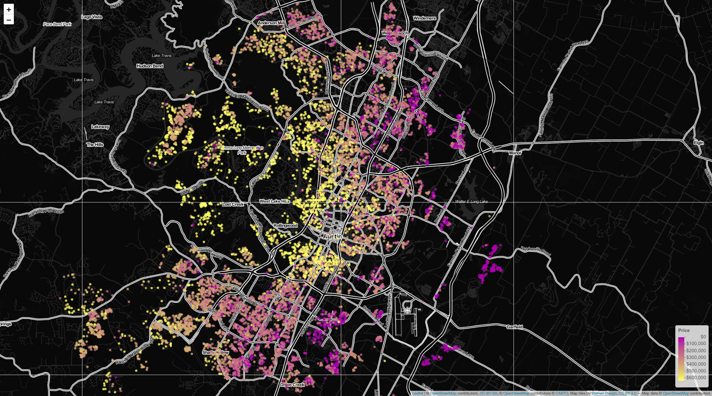 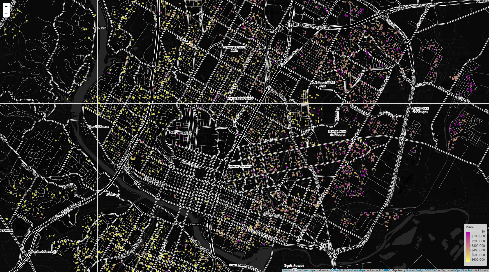

I want to see multiple features distributed on a similar map. Let’s
build hex plots for the numeric predictors and use `{patchwork}` to make
one nice plot.

    plot_hex <- function(var, title) {
      q %>%
        ggplot(aes(longitude, latitude, z = {{var}})) +
        stat_summary_hex(bins = 40) +
        scico::scale_fill_scico(palette = 'imola') +
        labs(fill = "Avg", title = title) +
        ggdark::dark_theme_minimal()  
    }

    (plot_hex(priceRange_bin,"Price")      + plot_hex(avgSchoolRating, "School Rating")) /
    (plot_hex(yearBuilt,"Year Built")      + plot_hex(log(lotSizeSqFt),"Lot size (log)"))/
    (plot_hex(garageSpaces,"Garages")      + plot_hex(MedianStudentsPerTeacher, "Median Student/Teacher")) / 
    (plot_hex(numOfBathrooms, "Bathrooms") + plot_hex(numOfBedrooms,"Bedrooms")) 

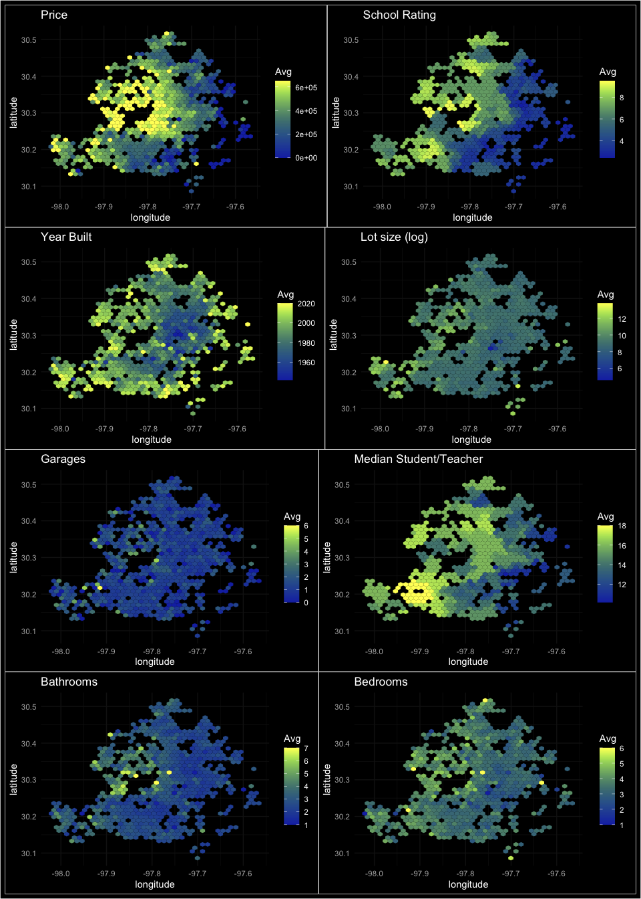

I’m going to drop `city` for being imballanced. I don’t trust humans to
tally `numOfPatioAndPorchFeatures` consistently, but we’ll keep it in.
Ditto for hasSpa.

    drop1 <- plot_hex(priceRange_bin,"Price by city") +
      facet_wrap(~city)

    drop2 <- plot_hex(numOfPatioAndPorchFeatures, "# Patio Features")

    drop3 <- plot_hex(priceRange_bin,"Price by hasSpa") +
      facet_wrap(~hasSpa)

    (drop1 + drop2) / (drop3 + plot_spacer())

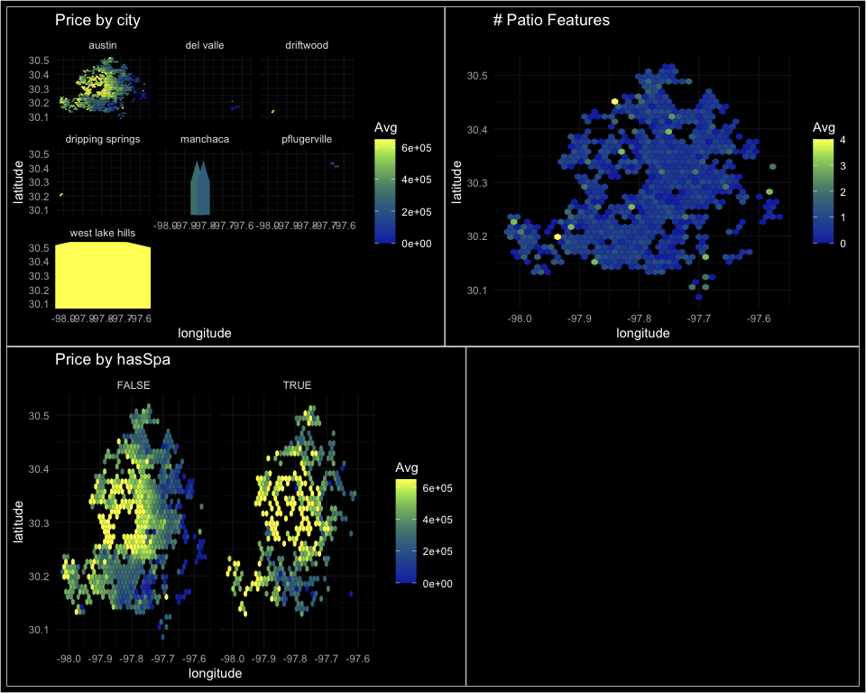

I always like making density plots of numeric features for
classification predictions. Just another way to see if any category
stands out within a feature.

    dense <- q %>%
             select(-c(uid, city, description, homeType, 
                       hasSpa, priceRange_bin, yearBuilt)) %>%
             pivot_longer(cols = c(garageSpaces, avgSchoolRating, MedianStudentsPerTeacher,
                                   numOfBathrooms, numOfBedrooms, longitude, latitude), 
                          names_to = "feature", 
                          values_to = "value")

    ggplot(dense, aes(value, fill = priceRange)) +
      geom_density(alpha = .5) +
      facet_wrap(~ feature, scales = "free") +
      labs(title = "Numeric features impacting priceRange") +
      ggdark::dark_theme_minimal() +
      theme(legend.position = c(0.45, 0.2),
            legend.background = element_rect(fill = "black", color = "white"))

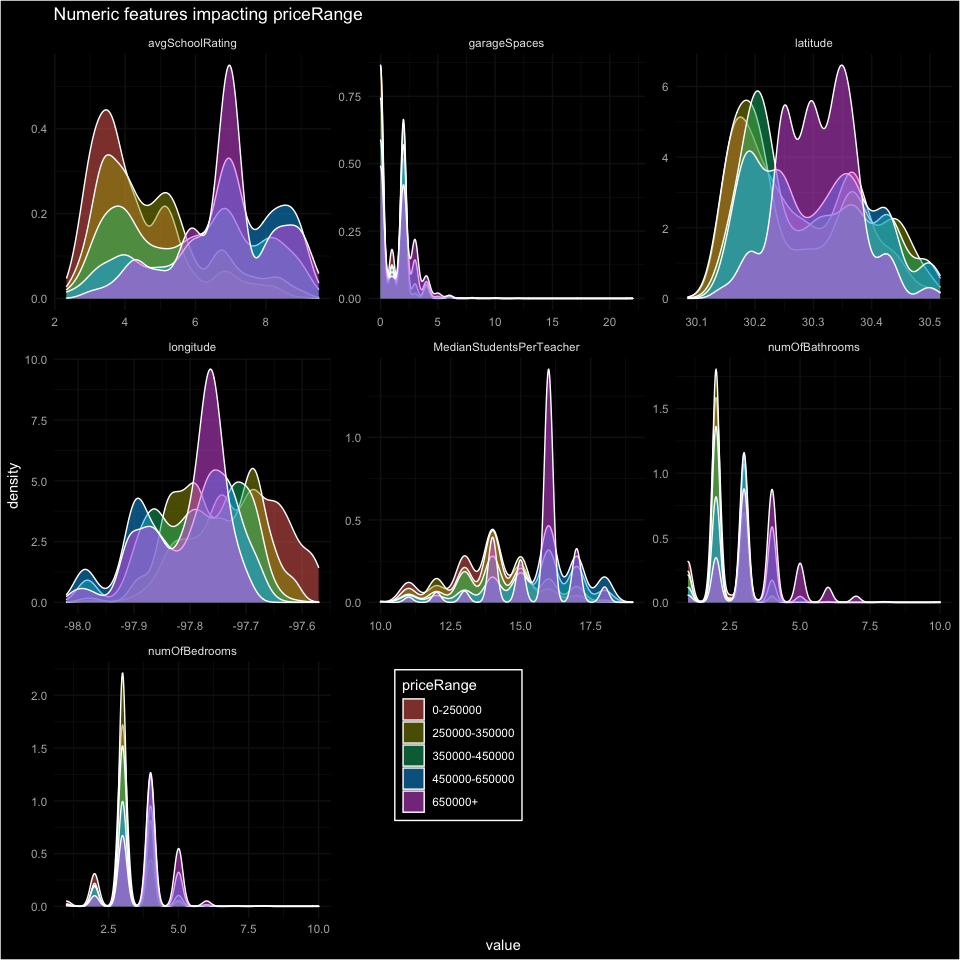

Between the maps, hex-plots and density plots, it seems `latitude`,
`longitude`, `avgSchoolRating`, and `MedianStudentsPerTeacher` will be
good predictors of `priceRange`.

## NLP - Can we find important words in `description` to engineer some features?

Let’s borrow some tricks from [Julia Silge](https://juliasilge.com), the
OG of text-mining in R, to identify important words and then add dummy
variables for important words found in an observations `description`.

    austin_text <- 
      train_raw %>%
      mutate(priceRange = parse_number(priceRange) + 100000) %>% # make bin categories numeric so we can run glm
      unnest_tokens(word, description) %>% # Splits column into tokens, flattening table into one-token-per-row.
      anti_join(get_stopwords()) # Removes stop words

    austin_text %>%
      count(word, sort = TRUE)

    ## # A tibble: 17,944 × 2
    ##    word         n
    ##    <chr>    <int>
    ##  1 home     11620
    ##  2 kitchen   5721
    ##  3 room      5494
    ##  4 austin    4918
    ##  5 new       4772
    ##  6 large     4771
    ##  7 2         4585
    ##  8 bedrooms  4571
    ##  9 contains  4413
    ## 10 3         4386
    ## # … with 17,934 more rows

Find word frequencies per `priceRange` bin for the top 100 words.

    top_words <- 
      austin_text %>%
      count(word, sort = TRUE) %>%
      filter(!word %in% as.character(1:5)) %>% # removing numbers
      slice_max(n, n = 100) %>% # 100 most frequent words
      pull(word)

    word_freqs <- 
      austin_text %>%
      count(word, priceRange) %>%
      complete(word, priceRange, fill = list(n = 0)) %>%   # 0 instead of NA
      group_by(priceRange) %>%
      mutate(price_total = sum(n),
             proportion = n / price_total) %>%
      ungroup() %>%
      filter(word %in% top_words)

    word_freqs

    ## # A tibble: 500 × 5
    ##    word       priceRange     n price_total proportion
    ##    <chr>           <dbl> <dbl>       <dbl>      <dbl>
    ##  1 access         100000   180       56290    0.00320
    ##  2 access         350000   365      114853    0.00318
    ##  3 access         450000   322      116678    0.00276
    ##  4 access         550000   294      125585    0.00234
    ##  5 access         750000   248      112073    0.00221
    ##  6 appliances     100000   209       56290    0.00371
    ##  7 appliances     350000   583      114853    0.00508
    ##  8 appliances     450000   576      116678    0.00494
    ##  9 appliances     550000   567      125585    0.00451
    ## 10 appliances     750000   391      112073    0.00349
    ## # … with 490 more rows

Build a glm that shows word frequency **increasing** across `priceRange`
bins or **decreasing** across `priceRange` bins.

    word_mods <-
      word_freqs %>%
      nest(data = c(priceRange, n, price_total, proportion)) %>%
      mutate(model = map(data, ~ glm(cbind(n, price_total) ~ priceRange, ., family = "binomial")),
             model = map(model, tidy)) %>%
      unnest(model) %>%
      filter(term == "priceRange") %>% # want slope and not intercept
      mutate(adj.pvalue = p.adjust(p.value)) %>%  # adjusting p-values for imbalanced words
      arrange(-estimate)

    word_mods

    ## # A tibble: 100 × 8
    ##    word     data     term    estimate std.error statistic  p.value
    ##    <chr>    <list>   <chr>      <dbl>     <dbl>     <dbl>    <dbl>
    ##  1 outdoor  <tibble… priceR…  3.25e-6   1.85e-7     17.6  4.41e-69
    ##  2 custom   <tibble… priceR…  2.14e-6   1.47e-7     14.6  4.14e-48
    ##  3 pool     <tibble… priceR…  1.59e-6   1.22e-7     13.0  6.52e-39
    ##  4 office   <tibble… priceR…  1.50e-6   1.46e-7     10.3  6.85e-25
    ##  5 suite    <tibble… priceR…  1.43e-6   1.39e-7     10.3  4.53e-25
    ##  6 gorgeous <tibble… priceR…  9.75e-7   1.62e-7      6.02 1.73e- 9
    ##  7 w        <tibble… priceR…  9.20e-7   9.05e-8     10.2  2.74e-24
    ##  8 windows  <tibble… priceR…  8.90e-7   1.28e-7      6.95 3.75e-12
    ##  9 private  <tibble… priceR…  8.89e-7   1.15e-7      7.70 1.35e-14
    ## 10 car      <tibble… priceR…  7.78e-7   1.66e-7      4.69 2.67e- 6
    ## # … with 90 more rows, and 1 more variable: adj.pvalue <dbl>

These are the words we want to detect and use as a feature for our
xgboost model, rather than using all the text tokens as features
individually.

    higher_words <-
      word_mods %>%
      filter(p.value < 0.05) %>%
      slice_max(estimate, n = 12) %>%
      pull(word)

    lower_words <- 
      word_mods %>%
      filter(p.value < 0.05) %>%
      slice_max(-estimate, n = 12) %>%
      pull(word)

Let’s plot how often the most significant words show up in the different
`priceRange` bins. These are the words that most associate with price
decrease and increase.

    high <- word_freqs %>% 
      filter(word %in% higher_words) %>%
      ggplot(aes(priceRange, proportion, color = word)) +
      geom_line(size = 2.5, alpha = 0.7, show.legend = FALSE) +
      facet_wrap(vars(word), scales = "free") +
      scale_x_continuous(labels = scales::dollar) +
      scale_y_continuous(labels = scales::percent, limits = c(0, NA)) +
      labs(x = NULL, y = "% of word in home description at price",
           title = "12 Expensive Words")

    low <- word_freqs %>% 
      filter(word %in% lower_words) %>%
      ggplot(aes(priceRange, proportion, color = word)) +
      geom_line(size = 2.5, alpha = 0.7, show.legend = FALSE) +
      facet_wrap(vars(word), scales = "free") +
      scale_x_continuous(labels = scales::dollar) +
      scale_y_continuous(labels = scales::percent, limits = c(0, NA)) +
      labs(x = NULL, y = "% of word in home description at price",
           title = "12 Cheap Words") 

    high/low

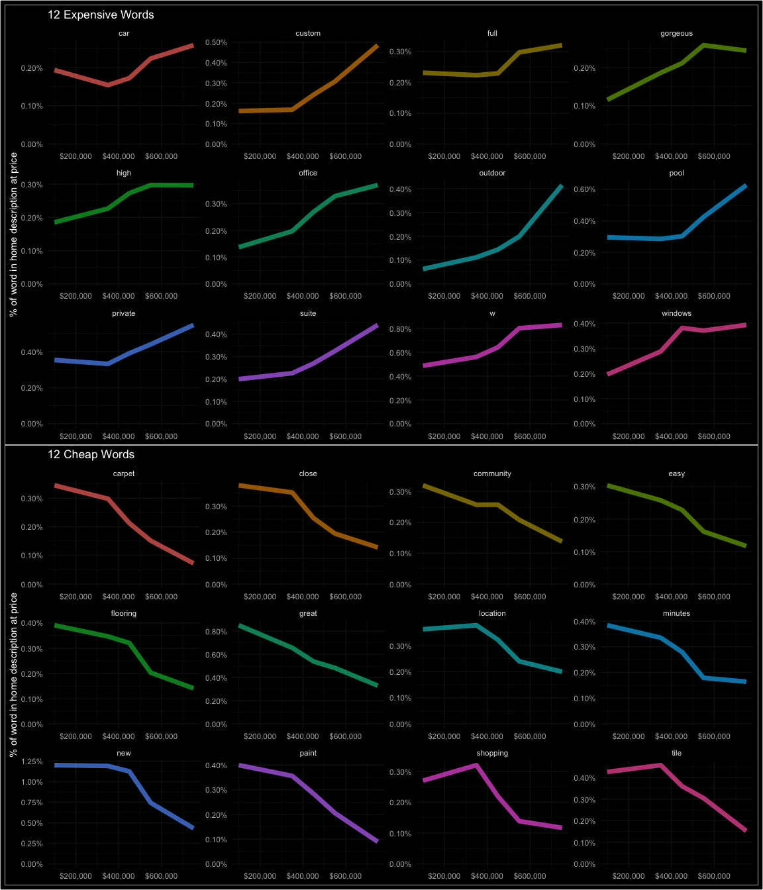

Some of these words show up in a great linear trend across the
`priceRange` bins. I assume XGBoost will find them useful.

## Modeling

Before we plug data into SageMaker’s XGBoost, we need to tranform the
target `priceRange` into a factor of numbers. It is NOT recommended to
transform the target inside a recipe. To transform the predictors and
add our engineered high/low word variables, we’ll use `{tidymodels}`
recipe that we can easily apply to our train/test/validation/holdout
data.

    train_raw$priceRange <- factor(recode(train_raw$priceRange,
                                          "0-250000"      = "0", 
                                          "250000-350000" = "1",
                                          "350000-450000" = "2",
                                          "450000-650000" = "3", 
                                          "650000+"       = "4"), 
                                   levels = c("0", "1", "2", "3", "4"))

    head(train_raw$priceRange, n = 20)

    ##  [1] 4 2 0 0 4 3 4 0 1 1 2 3 2 1 3 1 2 0 4 2
    ## Levels: 0 1 2 3 4

**Split data**

    # Make 75/12.5/12.5 Train/Validate/Test split
    set.seed(333)
    splits  <- initial_split(train_raw, prop = 0.75, strata = priceRange)

    train <- training(splits)
    other <- testing(splits)

    splits2 <- initial_split(other, prop = 0.50, strata = priceRange)
    validation <- training(splits2)
    test <- testing(splits2)

    # Before predicting holdout data, refit best models on train+validation data.
    tr_val <- bind_rows(train, validation) 

    print(splits)

    ## <Analysis/Assess/Total>
    ## <7498/2502/10000>

    print(splits2)

    ## <Analysis/Assess/Total>
    ## <1249/1253/2502>

Let’s add only the most significant high/low words. If they help the
model, we could tinker with these features more.

**Build Recipe**

Drop `city` and `description`, reduce the sparse categories in
`hometype` to an `other` category, then dummy both `hasSpa` and
`homeType`. XGBoost only works with numeric data.

    higher_words_6 <- word_mods %>%
                       filter(p.value < 0.05) %>%
                       slice_max(estimate, n = 6) %>%
                       pull(word)

    lower_words_5 <- word_mods %>%
                      filter(p.value < 0.05) %>%
                      slice_max(-estimate, n = 5) %>%
                      pull(word)

    higher_pat <- glue::glue_collapse(higher_words_6, sep = "|")
    lower_pat <- glue::glue_collapse(lower_words_5, sep = "|")

    rec_austin1 <-
      recipe(priceRange ~ ., data = train) %>%
      step_regex(description, pattern = higher_pat, result = "high_price_words") %>%
      step_regex(description, pattern = lower_pat, result = "low_price_words") %>%
      step_rm(c(uid, city, description)) %>%
      step_mutate(hasSpa = as.factor(hasSpa)) %>%
      step_novel(homeType) %>% 
      step_unknown(homeType) %>% 
      step_other(homeType, threshold = 0.02) %>%
      step_dummy(all_nominal_predictors()) %>%
      prep()

**Transform Data**

After running `prep()` on the training data, `bake()` applies the recipe
steps to each split data. XGBoost needs the target variable `priceRange`
to be the first column.

    austin_training <-  rec_austin1 %>% 
                         juice() %>% 
                         select(priceRange, everything()) # put priceRange as 1st column

    austin_validation <- bake(rec_austin1, new_data = validation) %>% 
                         select(priceRange, everything())

    austin_test <-       bake(rec_austin1, new_data = test) %>% 
                         select(priceRange, everything()) 

    austin_holdout <-    bake(rec_austin1, new_data = holdout) 
                         # priceRange not in this data

    austin_tr_val <-     bake(rec_austin1, new_data = tr_val) %>%
                         select(priceRange, everything())

    id_holdout <- holdout %>% select(uid) # save for batch inference at end

Save all these data locally, then send them over to your S3 bucket on
AWS.

    dir.create("../2021-08-01-austin-r-xgb-house-price/data") # local

    write_csv(austin_training, col_names = FALSE,
              "../2021-08-01-austin-r-xgb-house-price/data/austin_training.csv")

    write_csv(austin_validation, col_names = FALSE,
              "../2021-08-01-austin-r-xgb-house-price/data/austin_validation.csv")

    write_csv(austin_test %>% select(-priceRange),  col_names = FALSE,
              "../2021-08-01-austin-r-xgb-house-price/data/austin_test.csv")

    write_csv(austin_test, col_names = TRUE,  # Need this later to use with results
              "../2021-08-01-austin-r-xgb-house-price/data/austin_test_2.csv")
              
    write_csv(austin_holdout, col_names = FALSE,
              "../2021-08-01-austin-r-xgb-house-price/data/austin_holdout.csv") 

    # Need this later to use with holdout results
    write_csv(id_holdout, col_names = FALSE,
              "../2021-08-01-austin-r-xgb-house-price/data/austin_holdout_id.csv") 

    write_csv(austin_tr_val, col_names = FALSE,
              "../2021-08-01-austin-r-xgb-house-price/data/austin_tr_val.csv") 

## AWS SageMaker

Start up your conda environment in RStudio for running AWS SageMaker

    use_condaenv("sagemaker-r", required = TRUE)
    sagemaker <- import("sagemaker")
    session <- sagemaker$Session()

Set up your S3 bucket.

    bucket <- "twarczak-sagemaker7"
    project <- "austin"    # keep short. 
    data_path <- paste0("s3://", bucket, "/", project, "/", "data")
    models_path <- paste0("s3://", bucket, "/", project, "/", "models")

Send your `split` data to S3. XGBoost will find your data in the S3
bucket.

    s3_uploader <- sagemaker$s3$S3Uploader()

    s3_train <- s3_uploader$upload(local_path = "../2021-08-01-austin-r-xgb-house-price/data/austin_training.csv", 
                                   desired_s3_uri = data_path)

    s3_validation <- s3_uploader$upload(local_path = "../2021-08-01-austin-r-xgb-house-price/data/austin_validation.csv",
                                        desired_s3_uri = data_path)

    s3_test <- s3_uploader$upload(local_path = "../2021-08-01-austin-r-xgb-house-price/data/austin_test.csv", 
                                  desired_s3_uri = data_path)

    s3_test_full <- s3_uploader$upload(local_path = "../2021-08-01-austin-r-xgb-house-price/data/austin_test_2.csv", 
                                  desired_s3_uri = data_path)

    s3_holdout <- s3_uploader$upload(local_path = "../2021-08-01-austin-r-xgb-house-price/data/austin_holdout.csv", 
                                     desired_s3_uri = data_path)

    s3_tr_val <- s3_uploader$upload(local_path = "../2021-08-01-austin-r-xgb-house-price/data/austin_tr_val.csv", 
                                    desired_s3_uri = data_path)

### XGBoost

Set up AWS credentials so RStudio can talk to AWS, grab SageMaker’s
built-in XGBoost, and start your EC2 instance to begin modeling.

    region <- session$boto_region_name
    container <- sagemaker$image_uris$retrieve(framework = "xgboost", 
                                               region    = region, 
                                               version   = "1.3-1" )

    role_arn <- Sys.getenv("SAGEMAKER_ROLE_ARN")

    xgb_estimator <- sagemaker$estimator$Estimator(image_uri          = container,
                                                   role               = role_arn,
                                                   instance_count     = 1L,
                                                   instance_type      = "ml.m4.16xlarge", 
                                                   volume_size        = 50L, 
                                                   output_path        = models_path,
                                                   sagemaker_session  = session,
                                                   use_spot_instances = TRUE,
                                                   max_run            = 1800L,
                                                   max_wait           = 3600L )

Set your first XGBoost model w/ baseline parameters. Use `softprob`
multiclass because we’ll need to send Kaggle a probability for each
category of `priceRange`. Set `mlogloss` because that’s the evaluation
algorithm we’ll be scored on.

    xgb_estimator$set_hyperparameters(objective        = "multi:softprob",
                                      eval_metric      = "mlogloss",
                                      num_class        = 5L, # necessary for multiclass
                                      max_depth        = 5L, 
                                      eta              = 0.1,
                                      num_round        = 70L,
                                      colsample_bytree = 0.4,
                                      alpha            = 1L,
                                      min_child_weight = 1.1,
                                      subsample        = 0.7,
                                      gamma            = 0.01)

Give SageMaker models you build a unique identifier. Tell XGBoost where
your data is in S3.

    algo          <- "xgb"    # keep short
    timestamp      <- format(Sys.time(), "%Y-%m-%d-%H-%M-%S") # timestamp
    job_name_a     <- paste(project, algo, timestamp, sep = "-")
    s3_train_input <- sagemaker$inputs$TrainingInput(s3_data = s3_train, content_type = 'csv')
    s3_valid_input <- sagemaker$inputs$TrainingInput(s3_data = s3_validation, content_type = 'csv')
    input_data     <- list('train'      = s3_train_input,
                           'validation' = s3_valid_input)

Fit first XGBoost model on training data you sent to S3 bucket.

    xgb_estimator$fit(inputs   = input_data,
                      job_name = job_name_a,
                      wait     = FALSE)

### Evaluate model

    training_job_stats <- session$describe_training_job(job_name = "austin-xgb-2021-08-24-19-07-45")
    final_metrics_a <-  map_df(training_job_stats$FinalMetricDataList, 
                               ~tibble(metric_name = .x[["MetricName"]],
                                       value = .x[["Value"]]))

    final_metrics_a

    ## # A tibble: 2 × 2
    ##   metric_name         value
    ##   <chr>               <dbl>
    ## 1 train:mlogloss      0.860
    ## 2 validation:mlogloss 1.01

Evaluate model on test data

    predictions_path_1 <- paste0(models_path, "/", "austin-xgb-2021-08-24-19-07-45", "/predictions") 

    xgb_batch_predictor_1 <- xgb_estimator$transformer(instance_count     = 1L, 
                                                       instance_type      = "ml.m4.16xlarge", 
                                                       strategy           = "MultiRecord",
                                                       assemble_with      = "Line",
                                                       output_path        = predictions_path_1)

    xgb_batch_predictor_1$transform(data         = s3_test,  # test set LACKING the TRUE `priceRange`
                                    content_type = 'text/csv',
                                    split_type   = "Line",
                                    job_name     = "austin-xgb-2021-08-24-19-07-45",
                                    wait         = FALSE)

Compare predictions for the test data to actual `priceRange` “truth”.
Download the predicted `priceRange` for every observation.

    s3_downloader <- sagemaker$s3$S3Downloader()
    s3_test_predictions_path_1 <- s3_downloader$list(predictions_path_1)
     
    dir.create("./predictions")
    s3_downloader$download(s3_test_predictions_path_1, "./predictions")
     
    test_predictions_1 <- read_csv("./predictions/austin_test.csv.out",
                                    col_names = FALSE )

To get data in the correct format, do some wrangling. This is annoying.

    test_predictions_1.2 <- test_predictions_1 %>% 
                          transmute("0-250000"      = X1,
                                    "250000-350000" = X2,
                                    "350000-450000" = X3,
                                    "450000-650000" = X4,
                                    "650000+"       = X5 )

    # Need to get rid of brackets
    test_predictions_1.2$`0-250000` <- as.numeric(str_replace_all(test_predictions_1.2$`0-250000`,"\\[|\\]", ""))
    test_predictions_1.2$`650000+` <- as.numeric(str_replace_all(test_predictions_1.2$`650000+`,"\\[|\\]", "")) 

    austin_test <- read_csv("./data/austin_test_2.csv") # test set WITH the TRUE `priceRange`

    test_results_1 <- austin_test %>% 
                      select(priceRange) %>% 
                      bind_cols(test_predictions_1.2) %>% 
                      rename(Truth = priceRange) %>% 
                      mutate(Truth = case_when(Truth == "0" ~ "0-250000", 
                                               Truth == "1" ~ "250000-350000",
                                               Truth == "2" ~ "350000-450000",
                                               Truth == "3" ~ "450000-650000", 
                                               Truth == "4" ~ "650000+"      ))

Now we can understand the results. Each row sums to 1. Each column
contains the probability the observations can be classified in that
`priceRange` bin.

    head(test_results_1)

    ## # A tibble: 6 × 6
    ##   Truth         `0-250000` `250000-350000` `350000-450000` `450000-650000`
    ##   <chr>              <dbl>           <dbl>           <dbl>           <dbl>
    ## 1 650000+          0.0106          0.0134          0.0338           0.103 
    ## 2 650000+          0.00567         0.00782         0.0120           0.0328
    ## 3 350000-450000    0.121           0.504           0.299            0.0580
    ## 4 350000-450000    0.0910          0.237           0.386            0.243 
    ## 5 0-250000         0.343           0.487           0.118            0.0396
    ## 6 650000+          0.00542         0.00386         0.00664          0.0258
    ## # … with 1 more variable: 650000+ <dbl>

### Confusion Matrix

First put the highest probability `priceRange` column name (per row)
into a new column called `pred_class`. That will be the `priceRange`
category predictred by our model for that observation. Then set up a
confusion matrix to visualize predicted `priceRange` vs. actual
`priceRange`.

    test_results_1 <- test_results_1 %>%
        mutate(pred_class = pmap_chr(across(`0-250000`:`650000+`),
                            ~ names(c(...)[which.max(c(...))])))

    conf1 <- test_results_1 %>% 
      conf_mat(Truth, pred_class) %>% 
      autoplot(type = "heatmap") +
      scale_fill_scico(begin = 0.2, end = 0.7, palette = "bamako") +  
      labs(title = "Confusion Matrix - XGBoost multi-class BEFORE Tuning\n") +
      scale_x_discrete(position = "top")
    conf1

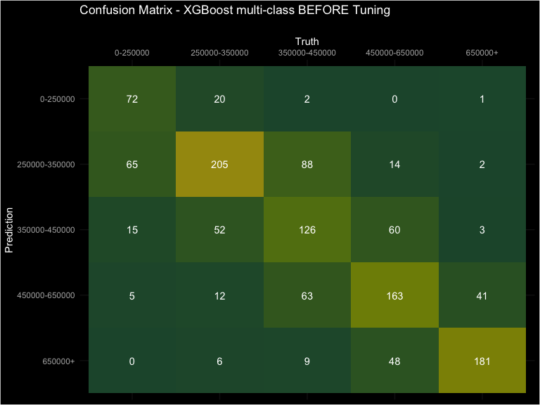

### ROC Curve

Not a bad baseline. ROC curves aren’t as useful in multi-class
predictions IMO, but overall AUC is still a useful metric.

    auc1 <- test_results_1 %>% 
      roc_auc(as.factor(Truth), `0-250000`:`650000+`)

    roc1 <- test_results_1 %>% 
      roc_curve(as.factor(Truth), `0-250000`:`650000+`) %>% 
      ggplot(aes(1-specificity, sensitivity, color = .level)) +
      geom_abline(lty = 2, color = "gray80", size = 1.5) +
      geom_path(alpha = 0.7, size = 1.1) +
      coord_equal() +
      labs(color = "priceRange",
           title = "ROC: XGBoost multi-class",
           subtitle = paste("AUC = ", auc1$.estimate)) +
      theme(legend.position = c(0.8, 0.3),
            legend.background = element_rect(fill = "black"))
    roc1

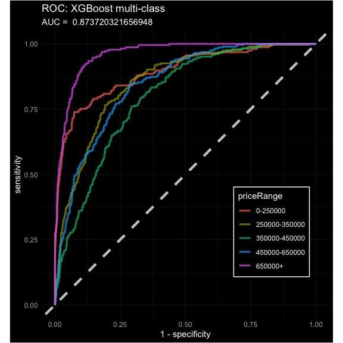

## Hyperparameter Tuning

To build an XGBoost model better than our baseline model, we need to
find a better combination of hyperparameters. First set SageMaker’s
estimator with the static parameters.

    xgb_estimator <- sagemaker$estimator$Estimator(image_uri          = container,
                                                   role               = role_arn,
                                                   instance_count     = 1L,
                                                   instance_type      = "ml.m5.4xlarge", 
                                                   volume_size        = 10L, 
                                                   output_path        = models_path,
                                                   sagemaker_session  = session,
                                                   use_spot_instances = TRUE,
                                                   max_run            = 1800L,
                                                   max_wait           = 3600L )

    xgb_estimator$set_hyperparameters(objective        = "multi:softprob",
                                      eval_metric      = "mlogloss",
                                      num_class        = 5L,
                                      alpha            = 1L ) 

Now set the **Tunable Parameters**.

    hyperp_ranges <- list(num_round = sagemaker$tuner$IntegerParameter(500L, 800L),
                          max_depth = sagemaker$tuner$IntegerParameter(5L, 8L),
                  eta              = sagemaker$tuner$ContinuousParameter(0.01,0.07),
                  colsample_bytree = sagemaker$tuner$ContinuousParameter(0.5, 0.75),
                  min_child_weight = sagemaker$tuner$ContinuousParameter(1.0, 7.0),
                  subsample        = sagemaker$tuner$ContinuousParameter(0.5, 0.9),
                  gamma            = sagemaker$tuner$ContinuousParameter(0.01, 0.4, "Logarithmic"))

Create `HyperparameterTuner` object. I’m running 10 models in parallel,
which might be too many, but it cuts down training time. Also running a
bayesian optimizer instead of hyperparameter grid.

    tuner <- sagemaker$tuner$HyperparameterTuner(estimator             = xgb_estimator,
                                                 objective_metric_name = "validation:mlogloss",
                                                 objective_type        = "Minimize",
                                                 hyperparameter_ranges = hyperp_ranges, 
                                                 strategy              = "Bayesian",
                                                 max_jobs              = 250L,
                                                 max_parallel_jobs     = 10L)

Keep everything organized. Every training/tuning/transform job is a
little different. Give every job a unique identifier. You can find info
about each job within SageMaker. Either in the `Training` or `Inference`
tabs.

    algo <- "xgb"
    timestamp <- format(Sys.time(), "%Y-%m-%d-%H-%M-%S")
    job_name_b <- paste(project, algo, timestamp, sep = "-")
    s3_train_input <- sagemaker$inputs$TrainingInput(s3_data = s3_train,
                                                     content_type = 'csv')
    s3_valid_input <- sagemaker$inputs$TrainingInput(s3_data = s3_validation,
                                                     content_type = 'csv')
    input_data <- list('train'      = s3_train_input,
                       'validation' = s3_valid_input)

### Start tuning job

    tuner$fit(inputs   = input_data, 
              job_name = job_name_b,
              wait     = FALSE )

### Evaluate tuning job results

    # find the jobs names in aws services: sagemaker/training/hyperparameter tuning jobs
    tuning_job_results <- sagemaker$HyperparameterTuningJobAnalytics("austin-xgb-2021-08-24-19-26-01")
    tuning_results_df <- tuning_job_results$dataframe()

These are our best performing models.

    tuning_results_df %>% arrange(FinalObjectiveValue) %>% select(FinalObjectiveValue, colsample_bytree:num_round) %>% head(n=5)

    ##   FinalObjectiveValue colsample_bytree        eta      gamma
    ## 1             0.91389        0.6290542 0.03520119 0.03713676
    ## 2             0.91495        0.6071249 0.03396735 0.05022432
    ## 3             0.91541        0.5551431 0.03392736 0.06289694
    ## 4             0.91550        0.5551431 0.03512736 0.06289694
    ## 5             0.91558        0.6315542 0.03460119 0.03853227
    ##   max_depth min_child_weight num_round
    ## 1         6         1.187750       547
    ## 2         6         1.001407       531
    ## 3         6         1.007632       596
    ## 4         6         1.127632       602
    ## 5         6         1.127750       544

Plot a time series chart that shows how AUC developed over 250 training
jobs, tuned by the Bayesian optimizer. Also plot the hyperparameters to
see if the optimizer found the sweet spots.

    tune_plot0 <-ggplot(tuning_results_df, aes(TrainingEndTime, FinalObjectiveValue)) +
      geom_point() +
      xlab("Time") +
      ylab(tuning_job_results$description()$TrainingJobDefinition$StaticHyperParameters$`_tuning_objective_metric`) +
      ggtitle("Hyperparameter tuning mLogloss",  
              "Progression over the period of all 250 training jobs") 

    tune_plot1 <- ggplot(tuning_results_df, aes(num_round, max_depth)) +
      geom_point(aes(color = FinalObjectiveValue)) +
      scale_color_scico("mLogloss", palette = "roma", direction = 1) +
      ggtitle("Hyperparameter tuning mLogloss", 
              "Using a Bayesian strategy") 

    tune_plot2 <-ggplot(tuning_results_df, aes(eta, colsample_bytree)) +
      geom_point(aes(color = FinalObjectiveValue)) +
      scale_color_scico("mLogloss", palette = "roma", direction = 1) +
      ggtitle("Hyperparameter tuning mLogloss", 
              "Using a Bayesian strategy") 

    tune_plot3 <-ggplot(tuning_results_df, aes(min_child_weight, subsample)) +
      geom_point(aes(color = FinalObjectiveValue)) +
      scale_color_scico("mLogloss", palette = "roma", direction = 1) +
      ggtitle("Hyperparameter tuning mLogloss", 
              "Using a Bayesian strategy") 

    tune_plot4 <-ggplot(tuning_results_df, aes(gamma, eta)) +
      geom_point(aes(color = FinalObjectiveValue)) +
      scale_color_scico("mLogloss", palette = "roma", direction = 1) +
      ggtitle("Hyperparameter tuning mLogloss", 
              "Using a Bayesian strategy") 

    (tune_plot0 + tune_plot1) / (tune_plot2 + tune_plot3) / (tune_plot4 + plot_spacer())

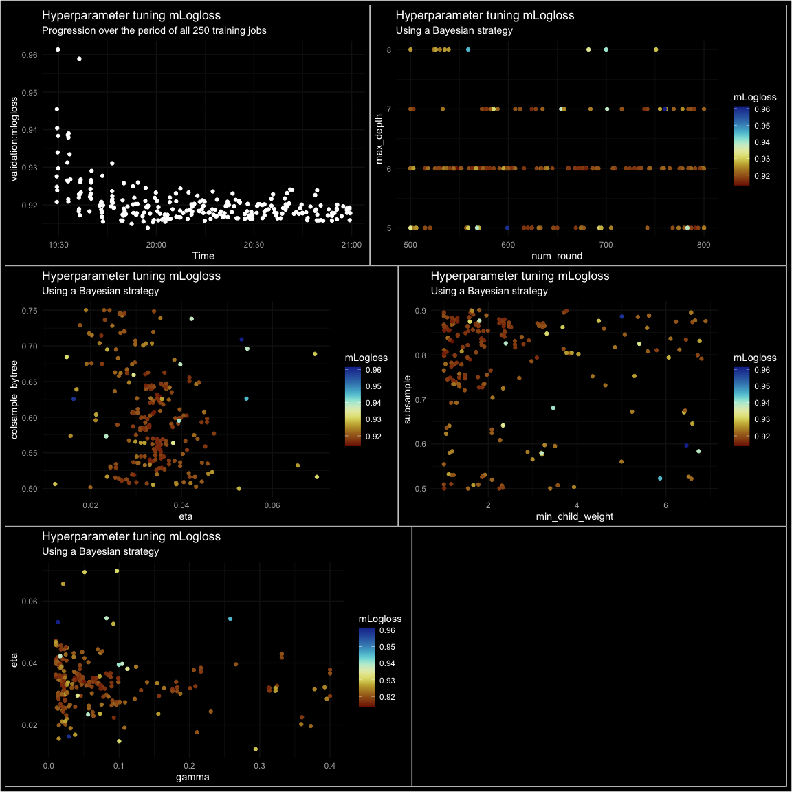

Let’s take the top model then evaluate on the test data.

    # best_5_tuned_models <- tuning_results_df %>%
    #                        arrange(FinalObjectiveValue) %>% 
    #                        head(n=5) 

    #unnest(best_10_tuned_models) %>% select(FinalObjectiveValue, everything())

    best_tuned_model <- tuning_results_df %>%
                        arrange(FinalObjectiveValue) %>% 
                        head(n=1) %>% pull(TrainingJobName)

    training_job_stats <- session$describe_training_job(job_name = best_tuned_model)

    final_metrics_2 <-  map_df(training_job_stats$FinalMetricDataList, 
                               ~tibble(metric_name = .x[["MetricName"]],
                                       value       = .x[["Value"]]))

This is how well the best model performed on the validation data.

    final_metrics_2

    ## # A tibble: 3 × 2
    ##   metric_name         value
    ##   <chr>               <dbl>
    ## 1 train:mlogloss      0.495
    ## 2 validation:mlogloss 0.914
    ## 3 ObjectiveMetric     0.914

Run the best model, `"austin-xgb-2021-08-24-19-26-01-087-8bf5c7e6"`, on
the test data to predict `priceRange`.

    predictions_path_2 <- paste0(models_path, "/", 
                                 "austin-xgb-2021-08-24-19-26-01-087-8bf5c7e6", 
                                 "/predictions")

    session$create_model_from_job("austin-xgb-2021-08-24-19-26-01-087-8bf5c7e6")

    ## [1] "austin-xgb-2021-08-24-19-26-01-087-8bf5c7e6"

    xgb_batch_predictor_2 <- sagemaker$transformer$Transformer(model_name     = "austin-xgb-2021-08-24-19-26-01-087-8bf5c7e6",
                                                               instance_count = 1L, 
                                                               instance_type  = "ml.m4.4xlarge", 
                                                               strategy       = "MultiRecord",  
                                                               assemble_with  = "Line",
                                                               output_path    = predictions_path_2)

Start batch prediction job. Note that I added a `-2` to the job\_name
below. SageMaker needs all jobs to be unique. Now this
`Batch transform job` name is different than the model `Training job`
name.

    xgb_batch_predictor_2$transform(data         = s3_test, # test set LACKING the TRUE `priceRange`
                                    content_type = 'text/csv',
                                    split_type   = "Line",
                                    job_name     = "austin-xgb-2021-08-24-19-26-01-087-8bf5c7e6-2",
                                    wait         = FALSE) 

Download the predicted `priceRange` for every observation.

    s3_test_predictions_path_2 <- s3_downloader$list(predictions_path_2)
     
    s3_downloader$download(s3_test_predictions_path_2, "./predictions")
     
    test_predictions_2 <- read_csv("./predictions/austin_test.csv.out",
                                   col_names = FALSE) #%>% pull(X1)

Transform again, annoying, but there’s a payoff.

    test_predictions_2.1 <- test_predictions_2 %>%
                          transmute("0-250000"      = X1,
                                    "250000-350000" = X2,
                                    "350000-450000" = X3,
                                    "450000-650000" = X4,
                                    "650000+"       = X5 )
     
    # Need to get rid of brackets
    test_predictions_2.1$`0-250000` <- as.numeric(str_replace_all(test_predictions_2.1$`0-250000`,"\\[|\\]", ""))
    test_predictions_2.1$`650000+` <- as.numeric(str_replace_all(test_predictions_2.1$`650000+`,"\\[|\\]", "")) 

    austin_test <- read_csv("./data/austin_test_2.csv") # test set WITH the TRUE `priceRange`

    test_results_2 <- austin_test %>%
      select(priceRange) %>%
      bind_cols(test_predictions_2.1) %>%
      rename(Truth = priceRange) %>%
      mutate(Truth = case_when(Truth == "0" ~ "0-250000",
                               Truth == "1" ~ "250000-350000",
                               Truth == "2" ~ "350000-450000",
                               Truth == "3" ~ "450000-650000",
                               Truth == "4" ~ "650000+"      ))

Make column for predicted `priceRange` from highest probability per row.

    test_results_2 <- test_results_2 %>%
        mutate(pred_class = pmap_chr(across(`0-250000`:`650000+`),
                            ~ names(c(...)[which.max(c(...))])))

Build another confusion matrix and compare it to the untuned model
confusion matrix.

    conf2 <- test_results_2 %>% 
      conf_mat(Truth, pred_class) %>% 
      autoplot(type = "heatmap") +
      scale_fill_scico(begin = 0.2, end = 0.7, palette = "bamako") +  
      labs(title = "Confusion Matrix - XGBoost multi-class AFTER Tuning\n") +
      scale_x_discrete(position = "top")
    # compare to initial model

    conf1 + conf2

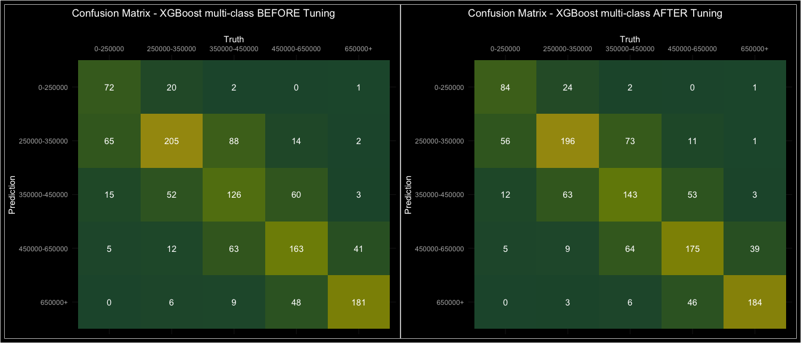

That’s a big improvement. Of 1,253 observations in the `austin_test`
data, the tuned model correctly classifies 782 homes, compared to 747
correct classifications by the untuned model.

What about AUC?

    auc2 <- test_results_2 %>% 
      roc_auc(as.factor(Truth), `0-250000`:`650000+`)

    roc2 <- test_results_2 %>% 
      roc_curve(as.factor(Truth), `0-250000`:`650000+`) %>% 
      ggplot(aes(1-specificity, sensitivity, color = .level)) +
      geom_abline(lty = 2, color = "gray80", size = 1.5) +
      geom_path(alpha = 0.7, size = 1.1) +
      coord_equal() +
      labs(color = "priceRange",
           title = "ROC: XGBoost multi-class TUNED",
           subtitle = paste("AUC =", auc2$.estimate )) +
      theme(legend.position = c(0.8, 0.3),
            legend.background = element_rect(fill = "black"))

    roc1 + roc2

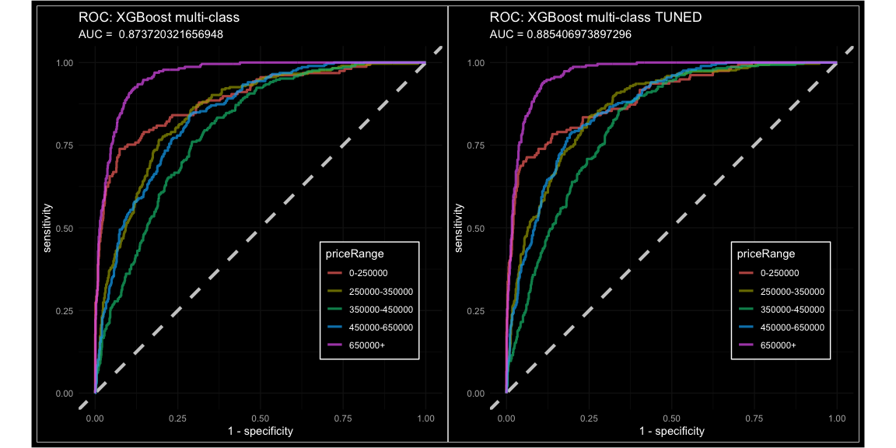

The AUC impoved from 0.8737 to 0.8854.

## Batch Inference on Holdout Data

First, let’s refit the best tuned models on the training + validation
data.

After refitting, we need to submit probabilities of every `priceRange`
bin for each observation (home). There are 5 possible price bins:
`0-250000`, `250000-350000`, `350000-450000`, `450000-650000`, `650000+`
So we’ll need to submit a .cvs file containing the holdout id column + 5
price columns containing our predicted probabilities. To run inference
we’ll pass our “baked” holdout data into our best performing XGboost
model.

    best_model_spec1 <- "austin-xgb-2021-08-24-19-26-01-087-8bf5c7e6" # with high/low word features
    #best_model_spec2 <- "austin-xgb-2021-08-24-16-05-39-168-ba9e4034" # without high/low words

Set the hyperparameters found in our best model. Search for model in
SageMaker/Inference/Models and you’ll find the hyperparameters within
the model file.

    # hyperparameters for "austin-xgb-2021-08-24-19-26-01-087-8bf5c7e6" 
    xgb_estimator$set_hyperparameters(objective        = "multi:softprob",
                                      eval_metric      = "mlogloss",
                                      num_class        = 5L, # necessary for multiclass
                                      max_depth        = 6L, 
                                      eta              = 0.03520118545875153,
                                      num_round        = 547L,
                                      colsample_bytree = 0.6290542489323581,
                                      alpha            = 1L,
                                      min_child_weight = 1.1877495749360136,
                                      subsample        = 0.8303568755778328,
                                      gamma            = 0.037136763001608175)

Refit model on train + validation data before predicting on holdout
data.

    # Create training job name based project organization principles
    algo <- "xgb"    # keep short
    timestamp <- format(Sys.time(), "%Y-%m-%d-%H-%M-%S") # timestamp
    job_name_refit <- paste(project, algo, timestamp, sep = "-")
    s3_train_input <- sagemaker$inputs$TrainingInput(s3_data = s3_tr_val,     # train + validation
                                                     content_type = 'csv')
    s3_valid_input <- sagemaker$inputs$TrainingInput(s3_data = s3_test_full,  # test set w/ truth
                                                     content_type = 'csv')
    input_data <- list('train'      = s3_train_input,
                       'validation' = s3_valid_input) 

    xgb_estimator$fit(inputs   = input_data,
                      job_name = job_name_refit,
                      wait     = FALSE)

Our refit model name is `austin-xgb-2021-08-24-22-07-41`.

    training_job_stats_refit <- session$describe_training_job(job_name = "austin-xgb-2021-08-24-22-07-41")

    final_metrics_refit <-  map_df(training_job_stats_refit$FinalMetricDataList, 
                                   ~tibble(metric_name = .x[["MetricName"]],
                                           value = .x[["Value"]]))
    training_job_stats_refit$TrainingJobName

    ## [1] "austin-xgb-2021-08-24-22-07-41"

    final_metrics_refit

    ## # A tibble: 2 × 2
    ##   metric_name         value
    ##   <chr>               <dbl>
    ## 1 train:mlogloss      0.519
    ## 2 validation:mlogloss 0.904

    predictions_path_h <- paste0(models_path, "/", "austin-xgb-2021-08-24-22-07-41", "/predictions") 

    session$create_model_from_job("austin-xgb-2021-08-24-22-07-41")

    ## [1] "austin-xgb-2021-08-24-22-07-41"

    xgb_batch_predictor_h <- sagemaker$transformer$Transformer(model_name     = "austin-xgb-2021-08-24-22-07-41",
                                                               instance_count = 1L, 
                                                               instance_type  = "ml.m5.4xlarge", 
                                                               strategy       = "MultiRecord",  
                                                               assemble_with  = "Line",
                                                               output_path    = predictions_path_h)

Run batch inference on holdout data. Make job\_name unique with an added
`-h` for holdout.

    xgb_batch_predictor_h$transform(data         = s3_holdout, # data to predict on for Kaggle comp.
                                    content_type = 'text/csv',
                                    split_type   = "Line",
                                    job_name     = "austin-xgb-2021-08-24-22-07-41-h",
                                    wait         = FALSE)

Transform to format data for submission to Kaggle.

    s3_holdout_predictions_path_h <- s3_downloader$list(predictions_path_h)

    s3_downloader$download(s3_holdout_predictions_path_h, "./predictions")
     
    holdout_predictions_h <- read_csv("./predictions/austin_holdout.csv.out",
                                      col_names = FALSE) #%>% pull(X1)

    holdout_predictions_h.1 <- holdout_predictions_h %>%
                               transmute("0-250000"      = X1,
                                         "250000-350000" = X2,
                                         "350000-450000" = X3,
                                         "450000-650000" = X4,
                                         "650000+"       = X5 )
     
    # Remove brackets
    holdout_predictions_h.1$`0-250000` <- as.numeric(str_replace_all(holdout_predictions_h.1$`0-250000`,"\\[|\\]", ""))
    holdout_predictions_h.1$`650000+` <- as.numeric(str_replace_all(holdout_predictions_h.1$`650000+`,"\\[|\\]", "")) 

    austin_holdout_id <- read_csv("data/austin_holdout_id.csv", col_names = FALSE) %>% 
                         rename(uid = X1)
    chop_submit_final <- bind_cols(austin_holdout_id, holdout_predictions_h.1)

    write_csv(chop_submit_final, "predictions/chop_submit_final.csv")

This submission received a score of 0.88876 (Multiclass Log Loss), which
would have placed 6th out of 90 entries in the Kaggle competition.

To understand how this XGBoost model predicted `priceRange`, we can use
SHapley Additive exPlanations (**SHAP**) to visualize feature importance
for every observation, and how those features impacted the probabilities
of each `priceRange` category. SHAP is a method to interpret results
from tree-based models, and can prevent your XGBoost model from falling
into `Black Box` territory, where you cannot explain how the model
works.

I had to adjust the `{SHAPforxgboost}` R package slightly to work for
multi-class XGBoost predictions. First, rebuild the model using the
`{xgboost}` R package and the model hyperparameters.

    library(SHAPforxgboost)
    library(xgboost)

    lb <- as.numeric(austin_training$priceRange) -1   # to get priceRange categories 0:4
    X_train <- as.matrix(austin_training[, -1])       # remove priceRange from matrix

    bst <- xgboost(data             = X_train, 
                   label            = lb,
                   objective        = "multi:softprob", 
                   eval_metric      = "mlogloss",
                   max_depth        = 6, 
                   eta              = 0.03520118545875153, 
                   nthread          = 2, 
                   nrounds          = 547, 
                   subsample        = 0.8303568755778328,
                   num_class        = 5,
                   gamma            = 0.037136763001608175,
                   colsample_bytree = 0.6290542489323581,
                   min_child_weight = 1.1877495749360136)

    # predict for softmax returns num_class probability numbers per case:
    pred_labels1 <- predict(bst, as.matrix(austin_training[, -1]))
    pred_labels2 <- matrix(pred_labels1, ncol=5, byrow=TRUE)
    # convert the probabilities to softmax labels
    pred_labels3 <- max.col(pred_labels2) - 1
    #head(pred_labels2, n = 4)
    #head(pred_labels3, n = 4)

    pred <- predict(bst, as.matrix(austin_training[, -1]), predcontrib = TRUE)

As of now `{SHAPforxgboost}` can’t handle multiclass predictions.
Unnesting `pred` and a small adjustment to the `shap.values()` function
allows SHAP values for each category.

    shap_contrib_0 <- pred[[1]]
    shap_contrib_1 <- pred[[2]]
    shap_contrib_2 <- pred[[3]]
    shap_contrib_3 <- pred[[4]]
    shap_contrib_4 <- pred[[5]]

New `shap.values()` function.

    shap.values_todd <- function(shap_contrib, X_train){

      # Add colnames if not already there (required for LightGBM)
      if (is.null(colnames(shap_contrib))) {
        colnames(shap_contrib) <- c(colnames(X_train), "BIAS")
      }

      shap_contrib <- as.data.table(shap_contrib)

      # For both XGBoost and LightGBM, the baseline value is kept in the last column
      BIAS0 <- shap_contrib[, ncol(shap_contrib), with = FALSE][1]

      # Remove baseline and ensure the shap matrix has column names
      shap_contrib[, `:=`(BIAS, NULL)]

      # Make SHAP score in decreasing order
      imp <- colMeans(abs(shap_contrib))
      mean_shap_score <- imp[order(imp, decreasing = T)]

      return(list(shap_score = shap_contrib,
                  mean_shap_score = mean_shap_score,
                  BIAS0 = BIAS0))
    }

    shap_values_0 <- shap.values_todd(shap_contrib = shap_contrib_0, X_train)
    shap_values_1 <- shap.values_todd(shap_contrib = shap_contrib_1, X_train)
    shap_values_2 <- shap.values_todd(shap_contrib = shap_contrib_2, X_train)
    shap_values_3 <- shap.values_todd(shap_contrib = shap_contrib_3, X_train)
    shap_values_4 <- shap.values_todd(shap_contrib = shap_contrib_4, X_train)

    shap_long_0 <- shap.prep(shap_contrib = shap_values_0$shap_score, X_train = X_train)
    shap_long_1 <- shap.prep(shap_contrib = shap_values_1$shap_score, X_train = X_train)
    shap_long_2 <- shap.prep(shap_contrib = shap_values_2$shap_score, X_train = X_train)
    shap_long_3 <- shap.prep(shap_contrib = shap_values_3$shap_score, X_train = X_train)
    shap_long_4 <- shap.prep(shap_contrib = shap_values_4$shap_score, X_train = X_train)

Use the `shap_long` values to build SHAP Summary Plots showing global
feature importance.

    sh_pl_0 <-  shap.plot.summary(shap_long_0) +
                ggdark::dark_theme_minimal() +
                theme(legend.position = 'bottom') +
                labs(title = "SHAP Values for Features in XGBoost Model",
                     subtitle = "Homes Predicted to be $0 - $250,000")
    sh_pl_1 <-  shap.plot.summary(shap_long_1) +
                ggdark::dark_theme_minimal() +
                theme(legend.position = 'bottom') +
                labs(title = "SHAP Values for Features in XGBoost Model",
                     subtitle = "Homes Predicted to be $250,000 - $350,000")
    sh_pl_2 <-  shap.plot.summary(shap_long_2) +
                ggdark::dark_theme_minimal() +
                theme(legend.position = 'bottom') +
                labs(title = "SHAP Values for Features in XGBoost Model",
                     subtitle = "Homes Predicted to be $350,000 - $450,000")
    sh_pl_3 <-  shap.plot.summary(shap_long_3) +
                ggdark::dark_theme_minimal() +
                theme(legend.position = 'bottom') +
                labs(title = "SHAP Values for Features in XGBoost Model",
                     subtitle = "Homes Predicted to be $450,000 - $650,000")
    sh_pl_4 <-  shap.plot.summary(shap_long_4) +
                ggdark::dark_theme_minimal() +
                theme(legend.position = 'bottom') +
                labs(title = "SHAP Values for Features in XGBoost Model",
                     subtitle = "Homes Predicted to be $650,000+")

    #library(patchwork)
    sh_pl_0 / sh_pl_1 / sh_pl_2 / sh_pl_3 / sh_pl_4

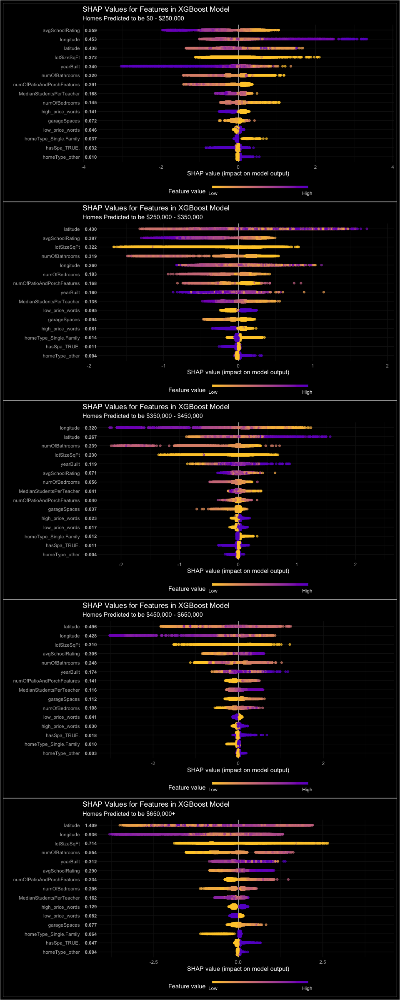

The SHAP summary plots above combine feature importance with feature
effects. Each point on the summary plot is a Shapley value for an
individual observation’s feature. The position on the y-axis is
determined by the feature importance within that `priceRange`.

Notice feature importance values in the `$650,000` plot (5th plot) are
highest among the `priceRange` categories and the `$350,000 - $450,000`
plot (3rd plot) are lowest. That means our XGBoost model is better at
predicting the most expensive homes and relatively poor at predicting
middle priced homes. The model even predicts `$0-$250,000` homes well
considering there are fewest observations of that `priceRange`

    # Count of homes per priceRange category.  0 = $0-$250,000    4 = $650,000
    table(austin_training$priceRange)

    ## 
    ##    0    1    2    3    4 
    ##  936 1767 1725 1706 1364

The color represents the relative value of the feature to the
observation.

Deep purple points with POSITIVE SHAP Values (right of 0) are feature
values that strongly influence XGBoost to POSITIVELY classify the
observation into THAT `priceRange` bin.

Deep purple points with NEGATIVE SHAP Values (left of 0) are feature
values that strongly influence XGBoost to NOT POSITIVELY classify the
observation into THAT `priceRange` bin.

Each feature gets it’s own yellow-purple scale (can’t compare purple
points of different features).

Different observations with the same feature value can have very
different SHAPley values. For example, we might see a dark purple point
and a bright yellow point in `numofBedrooms` feature for two homes that
each have `numofBedrooms` = 3. Imagine a suburban home with 3 bedrooms
being priced slightly more than a suburban 2 bedroom home. A downtown
apartment, however, with 3 bedrooms might be 2X the price of a 2 bedroom
downtown apartment. Therefore, the feature value (color) for
`numofBedrooms` will be higher for the apartment observation.

Look at `high_price_words` and `low_price_words` in the `$0-$250,000`
SHAP summary plot. Observations with `low_price_words` in the
`$0-$250,000` plot are always purple and positive, influencing XGBoost
to say YES, classify me as `$0-$250,000`. Observations with
`high_price_words` are purple and negative, saying NO, don’t classify me
as `$0-$250,000`. The opposite pattern is seen with high/low words in
the `$640,000` plot.

The color scale for `lotSizeSqft` is messed up due to outliers.

    austin_training %>% arrange(desc(lotSizeSqFt)) %>% head(n=50) %>% select(priceRange, lotSizeSqFt)

    ## # A tibble: 50 × 2
    ##    priceRange lotSizeSqFt
    ##    <fct>            <dbl>
    ##  1 4             8581320 
    ##  2 0             5967720 
    ##  3 3             5880600 
    ##  4 2             2988216 
    ##  5 0             2178000 
    ##  6 4             1003622.
    ##  7 2              871200 
    ##  8 4              702623.
    ##  9 0              411206.
    ## 10 0              225205.
    ## # … with 40 more rows

`lotSizeSqFt` range is fairly linear until the largest 9 observations.
Because these 9 observations do not associate with `priceRange`, we
might consider a rule removing any observation above 400,000 SqFt. These
might be typos or a large empty stretch of private land. Must dig deeper
into these 9 observations to adjust our model recipe.

The last plots are SHAP Force Plots which clusters (ward.D2) similar
observations and stacks SHAP values for each observation. These show how
the final output was obtained as a sum of each predictor’s attributions.

Think of these plots as the algorithm summing up an observations feature
values to determine whether to classify into this `priceRange` bin. I’ll
show code for just one of the plots.

    shap_force_plot4 <- shap.prep.stack.data(shap_contrib = shap_values_4$shap_score, 
                                            top_n = 4, n_groups = 5)
    # you may choose to zoom in at a location, and set y-axis limit using `y_parent_limit`  
    shap.plot.force_plot(shap_force_plot4, zoom_in = FALSE) +
      ggdark::dark_theme_bw() +
      labs(title = "SHAP Force Plot;  $650,000+",
           subtitle = "Stacked SHAP values for each observation contribute to XGBoost assigning probability of this priceRange.")

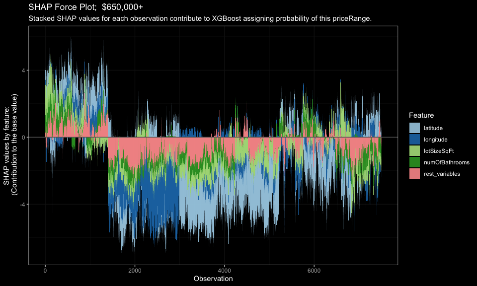

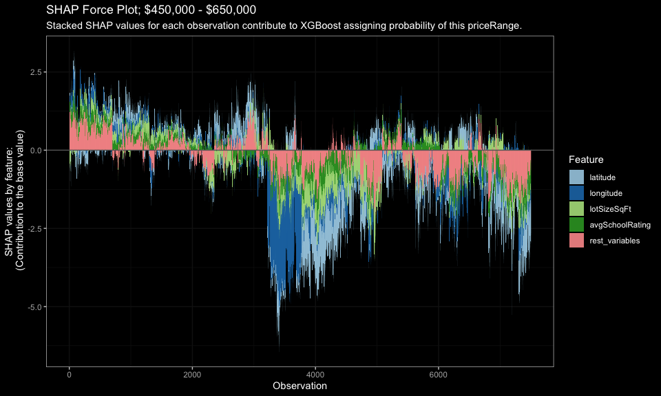

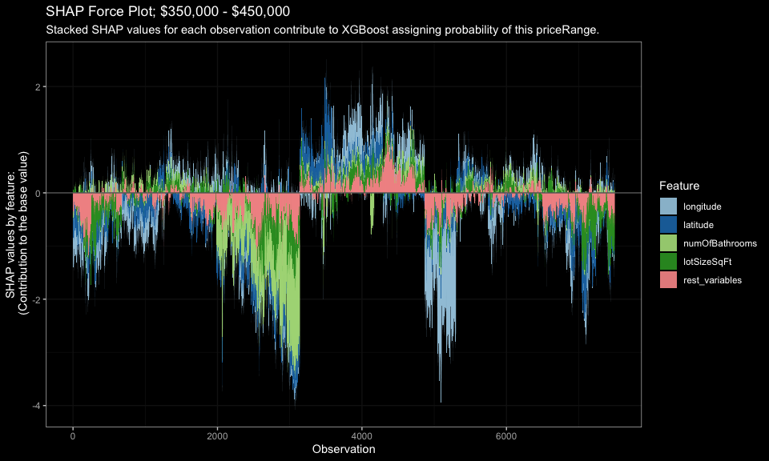

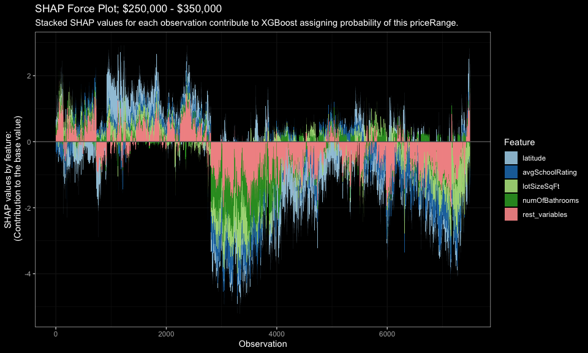

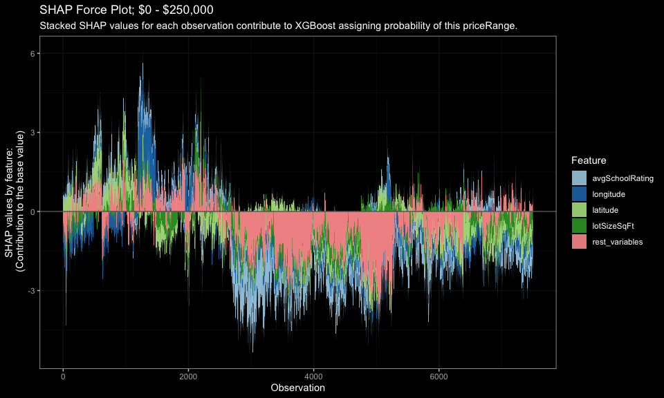

## Summary

In this post I used a Kaggle dataset for Austin, TX real estate and
predict homes into one of 5 `priceRange` bins. I performed exploratory
data analysis in R, leaning heavily on geospacial tools like `{ggmaps}`,
`{leaflet}` for interactive plotting, and `{ggplot2}` for distribution
hex plots to visualize features across Austin. I performed natural
language processing (NLP) on the `description` feature to produce high
and low values words that associate with home price. I then connected
RStudio to AWS SageMaker to gain access to it’s built-in XGBoost, S3,
and EC2 instances for modeling. After training and tuning XGBoost to
find the best multi-class model, I ran batch inference on Kaggle holdout
data and predicted `priceRange` probabilites for 4,961 Austin homes. I
submitted those predictions to the
[SLICED](https://www.kaggle.com/c/sliced-s01e11-semifinals) Kaggle
Competition which scored 0.88876 (Multiclass Log Loss) which would have
been good enough for 6th place (out of 90 entries). Finally, I replicate
that XGBoost model in R with `{xgboost}` and build a set of multi-class
XGBoost SHAP plots to better understand how the XGBoost model classified
observations, based on feature importance, relative feature impact, and
clustering of observations by SHAPley values.
