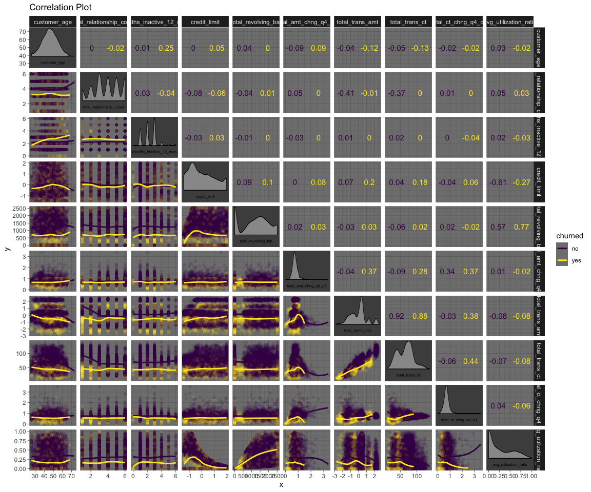

-   [🥅 Project Goal](#goal)
-   [🗂 Obtain Data](#data)
-   [🛁 Clean Data](#clean)
-   [🔭 Explore Data](#explore)
-   [🧮 AWS Setup](#aws)
-   [🏗 Train XGBoost](#build)
-   [🔧 Tune XGBoost](#tune)
-   [🏆 Select Best Model](#best)
-   [🎯 Predict Holdout](#holdout)
-   [📬 Submission](#submit)

    library(tidymodels)
    library(tidyverse)
    library(corrmorant)    # correlation matrix
    library(patchwork)     # multiple plots to 1 plot
    library(reticulate)    # calling the SageMaker Python SDK from R
    library(pROC)          # ROC curves
    library(viridis)       # color palletes
    library(caret)         # confusion matrix
    
## 🥅 Goal of this Project

Predict whether a bank customer will churn using AWS SageMaker and
RStudio

## 🗂 Obtain Data

The data comes from the Kaggle competition
[SLICED](https://www.kaggle.com/c/sliced-s01e07-HmPsw2/overview).

    churn_data <- read_csv("~/Documents/R/data_warz/content/post/2021-08-01-sagemaker-r-xgb-churn/train.csv")

    holdout <- read_csv("~/Documents/R/data_warz/content/post/2021-08-01-sagemaker-r-xgb-churn/test.csv")

`holdout` does not contain `attrition_flag`. Use `holdout` to run
inference after you’ve selected the best tuned model and built an
endpoint to host the model. To submit predicted customer churn to the
SLICED competition, we’ll need a .csv file that contains only 2 columns:
“id” (those found in `holdout`) and inferred `attrition_flag`. That will
be our final step.

## 🛁 Clean Data

    glimpse(churn_data)

    ## Rows: 7,088
    ## Columns: 15
    ## $ id                       <dbl> 8805, 4231, 5263, 2072, 7412, 6142, 558, 1046, 576, 2942, 8801,…
    ## $ attrition_flag           <dbl> 0, 0, 1, 0, 0, 0, 0, 0, 0, 0, 0, 0, 1, 1, 0, 0, 0, 0, 0, 0, 0, …
    ## $ customer_age             <dbl> 27, 42, 47, 44, 54, 51, 37, 38, 45, 63, 44, 47, 43, 42, 44, 52,…
    ## $ gender                   <chr> "F", "F", "F", "M", "M", "M", "F", "F", "F", "M", "F", "M", "M"…
    ## $ education_level          <chr> "Post-Graduate", "College", "Unknown", "Uneducated", "Graduate"…
    ## $ income_category          <chr> "Less than $40K", "Less than $40K", "Less than $40K", "$80K - $…
    ## $ total_relationship_count <dbl> 3, 6, 3, 1, 3, 3, 2, 2, 3, 6, 1, 3, 2, 4, 5, 3, 4, 1, 2, 4, 2, …
    ## $ months_inactive_12_mon   <dbl> 2, 4, 3, 3, 3, 2, 1, 3, 4, 2, 1, 3, 3, 3, 3, 2, 3, 2, 4, 3, 1, …
    ## $ credit_limit             <dbl> 1438.3, 3050.0, 1561.0, 25428.0, 2947.0, 34516.0, 3680.0, 9830.…
    ## $ total_revolving_bal      <dbl> 990, 1824, 0, 1528, 2216, 1763, 683, 2055, 1519, 0, 1995, 1340,…
    ## $ total_amt_chng_q4_q1     <dbl> 0.715, 0.771, 0.502, 0.725, 0.760, 1.266, 0.850, 0.977, 0.887, …
    ## $ total_trans_amt          <dbl> 3855, 1973, 1947, 13360, 1744, 1550, 4835, 1042, 3434, 2399, 75…
    ## $ total_trans_ct           <dbl> 73, 50, 28, 97, 53, 41, 77, 23, 49, 43, 87, 39, 65, 43, 60, 79,…
    ## $ total_ct_chng_q4_q1      <dbl> 1.147, 1.381, 0.556, 0.796, 0.606, 1.050, 0.750, 0.917, 0.690, …
    ## $ avg_utilization_ratio    <dbl> 0.688, 0.598, 0.000, 0.060, 0.752, 0.051, 0.186, 0.209, 0.291, …

Let’s look at the data dictionary to check we understand what each
variable represents.

### \[Data Dictionary\]

#### Outcome Variable

-   attrition\_flag: whether the customer is churned (0 = no; 1 = yes)

#### ID

-   id: unique identifier for the customer

#### Categorical Features

-   gender
-   education\_level
-   income\_category: income range of the customer

#### Numeric Features

-   customer\_age

-   total\_relationship\_count: number of relationships

-   months\_inactive\_12\_mon: number of months the customer is inactive
    in past 12 months

-   credit\_limit

-   total\_revolving\_bal: customer’s total revolving balance

-   total\_amt\_chng\_q4\_q1: amount the balance changed from Q4 to Q1

-   total\_trans\_amt: value of all the customer’s transactions in the
    period

-   total\_trans\_ct: count of all the customer’s transactions

-   total\_ct\_chng\_q4\_q1: difference in number of the customer’s
    transactions from Q4 to Q1

-   avg\_utilization\_ratio: customer’s average utilization ratio during
    the period

I like using the `{skimr}` package to quickly check for missing values
and get variable information.

    skimr::skim_without_charts(churn_data)

<table>
<caption>Data summary</caption>
<tbody>
<tr class="odd">
<td style="text-align: left;">Name</td>
<td style="text-align: left;">churn_data</td>
</tr>
<tr class="even">
<td style="text-align: left;">Number of rows</td>
<td style="text-align: left;">7088</td>
</tr>
<tr class="odd">
<td style="text-align: left;">Number of columns</td>
<td style="text-align: left;">15</td>
</tr>
<tr class="even">
<td style="text-align: left;">_______________________</td>
<td style="text-align: left;"></td>
</tr>
<tr class="odd">
<td style="text-align: left;">Column type frequency:</td>
<td style="text-align: left;"></td>
</tr>
<tr class="even">
<td style="text-align: left;">character</td>
<td style="text-align: left;">3</td>
</tr>
<tr class="odd">
<td style="text-align: left;">numeric</td>
<td style="text-align: left;">12</td>
</tr>
<tr class="even">
<td style="text-align: left;">________________________</td>
<td style="text-align: left;"></td>
</tr>
<tr class="odd">
<td style="text-align: left;">Group variables</td>
<td style="text-align: left;">None</td>
</tr>
</tbody>
</table>

Data summary

**Variable type: character**

<table>
<thead>
<tr class="header">
<th style="text-align: left;">skim_variable</th>
<th style="text-align: right;">n_missing</th>
<th style="text-align: right;">complete_rate</th>
<th style="text-align: right;">min</th>
<th style="text-align: right;">max</th>
<th style="text-align: right;">empty</th>
<th style="text-align: right;">n_unique</th>
<th style="text-align: right;">whitespace</th>
</tr>
</thead>
<tbody>
<tr class="odd">
<td style="text-align: left;">gender</td>
<td style="text-align: right;">0</td>
<td style="text-align: right;">1</td>
<td style="text-align: right;">1</td>
<td style="text-align: right;">1</td>
<td style="text-align: right;">0</td>
<td style="text-align: right;">2</td>
<td style="text-align: right;">0</td>
</tr>
<tr class="even">
<td style="text-align: left;">education_level</td>
<td style="text-align: right;">0</td>
<td style="text-align: right;">1</td>
<td style="text-align: right;">7</td>
<td style="text-align: right;">13</td>
<td style="text-align: right;">0</td>
<td style="text-align: right;">7</td>
<td style="text-align: right;">0</td>
</tr>
<tr class="odd">
<td style="text-align: left;">income_category</td>
<td style="text-align: right;">0</td>
<td style="text-align: right;">1</td>
<td style="text-align: right;">7</td>
<td style="text-align: right;">14</td>
<td style="text-align: right;">0</td>
<td style="text-align: right;">6</td>
<td style="text-align: right;">0</td>
</tr>
</tbody>
</table>

**Variable type: numeric**

<table>
<thead>
<tr class="header">
<th style="text-align: left;">skim_variable</th>
<th style="text-align: right;">n_missing</th>
<th style="text-align: right;">complete_rate</th>
<th style="text-align: right;">mean</th>
<th style="text-align: right;">sd</th>
<th style="text-align: right;">p0</th>
<th style="text-align: right;">p25</th>
<th style="text-align: right;">p50</th>
<th style="text-align: right;">p75</th>
<th style="text-align: right;">p100</th>
</tr>
</thead>
<tbody>
<tr class="odd">
<td style="text-align: left;">id</td>
<td style="text-align: right;">0</td>
<td style="text-align: right;">1</td>
<td style="text-align: right;">5055.37</td>
<td style="text-align: right;">2932.28</td>
<td style="text-align: right;">1.0</td>
<td style="text-align: right;">2514.75</td>
<td style="text-align: right;">5039.50</td>
<td style="text-align: right;">7613.25</td>
<td style="text-align: right;">10126.00</td>
</tr>
<tr class="even">
<td style="text-align: left;">attrition_flag</td>
<td style="text-align: right;">0</td>
<td style="text-align: right;">1</td>
<td style="text-align: right;">0.16</td>
<td style="text-align: right;">0.37</td>
<td style="text-align: right;">0.0</td>
<td style="text-align: right;">0.00</td>
<td style="text-align: right;">0.00</td>
<td style="text-align: right;">0.00</td>
<td style="text-align: right;">1.00</td>
</tr>
<tr class="odd">
<td style="text-align: left;">customer_age</td>
<td style="text-align: right;">0</td>
<td style="text-align: right;">1</td>
<td style="text-align: right;">46.31</td>
<td style="text-align: right;">7.99</td>
<td style="text-align: right;">26.0</td>
<td style="text-align: right;">41.00</td>
<td style="text-align: right;">46.00</td>
<td style="text-align: right;">52.00</td>
<td style="text-align: right;">73.00</td>
</tr>
<tr class="even">
<td style="text-align: left;">total_relationship_count</td>
<td style="text-align: right;">0</td>
<td style="text-align: right;">1</td>
<td style="text-align: right;">3.82</td>
<td style="text-align: right;">1.55</td>
<td style="text-align: right;">1.0</td>
<td style="text-align: right;">3.00</td>
<td style="text-align: right;">4.00</td>
<td style="text-align: right;">5.00</td>
<td style="text-align: right;">6.00</td>
</tr>
<tr class="odd">
<td style="text-align: left;">months_inactive_12_mon</td>
<td style="text-align: right;">0</td>
<td style="text-align: right;">1</td>
<td style="text-align: right;">2.33</td>
<td style="text-align: right;">1.01</td>
<td style="text-align: right;">0.0</td>
<td style="text-align: right;">2.00</td>
<td style="text-align: right;">2.00</td>
<td style="text-align: right;">3.00</td>
<td style="text-align: right;">6.00</td>
</tr>
<tr class="even">
<td style="text-align: left;">credit_limit</td>
<td style="text-align: right;">0</td>
<td style="text-align: right;">1</td>
<td style="text-align: right;">8703.87</td>
<td style="text-align: right;">9152.31</td>
<td style="text-align: right;">1438.3</td>
<td style="text-align: right;">2560.75</td>
<td style="text-align: right;">4588.50</td>
<td style="text-align: right;">11154.25</td>
<td style="text-align: right;">34516.00</td>
</tr>
<tr class="odd">
<td style="text-align: left;">total_revolving_bal</td>
<td style="text-align: right;">0</td>
<td style="text-align: right;">1</td>
<td style="text-align: right;">1169.67</td>
<td style="text-align: right;">815.47</td>
<td style="text-align: right;">0.0</td>
<td style="text-align: right;">461.75</td>
<td style="text-align: right;">1285.00</td>
<td style="text-align: right;">1789.25</td>
<td style="text-align: right;">2517.00</td>
</tr>
<tr class="even">
<td style="text-align: left;">total_amt_chng_q4_q1</td>
<td style="text-align: right;">0</td>
<td style="text-align: right;">1</td>
<td style="text-align: right;">0.76</td>
<td style="text-align: right;">0.22</td>
<td style="text-align: right;">0.0</td>
<td style="text-align: right;">0.63</td>
<td style="text-align: right;">0.74</td>
<td style="text-align: right;">0.86</td>
<td style="text-align: right;">3.36</td>
</tr>
<tr class="odd">
<td style="text-align: left;">total_trans_amt</td>
<td style="text-align: right;">0</td>
<td style="text-align: right;">1</td>
<td style="text-align: right;">4360.55</td>
<td style="text-align: right;">3339.10</td>
<td style="text-align: right;">563.0</td>
<td style="text-align: right;">2147.75</td>
<td style="text-align: right;">3896.00</td>
<td style="text-align: right;">4731.75</td>
<td style="text-align: right;">18484.00</td>
</tr>
<tr class="even">
<td style="text-align: left;">total_trans_ct</td>
<td style="text-align: right;">0</td>
<td style="text-align: right;">1</td>
<td style="text-align: right;">64.65</td>
<td style="text-align: right;">23.34</td>
<td style="text-align: right;">10.0</td>
<td style="text-align: right;">45.00</td>
<td style="text-align: right;">67.00</td>
<td style="text-align: right;">80.00</td>
<td style="text-align: right;">139.00</td>
</tr>
<tr class="odd">
<td style="text-align: left;">total_ct_chng_q4_q1</td>
<td style="text-align: right;">0</td>
<td style="text-align: right;">1</td>
<td style="text-align: right;">0.71</td>
<td style="text-align: right;">0.24</td>
<td style="text-align: right;">0.0</td>
<td style="text-align: right;">0.58</td>
<td style="text-align: right;">0.70</td>
<td style="text-align: right;">0.82</td>
<td style="text-align: right;">3.50</td>
</tr>
<tr class="even">
<td style="text-align: left;">avg_utilization_ratio</td>
<td style="text-align: right;">0</td>
<td style="text-align: right;">1</td>
<td style="text-align: right;">0.28</td>
<td style="text-align: right;">0.28</td>
<td style="text-align: right;">0.0</td>
<td style="text-align: right;">0.03</td>
<td style="text-align: right;">0.18</td>
<td style="text-align: right;">0.50</td>
<td style="text-align: right;">1.00</td>
</tr>
</tbody>
</table>

Not much cleaning to do. No missing data. For EDA I want the
`attrition_flag` variable to be obvious whether the customer has churned
or not. I’ll factor the categorical variables and experiment with log
transforming some numeric variables.

## 🔭 Explore Data

    churn_data2 <- churn_data %>% 
      mutate(churned = factor(ifelse(attrition_flag == 1, "yes", "no"),
                              levels = c("no", "yes"))) %>%
      mutate(education_level = fct_relevel(education_level, c("Unknown", 
                                                              "Uneducated", 
                                                              "High School", 
                                                              "College", 
                                                              "Graduate", 
                                                              "Doctorate", 
                                                              "Post-Graduate"))) %>%
      mutate(income_category = fct_relevel(income_category, c("Unknown",
                                                              "Less than $40K",
                                                              "$40K - $60K",
                                                              "$60K - $80K",
                                                              "$80K - $120K",
                                                              "$120K +")))

    churn_data3 <- churn_data2 %>% 
                   mutate(across(.cols = c(credit_limit, total_trans_amt),
                                 .fns  = log1p)) %>%
                   mutate(across(.cols = c(credit_limit, total_trans_amt), 
                                 .fns = timetk::standardize_vec)) %>% 
                   select(-c(id, attrition_flag))

Let’s look at a correlation matrix of all the numeric variables. We can
group by our new `churned` variable to see features that correlate
differently based on the churn outcome.

    corfun <- function(x, y)  {
      round(cor(x, y, method = "pearson", use = "pairwise.complete.obs"), 2)
    }

    ggcorrm(churn_data3, aes(col = churned, fill = churned), bg_dia  = "grey30") +
        lotri(geom_point(alpha = 0.1)) +
        lotri(geom_smooth(se=F, method = "loess")) +
        utri_funtext(fun = corfun, size = 4) +
        dia_names(y_pos = 0.15, size = 2) +
        dia_density(lower = 0.3, fill = "grey60", color = 1) +
        theme_dark() +
        scale_color_viridis_d() +
        scale_fill_viridis_d() +
        labs(title = "Correlation Plot")

It looks to me that `total_ct_chng_q4_q1`, `total_trans_amt`,
`total_trans_ct`, `credit_limit`, and `avg_utilization_ratio` might be
important to churn. I want to see how the numeric feature density plots
look and see if we can see any distributions that are clearly separated
by churn.

    dense <- churn_data3 %>%
             select(-c(gender, education_level, income_category)) %>%
             pivot_longer(cols = c(customer_age:avg_utilization_ratio), 
                          names_to = "feature", 
                          values_to = "value")

    ggplot(dense, aes(value, fill = churned)) +
      geom_density(alpha = .5) +
      facet_wrap(~ feature, scales = "free") +
      labs(title = "Numeric features impacting churn?")

We see some clues in the distributions of `total_trans_amt`,
`total_trans_ct`, `total_relationship_count`, and `total_revolving_bal`.
`months_inactive_12_mon` might be important, but mostly when the
variable = 1 month.

Let’s try and find some combinations of these features that lead to
churn more often. Last data viz for the numeric features.

    churn_data %>% 
      ggplot(aes(total_trans_amt, total_trans_ct, z = attrition_flag)) +
      stat_summary_hex(alpha = 0.8, bins = 50) +
      scale_fill_viridis_c() +
      labs(fill = "% Churned") +
      theme_dark()

    churn_data %>% 
      ggplot(aes(total_ct_chng_q4_q1, total_trans_ct, z = attrition_flag)) +
      stat_summary_hex(alpha = 0.8, bins = 50) +
      scale_fill_viridis_c() +
      labs(fill = "% Churned") +
      theme_dark()

    churn_data %>% 
      ggplot(aes(credit_limit, avg_utilization_ratio, z = attrition_flag)) +
      stat_summary_hex(alpha = 0.8, bins = 50) +
      scale_fill_viridis_c() +
      labs(fill = "% Churned") +
      theme_dark() 

    churn_data %>% 
      ggplot(aes(total_trans_amt, total_amt_chng_q4_q1, z = attrition_flag)) +
      stat_summary_hex(alpha = 0.8, bins = 60) +
      scale_fill_viridis_c() +
      labs(fill = "% Churned") +
      theme_dark()

It’s clear that churn will be predicted if a customer data contains
certain combination of feature values (yellow).

Now let’s get a count for each categorical variable and a percentage
churn for each category to see how balanced the dataset is.

    cat_feat <- churn_data2 %>% 
      select(c(gender, education_level, income_category, churned))

    n_gen <- cat_feat %>% 
      group_by(gender) %>% 
      summarise(count = n()) %>% 
      ggplot(aes(gender, count)) +
      geom_col() +
      coord_flip() +
      geom_text(aes(label = count),
                color    = "white",
                size     = 3,
                fontface = 'bold',
                hjust    = 1.2,
                vjust    = 0.4) +
            theme_minimal() +
            theme(legend.position = 'none',
                  axis.title.x = element_blank())

    n_edu <- cat_feat %>% 
      group_by(education_level) %>% 
      summarise(count = n()) %>% 
      ggplot(aes(education_level, count)) +
      geom_col() +
      coord_flip() +
      geom_text(aes(label = count),
                color    = "white",
                size     = 3,
                fontface = 'bold',
                hjust    = 1.2,
                vjust    = 0.4) +
            theme_minimal() +
            theme(legend.position = 'none')

    n_inc <- cat_feat %>% 
      group_by(income_category) %>% 
      summarise(count = n()) %>% 
      ggplot(aes(income_category, count)) +
      geom_col() +
      coord_flip() +
      geom_text(aes(label = count),
                color    = "white",
                size     = 3,
                fontface = 'bold',
                hjust    = 1.2,
                vjust    = 0.4) +
            theme_minimal() +
            theme(legend.position = 'none')

    n_chrn <- cat_feat %>% 
      group_by(churned) %>% 
      summarise(count = n()) %>% 
      ggplot(aes(churned, count)) +
      geom_col() +
      coord_flip() +
      geom_text(aes(label = count),
                color    = "white",
                size     = 3,
                fontface = 'bold',
                hjust    = 1.2,
                vjust    = 0.4) +
            theme_minimal() +
            theme(legend.position = 'none',
                  axis.title.x = element_blank())

    n_chrn + n_gen + n_edu + n_inc +
    plot_layout(ncol = 2, heights = c(0.7,2)) +
    plot_annotation(title = "Counts of Each Categorical Variable in Training Data")

Our churn variable is unbalanced. Would be better if we had more data
points for those that have churned. We could upsample positive churn
outcome or downsample the negative churn outcome, but I’ll let it slide
this time.  

How balanced are the categorical predictors?

    gen <- ggplot(cat_feat %>% 
                    group_by(gender, churned) %>% 
                    summarise(n = n()) %>% 
                    mutate(percent_churned = prop.table(n)*100) %>% 
                    filter(churned == 'yes'),
                   aes(gender, percent_churned)) +
            geom_col() +
            coord_flip() +
            geom_text(aes(label = round(percent_churned, digits = 1)),
                      color    = "white",
                      size     = 4,
                      fontface = 'bold',
                      hjust    = 1.3,
                      vjust    = 0.4) +
            theme_minimal() +
            theme(legend.position = 'none')

    ## `summarise()` has grouped output by 'gender'. You can override using the `.groups` argument.

    ed <- ggplot(cat_feat %>% 
                    group_by(education_level, churned) %>% 
                    summarise(n = n()) %>% 
                    mutate(percent_churned = prop.table(n)*100) %>% 
                    filter(churned == 'yes'),
                 aes(education_level, percent_churned)) +
            geom_col() +
            coord_flip() +
            geom_text(aes(label = round(percent_churned, digits = 1)),
                        color    = "white",
                        size     = 4,
                        fontface = 'bold',
                        hjust    = 1.3,
                        vjust    = 0.4) +
            theme_minimal() +
            theme(axis.title.x = element_blank(),
                  legend.position = 'none')

    ## `summarise()` has grouped output by 'education_level'. You can override using the `.groups` argument.

    inc <- ggplot(cat_feat %>% 
                    group_by(income_category, churned) %>% 
                    summarise(n = n()) %>% 
                    mutate(percent_churned = prop.table(n)*100) %>% 
                    filter(churned == 'yes'),
                  aes(income_category, percent_churned)) +
            geom_col() +
            coord_flip() +
            geom_text(aes(label = round(percent_churned, digits = 1)),
                        color    = "white",
                        size     = 4,
                        fontface = 'bold',
                        hjust    = 1.3,
                        vjust    = 0.4) +
            theme_minimal() +
            theme(axis.title.x = element_blank(),
                  legend.position = 'none')

    ## `summarise()` has grouped output by 'income_category'. You can override using the `.groups` argument.

    ed + inc + gen +
        plot_layout(ncol = 2, heights = c(2,0.7)) +
        plot_annotation(title = "Percentage of Each Categorical Variable that Churned")

    cat_feat %>%
      pivot_longer(gender:income_category) %>%
      ggplot(aes(y = value, fill = churned)) +
      geom_bar(position = "fill") +
      facet_wrap(vars(name), scales = "free", ncol = 1) +
      theme_minimal() +
      labs(x = NULL, y = NULL)

At least the data has consistantly low churn (12%-21%) across all
categorical values. I’d guess the numeric features are more important
based on what we’ve seen.

## 🧮 AWS Setup

Now it’s time to model. You need to set up your own AWS account and get
RStudio connected. Alex Lemm has a great repo that guides you through
configuring RStudio to work with AWS tools
[github.com/alex23lemm](https://github.com/alex23lemm/AWS-SageMaker-Fundamentals-R-Workshop).
You’ll find a more detailed explaination of my code chunks within his
projects if you want a deeper understanding.

We need to set up our AWS SageMaker session using a conda or miniconda
environment and the `{reticulate}` package.

This code works on the AWS ‘Free Tier’ btw.

    use_condaenv("sagemaker-r", required = TRUE)
    sagemaker <- import("sagemaker")
    session <- sagemaker$Session()

Select the S3 bucket you want to upload your data and models to. Then
create a `data` and `models` folder. The `data` folder will store
training, validation, test, and holdout data XGBoost will use for this
project. The `models` folder will store every training job we run in
this project, with an `output` subfolder containing the model artifacts.
Any model used to make predictions will also have a `predictions`
subfolder.

    # bucket <- session$default_bucket()
    bucket <- "twarczak-sagemaker3"
    project <- "churn"    # keep short. 32 character max job_name
    data_path <- paste0("s3://", bucket, "/", project, "/", "data")
    models_path <- paste0("s3://", bucket, "/", project, "/", "models")

### Data splitting

Split the `churn_data` into a train/validation/test. We will use the
SageMaker built-in XGBoost algorithm and Bayesian Optimation for
hyperparameter tuning. Info about this version of XGBoost,
hyperparameters, metrics, etc. can be found here
[AWS\_XGBoost](https://docs.aws.amazon.com/sagemaker/latest/dg/xgboost.html).

I am also using the original data, not the dataframes I manipulated for
our EDA.

    # Make 70/15/15 Train/Validate/Test split
    set.seed(333)
    splits  <- initial_split(churn_data, prop = 0.70, strata = attrition_flag)

    train <- training(splits)
    other  <- testing(splits)

    splits2 <- initial_split(other, prop = 0.50, strata = attrition_flag)
    validation <- training(splits2)
    test <- testing(splits2)

    print(splits)
    print(splits2)

### Preprocessing the data

Let’s make a simple recipe for our data. XGBoost doesn’t need numeric
variable transformations, but we need to one-hot encode the categorical
features. SageMaker XGBoost doesn’t want id variables and the target
(`attrition_flag`) must be the first column. We’ll also remove the table
header later.

    churn_rec <- recipe(attrition_flag ~ ., data = train) %>% 
                 step_dummy(all_nominal_predictors(), one_hot = TRUE) %>% 
                 step_rm(id) %>% 
                 prep()

    churn_training <- churn_rec %>% 
                      juice() %>% 
                      select(attrition_flag, everything()) # just to put attrition_flag as 1st column

    churn_validation <- bake(churn_rec, new_data = validation) %>% 
                        select(attrition_flag, everything()) # just to put attrition_flag as 1st column

    churn_test <- bake(churn_rec, new_data = test) %>% 
                  select(attrition_flag, everything()) # just to put attrition_flag as 1st column

    id_holdout <- holdout %>% select(id) 
    churn_holdout <- bake(churn_rec, new_data = holdout)

Great. Now all our data is transformed and ready for SageMaker XGBoost.
First though, let’s run the training data through a basic XGBoost algo
in R, just to look at feature importance.

    bst <- xgboost::xgboost(data = data.matrix(subset(churn_training, select = -attrition_flag)), 
                   label = churn_training$attrition_flag, max_depth = 2, eta = 0.5, nthread = 2, nrounds = 100, 
                   objective = "binary:logistic", verbose = FALSE)

    ## [22:07:55] WARNING: amalgamation/../src/learner.cc:1095: Starting in XGBoost 1.3.0, the default evaluation metric used with the objective 'binary:logistic' was changed from 'error' to 'logloss'. Explicitly set eval_metric if you'd like to restore the old behavior.

    imp_bst <- xgb.importance(model = bst)
    xgb.ggplot.importance(imp_bst)

We should have looked harder at `total_revolving_balance`. It might be
more important than we thought, but otherwise, this mostly agrees with
our EDA assessment. We could go back and remove the low importance
features, like `income_category`, `education_level`, and `gender`, but
not this time.

Save the pre-processed data. The test set must lack the target variable.

Save `churn_holdout_id` to join to the predicted values at the very end
for our SLICED submission.

    dir.create("../2021-08-01-sagemaker-r-xgb-churn/data") # local

    write_csv(churn_training, 
              "../2021-08-01-sagemaker-r-xgb-churn/data/churn_training.csv", 
              col_names = FALSE)
    write_csv(churn_validation, 
              "../2021-08-01-sagemaker-r-xgb-churn/data/churn_validation.csv", 
              col_names = FALSE)
    write_csv(churn_test %>% select(-attrition_flag), 
              "../2021-08-01-sagemaker-r-xgb-churn/data/churn_test.csv", 
              col_names = FALSE)
    write_csv(churn_test, 
              "../2021-08-01-sagemaker-r-xgb-churn/data/churn_test_2.csv", 
              col_names = TRUE) # Need this later to use with results

    write_csv(churn_holdout, 
              "../2021-08-01-sagemaker-r-xgb-churn/data/churn_holdout.csv", 
              col_names = FALSE) 
    write_csv(id_holdout, 
              "../2021-08-01-sagemaker-r-xgb-churn/data/churn_holdout_id.csv",
              col_names = FALSE) # Need this later to use with holdout results

`upload()` from `S3Uploader` moves the preprocessed data to the S3
bucket.

    s3_uploader <- sagemaker$s3$S3Uploader()

    s3_train <- s3_uploader$upload(local_path = "../2021-08-01-sagemaker-r-xgb-churn/data/churn_training.csv", 
                                   desired_s3_uri = data_path)

    s3_validation <- s3_uploader$upload(local_path = "../2021-08-01-sagemaker-r-xgb-churn/data/churn_validation.csv",
                                        desired_s3_uri = data_path)

    s3_test <- s3_uploader$upload(local_path = "../2021-08-01-sagemaker-r-xgb-churn/data/churn_test.csv", 
                                  desired_s3_uri = data_path)

## 🏗 Train XGBoost model

### Step 1 - Create an Estimator object

Need

-   `image_name` - Location of built-in XGBoost docker container image
    in AWS Elastic Container Registry (ECR)

-   `role` - AWS Identify and Access Management (IAM)

-   `instance_count` - Number of EC2 instances

-   `instance_type` - Choice of instance

-   `volume_size` - Size in GB of Amazon Elastic Block Store (EBS)

-   `output_path` - Path to S3 bucket for storing training results

-   `sagemaker_session` - Session object that manages interactions with
    SageMaker APIs

Setting a `max_run`, `use_spot_instances`, and `max_wait` is optional,
but will save you 70-90% on your compute purchase (in my experience).

Note: With `{reticulate}`, integers in R need to be converted to “long”
objects in Python, hence the “L” after integers in the script.

    region <- session$boto_region_name

    container <- sagemaker$image_uris$retrieve(framework = "xgboost", 
                                               region    = region, 
                                               version   = "1.3-1" )

    role_arn <- Sys.getenv("SAGEMAKER_ROLE_ARN")

    xgb_estimator <- sagemaker$estimator$Estimator(image_uri          = container,
                                                   role               = role_arn,
                                                   instance_count     = 1L,
                                                   instance_type      = "ml.m5.4xlarge",  
                                                   volume_size        = 10L, 
                                                   max_run            = 300L,
                                                   output_path        = models_path,
                                                   sagemaker_session  = session,
                                                   use_spot_instances = TRUE,
                                                   max_wait           = 300L )

### Step 2 - Set static hyperparameters

No tuning yet. Full list of SageMaker built-in XGBoost hyperparameters
here:
[XGBoost](https://docs.aws.amazon.com/sagemaker/latest/dg/xgboost_hyperparameters.html).

Use AUC as metric

    xgb_estimator$set_hyperparameters(objective        = "binary:logistic",
                                      eval_metric      = "auc",
                                      max_depth        = 5L, 
                                      eta              = 0.1,
                                      num_round        = 100L,
                                      colsample_bytree = 0.4,
                                      alpha            = 10L,
                                      min_child_weight = 1.1,
                                      subsample        = 0.7)

### Step 3 - Define S3 location of data sets and training job name

    # Create training job name based project organization principles
    algo <- "xgb"    # keep short. 32 character max job_name
    timestamp <- format(Sys.time(), "%Y-%m-%d-%H-%M-%S") # timestamp
    job_name_x <- paste(project, algo, timestamp, sep = "-")
    s3_train_input <- sagemaker$inputs$TrainingInput(s3_data = s3_train,
                                                     content_type = 'csv')
    s3_valid_input <- sagemaker$inputs$TrainingInput(s3_data = s3_validation,
                                                     content_type = 'csv')
    input_data <- list('train'      = s3_train_input,
                       'validation' = s3_valid_input)

### Step 4 - Start training job

    xgb_estimator$fit(inputs = input_data,
                      job_name = job_name_x,
                      wait = FALSE)  # If TRUE, call will wait until job completes

    session$describe_training_job(job_name_x)[["TrainingJobStatus"]]

    ## [1] "Completed"

### Step 5 - Evaluate training results

    training_job_stats <- session$describe_training_job(job_name = job_name_x)
    final_metrics_1 <-  map_df(training_job_stats$FinalMetricDataList, 
                               ~tibble(metric_name = .x[["MetricName"]],
                                       value = .x[["Value"]]))

    final_metrics_1

    ## # A tibble: 2 × 2
    ##   metric_name    value
    ##   <chr>          <dbl>
    ## 1 validation:auc 0.989
    ## 2 train:auc      0.993

### Step 6 - Fit model on test data

Use Batch Transform, a SageMaker feature for generating batch
inferences.

Create Transformer object

-   `strategy` - ‘MultiRecord’ or ‘SingleRecord’

-   `assemble_with` - ‘Line’ places each prediction on its own line

-   `output_path` - S3 location for storing prediction results

<!-- -->

    predictions_path_1 <- paste0(models_path, "/", job_name_x, "/predictions") 

    xgb_batch_predictor_1 <- xgb_estimator$transformer(instance_count     = 1L, 
                                                       instance_type      = "ml.m5.4xlarge", 
                                                       strategy           = "MultiRecord",
                                                       assemble_with      = "Line",
                                                       output_path        = predictions_path_1 )

Fit model to test data with `transform()`

-   `split_type` - Must use “Line” with csv files

<!-- -->

    xgb_batch_predictor_1$transform(data         = s3_test, 
                                    content_type = 'text/csv',
                                    split_type   = "Line",
                                    job_name     = job_name_x,
                                    wait         = FALSE) # If TRUE, call waits until job completes

    session$describe_transform_job(job_name_x)[["TransformJobStatus"]]

    ## [1] "Completed"

### Step 7 - Download & evaluate predictions

    s3_downloader <- sagemaker$s3$S3Downloader()
    s3_test_predictions_path_1 <- s3_downloader$list(predictions_path_1)
     
    dir.create("./predictions")
    s3_downloader$download(s3_test_predictions_path_1, "./predictions")
     
    test_predictions_1 <- read_csv("./predictions/churn_test.csv.out",
                                   col_names = FALSE) %>% 
                          pull(X1)

    test_results_1 <- tibble(truth       = churn_test$attrition_flag,
                             predictions = test_predictions_1 )

    head(test_results_1)

    ## # A tibble: 6 × 2
    ##   truth predictions
    ##   <dbl>       <dbl>
    ## 1     0     0.00919
    ## 2     0     0.171  
    ## 3     0     0.00493
    ## 4     0     0.0146 
    ## 5     1     0.846  
    ## 6     0     0.0360

    roc_obj_1 <- pROC::roc(test_results_1$truth,
                           test_results_1$predictions,
                           plot        = TRUE,         
                           grid        = TRUE,
                           print.auc   = TRUE,
                           legacy.axes = TRUE, 
                           main        = "ROC curve for XGBoost classification",
                           show.thres  = TRUE,
                           col         = "red2" )

AUC: 0.989

    conf_matrix_1 <- caret::confusionMatrix(factor(ifelse(test_results_1$predictions >= 0.5, 1, 0),
                                                    levels = c("0", "1"), 
                                                    labels = c("retained", "churned")),
                                             factor(test_results_1$truth, 
                                                    levels = c(0, 1), 
                                                    labels = c("retained", "churned")),
                                             positive = "churned")

    conf_matrix_1

    ## Confusion Matrix and Statistics
    ## 
    ##           Reference
    ## Prediction retained churned
    ##   retained      888      29
    ##   churned         6     141
    ##                                          
    ##                Accuracy : 0.9671         
    ##                  95% CI : (0.9545, 0.977)
    ##     No Information Rate : 0.8402         
    ##     P-Value [Acc > NIR] : < 2.2e-16      
    ##                                          
    ##                   Kappa : 0.8704         
    ##                                          
    ##  Mcnemar's Test P-Value : 0.0002003      
    ##                                          
    ##             Sensitivity : 0.8294         
    ##             Specificity : 0.9933         
    ##          Pos Pred Value : 0.9592         
    ##          Neg Pred Value : 0.9684         
    ##              Prevalence : 0.1598         
    ##          Detection Rate : 0.1325         
    ##    Detection Prevalence : 0.1382         
    ##       Balanced Accuracy : 0.9114         
    ##                                          
    ##        'Positive' Class : churned        
    ## 

-   Accuracy: **0.9671**

-   Sensitivity: **0.8294**

-   Specificity: **0.9933**

-   Kappa: **0.8704**

-   False Negatives: **29**

-   False Positives: **6**

## 🔧 Tune XGBoost

### Step 8 - Set hyperparameters

**Static**

    xgb_estimator$set_hyperparameters(objective        = "binary:logistic",
                                      min_child_weight = 1 )

**Tunable**

    hyperp_ranges <- list(num_round = sagemaker$tuner$IntegerParameter(50L, 500L),
                          max_depth = sagemaker$tuner$IntegerParameter(2L, 15L),
                          eta =sagemaker$tuner$ContinuousParameter(0.01,0.4,"Logarithmic"),
                          colsample_bytree = sagemaker$tuner$ContinuousParameter(0.3,0.8),
                          alpha = sagemaker$tuner$IntegerParameter(1L, 15L))

Create `HyperparameterTuner` object.

SageMaker supports two tuning methods: Bayesian optimization (default)
and random search. There is currently no grid search option. Let’s stick
with Bayesian.

-   `max_jobs` - Maximum number of training jobs executed

-   `max_parallel_job`: Number of training jobs executed in parallel

<!-- -->

    tuner <- sagemaker$tuner$HyperparameterTuner(estimator             = xgb_estimator,
                                                 objective_metric_name = "validation:auc",
                                                 objective_type        = "Maximize",
                                                 hyperparameter_ranges = hyperp_ranges, 
                                                 strategy              = "Bayesian",
                                                 max_jobs              = 100L,
                                                 max_parallel_jobs     = 3L )

Define S3 location of data sets and tuning job name.

    algo <- "xgb"
    timestamp <- format(Sys.time(), "%Y-%m-%d-%H-%M-%S")
    job_name_y <- paste(project, algo, timestamp, sep = "-")
    s3_train_input <- sagemaker$inputs$TrainingInput(s3_data = s3_train,
                                                     content_type = 'csv')
    s3_valid_input <- sagemaker$inputs$TrainingInput(s3_data = s3_validation,
                                                     content_type = 'csv')
    input_data <- list('train'      = s3_train_input,
                       'validation' = s3_valid_input)

### Step 9 - Start tuning job

    tuner$fit(inputs   = input_data, 
              job_name = job_name_y,
              wait     = FALSE ) # If TRUE, call will wait until job completes

    session$describe_tuning_job(job_name_y)[["HyperParameterTuningJobStatus"]]

    ## [1] "Completed"

### Step 10 - Evaluate tuning job results

    tuning_job_results <- sagemaker$HyperparameterTuningJobAnalytics(job_name_y)
    tuning_results_df <- tuning_job_results$dataframe()

    head(tuning_results_df)

    ##   alpha colsample_bytree        eta max_depth num_round
    ## 1     2        0.6871357 0.13871194        15       241
    ## 2     2        0.5947285 0.09493995        14       500
    ## 3     1        0.5546992 0.04806042        15       498
    ## 4     3        0.5543842 0.40000000         3       395
    ## 5     1        0.6140406 0.02905778        13       496
    ## 6     2        0.6146308 0.10305220        15       344
    ##                              TrainingJobName TrainingJobStatus
    ## 1 churn-xgb-2021-08-06-03-56-45-100-03dd1b49         Completed
    ## 2 churn-xgb-2021-08-06-03-56-45-099-29087499         Completed
    ## 3 churn-xgb-2021-08-06-03-56-45-098-f9263ea8         Completed
    ## 4 churn-xgb-2021-08-06-03-56-45-097-a4699279         Completed
    ## 5 churn-xgb-2021-08-06-03-56-45-096-e2705306         Completed
    ## 6 churn-xgb-2021-08-06-03-56-45-095-50620e38         Completed
    ##   FinalObjectiveValue   TrainingStartTime     TrainingEndTime
    ## 1             0.99394 2021-08-06 05:52:41 2021-08-06 05:53:39
    ## 2             0.99328 2021-08-06 05:49:44 2021-08-06 05:50:54
    ## 3             0.99445 2021-08-06 05:49:25 2021-08-06 05:50:55
    ## 4             0.99274 2021-08-06 05:49:43 2021-08-06 05:50:31
    ## 5             0.99399 2021-08-06 05:46:33 2021-08-06 05:47:40
    ## 6             0.99454 2021-08-06 05:46:02 2021-08-06 05:47:10
    ##   TrainingElapsedTimeSeconds
    ## 1                         58
    ## 2                         70
    ## 3                         90
    ## 4                         48
    ## 5                         67
    ## 6                         68

Plot a time series chart that shows how AUC developed over 50 training
jobs, tuned by the Bayesian optimizer.

    ggplot(tuning_results_df, aes(TrainingEndTime, FinalObjectiveValue)) +
      geom_point() +
      xlab("Time") +
      ylab(tuning_job_results$description()$TrainingJobDefinition$StaticHyperParameters$`_tuning_objective_metric`) +
      ggtitle("Hyperparameter tuning AUC",  
              "Progression over the period of all 100 training jobs") +
      theme_minimal()

The next plots show how the Bayesian optimizer focused on the region of
the search space that produced the best models.

    ggplot(tuning_results_df, aes(num_round, eta)) +
      geom_point(aes(color = FinalObjectiveValue)) +
      scale_color_viridis("AUC", option = "H") +
      ggtitle("Hyperparameter tuning AUC", 
              "Using a Bayesian strategy") +
      theme_dark()

    ggplot(tuning_results_df, aes(colsample_bytree, alpha)) +
      geom_point(aes(color = FinalObjectiveValue)) +
      scale_color_viridis("AUC", option = "H") +
      ggtitle("Hyperparameter tuning AUC", 
              "Using a Bayesian strategy") +
      theme_dark()

    ggplot(tuning_results_df, aes(num_round, max_depth)) +
      geom_point(aes(color = FinalObjectiveValue)) +
      scale_color_viridis("AUC", option = "H") +
      ggtitle("Hyperparameter tuning AUC", 
              "Using a Bayesian strategy") +
      theme_dark()

## 🏆 Select Best Models

    best_tuned_model <- tuning_results_df %>%
                        #filter(FinalObjectiveValue == max(FinalObjectiveValue)) %>%
                        arrange(desc(FinalObjectiveValue)) %>% 
                        head(n=1) %>% pull(TrainingJobName)

    #best_tuned_model
    training_job_stats <- session$describe_training_job(job_name = best_tuned_model)

    final_metrics_2 <-  map_df(training_job_stats$FinalMetricDataList, 
                               ~tibble(metric_name = .x[["MetricName"]],
                                       value       = .x[["Value"]]))

    final_metrics_2

    ## # A tibble: 3 × 2
    ##   metric_name     value
    ##   <chr>           <dbl>
    ## 1 validation:auc  0.995
    ## 2 train:auc       1.00 
    ## 3 ObjectiveMetric 0.995

### Step 11 - Create transformer object

    predictions_path_2 <- paste0(models_path, "/", best_tuned_model, "/predictions")

    session$create_model_from_job(best_tuned_model)

    xgb_batch_predictor_2 <- sagemaker$transformer$Transformer(model_name     = best_tuned_model,
                                                               instance_count = 1L, 
                                                               instance_type  = "ml.m5.4xlarge",   
                                                               strategy       = "MultiRecord",  
                                                               assemble_with  = "Line",
                                                               output_path    = predictions_path_2)

    best_tuned_model

    ## [1] "churn-xgb-2021-08-06-03-56-45-081-e16d7d4b"

### Step 12 - Start batch prediction job

    xgb_batch_predictor_2$transform(data         = s3_test, 
                                    content_type = 'text/csv',
                                    split_type   = "Line",
                                    job_name     = best_tuned_model,
                                    wait         = FALSE) # If TRUE, call will wait until job completes

    session$describe_transform_job(best_tuned_model)[["TransformJobStatus"]]

    ## [1] "Completed"

### Step 13 - Download test set predictions

    s3_downloader <- sagemaker$s3$S3Downloader()

    s3_test_predictions_path_2 <- s3_downloader$list(predictions_path_2)
     
    dir.create("./predictions")

    s3_downloader$download(s3_test_predictions_path_2, "./predictions")
     
    test_predictions_2 <- read_csv("./predictions/churn_test.csv.out",
                                   col_names = FALSE) %>% 
                          pull(X1)

    churn_test <- read_csv("./data/churn_test_2.csv")

    test_results_2 <- tibble(truth       = churn_test$attrition_flag,
                             predictions = test_predictions_2)

    head(test_results_2)

    ## # A tibble: 6 × 2
    ##   truth predictions
    ##   <dbl>       <dbl>
    ## 1     0    0.000535
    ## 2     0    0.140   
    ## 3     0    0.000582
    ## 4     0    0.000341
    ## 5     1    0.974   
    ## 6     0    0.00112

### Step 14 - Evaluate test set predictions

    roc_obj_2 <- roc(test_results_2$truth, 
                     test_results_2$predictions,
                     plot        = TRUE,         
                     grid        = TRUE,
                     print.auc   = TRUE,
                     legacy.axes = TRUE, 
                     main        = "ROC curve for XGBoost classification using the best model",
                     show.thres  = TRUE,
                     col         = "red2" )

Confusion matrix

    conf_matrix_2 <- confusionMatrix(factor(ifelse(test_results_2$predictions >= 0.5, 1, 0),
                                            levels = c("0", "1"), 
                                            labels = c("retained", "churned")),
                                     factor(test_results_2$truth, 
                                            levels = c(0, 1), 
                                            labels = c("retained", "churned")),           
                                     positive = "churned")

    conf_matrix_2

    ## Confusion Matrix and Statistics
    ## 
    ##           Reference
    ## Prediction retained churned
    ##   retained      890      22
    ##   churned         4     148
    ##                                          
    ##                Accuracy : 0.9756         
    ##                  95% CI : (0.9644, 0.984)
    ##     No Information Rate : 0.8402         
    ##     P-Value [Acc > NIR] : < 2.2e-16      
    ##                                          
    ##                   Kappa : 0.9049         
    ##                                          
    ##  Mcnemar's Test P-Value : 0.0008561      
    ##                                          
    ##             Sensitivity : 0.8706         
    ##             Specificity : 0.9955         
    ##          Pos Pred Value : 0.9737         
    ##          Neg Pred Value : 0.9759         
    ##              Prevalence : 0.1598         
    ##          Detection Rate : 0.1391         
    ##    Detection Prevalence : 0.1429         
    ##       Balanced Accuracy : 0.9331         
    ##                                          
    ##        'Positive' Class : churned        
    ## 

-   Accuracy: **0.9756**

-   Sensitivity: **0.8706**

-   Specificity: **0.9955**

-   Kappa: **0.9049**

-   False Negatives: **22**

-   False Positives: **4**

Save this model as our `churn_model`. `boto_client$list_models()`
returns the model with the best ‘Objective metric value’ as the first
object.

    boto_client <- session$boto_session$client("sagemaker")
    churn_model <- boto_client$list_models()[["Models"]] %>% 
      map_chr("ModelName") %>% 
      .[[1]]

    churn_model

    ## [1] "churn-xgb-2021-08-06-03-56-45-081-e16d7d4b"

### Step 15 - Create endpoint configuration

We can deploy the model so we (or anyone we give permission to) can use
it to make more bank customer churn predictions. We still need to run
inference on our `churn_holdout` data and submit those predictions to
the SLICED competition for scoring.

    config_name <- paste0(churn_model, "-config")
    session$create_endpoint_config(name = config_name,
                                   model_name =  churn_model, 
                                   initial_instance_count = 1L, 
                                   instance_type = "ml.m5.4xlarge")

### Step 16 - Create endpoint

    endpoint_name <- "churn-endpoint"
    session$create_endpoint(endpoint_name = endpoint_name, 
                            config_name = config_name,
                            wait = FALSE)

Check via the API when the endpoint is successfully deployed and
available. Might take 5-10 minutes.

    boto_client$describe_endpoint(EndpointName = endpoint_name)[["EndpointStatus"]]

    ## [1] "InService"

### Step 17 - Make real-time predictions against the endpoint (not batch)

-   Predictor object - Makes prediction requests to the inference
    endpoint
-   Serializer object - Encodes data for inference endpoint
-   Deserializer object - Decodes data from inference endpoint

<!-- -->

    csv_serializer <- sagemaker$serializers$CSVSerializer()
    csv_deserializer <- sagemaker$deserializers$CSVDeserializer()
    churn_predictor <- sagemaker$predictor$Predictor(endpoint_name     = endpoint_name, 
                                                     sagemaker_session = session, 
                                                     serializer        = csv_serializer,
                                                     deserializer      = csv_deserializer)

Let’s just check the first 5 test\_set entries to make sure it worked.
We already ran a batch transform job, so the results should be the same.
This is just to test the endpoint.

    test_set <- read_csv("./data/churn_test.csv", 
                         col_names = FALSE, 
                         n_max     = 5) %>% 
                as.matrix()
    real_time_predictions_1 <- churn_predictor$predict(data = test_set) %>% 
                               .[[1]] %>% 
                               as.numeric()

    batch_predictions <- read_csv("./predictions/churn_test.csv.out", 
                                  col_names = FALSE, n_max = 5) %>% 
                         .[[1]]

    data.frame(real_time_predictions_1, batch_predictions)

    ##   real_time_predictions_1 batch_predictions
    ## 1            0.0005347708      0.0005347708
    ## 2            0.1397440583      0.1397440583
    ## 3            0.0005816696      0.0005816696
    ## 4            0.0003410776      0.0003410776
    ## 5            0.9742197990      0.9742197990

Perfect!

1 model, 2 prediction pipelines, same results.

## 🎯 Predict w/ Holdout

Use the endpoint to predict churn from our holdout data.

    holdout_set <- read_csv("./data/churn_holdout.csv", 
                            col_names = FALSE) %>% 
                   as.matrix()
    real_time_predictions_2 <- churn_predictor$predict(data = holdout_set) %>% 
                               .[[1]] %>% 
                               as.numeric()

## 📬 Submission

Save and submit to SLICED s01e07 on Kaggle.

    churn_holdout_id <- read_csv("data/churn_holdout_id.csv", col_names = FALSE)
    submission <- data.frame(churn_holdout_id, real_time_predictions_2) %>% 
                  rename(id = X1, attrition_flag = real_time_predictions_2)
    write.csv(submission, "sliced_s01_e07_submission.csv", row.names = FALSE)

The evaluation algorithm for this competition was **LogLoss**, so the
lowest score wins. My submission scored **0.07622**, which would have
been 8th place (of 36 competitors). The winning score was **0.06800**.
Competitors only had 2 hours to submit, so this is not a fair
comparison, but it does show how a well-tuned XGBoost model can make
great predictions without much feature engineering. To improve the
model, we could log transform certain numeric variables, up/down-sample
with `{themis}` to balance the data, remove low-performing features,
and/or tune additional hyperparameters. There should be room to improve
model performance.

(Delete the endpoint so your not billed more $$$)

    session$delete_endpoint(endpoint_name)
